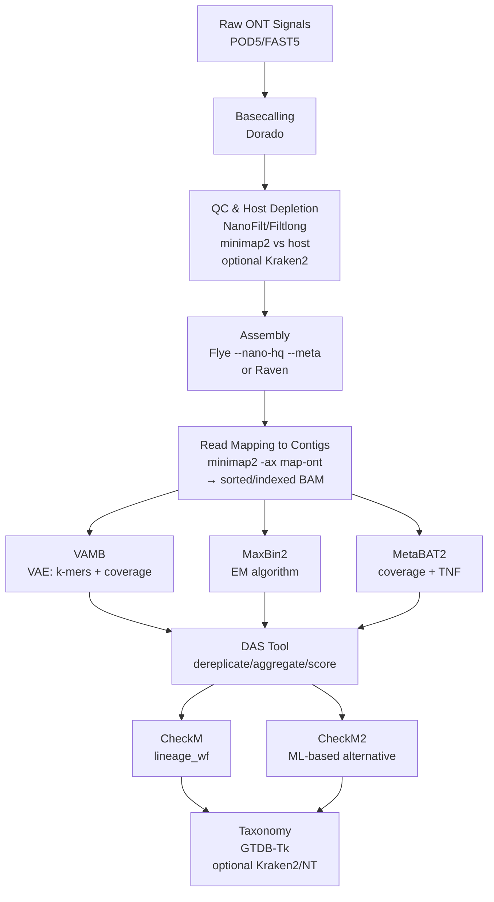

# Binning Nanopore Metagenomes with VAMB, MaxBin2, MetaBAT2, DAS Tool, and CheckM

A reproducible, end-to-end workflow for Oxford Nanopore metagenomes: upstream preparation, binning with VAMB, MaxBin2, and MetaBAT2, refinement with DAS Tool, quality assessment with CheckM (and CheckM2), and taxonomic assignment with GTDB-Tk (optional Kraken2). Commands are current for modern ONT pipelines (e.g., Flye --nano-hq; Dorado --emit-fastq) and emphasize methodological clarity, reproducibility, and interpretability.

Assumptions. ONT R9/R10 data, basecalled with Dorado (hac or sup). Assemblies via Flye/metaFlye in metagenome mode. Mapping with minimap2 preset -x map-ont. Prefer Flye --nano-hq for contemporary, high-quality (Q≈20) basecalls; use --meta for metagenomes. Reserve --nano-raw for older, noisier reads.

⸻



⸻

## 0) Environment and channels

```bash
# One-time channel setup
conda config --add channels conda-forge
conda config --add channels bioconda
conda config --add channels defaults
```

⸻

## 1) Upstream processing

### 1.1 Basecalling (Dorado)

Dorado writes BAM to stdout by default; use `--emit-fastq` to emit FASTQ. Select a model (fast, hac, or sup) and point to your POD5/FAST5 location. Use GPU with `-x cuda:0`.

```bash
# Basecall to FASTQ (GPU, SUP model)
dorado basecaller sup pod5_dir/ --emit-fastq -x cuda:0 > reads.fastq

# Recursively traverse nested directories if needed
dorado basecaller hac /data --recursive --emit-fastq -x cuda:0 > reads.fastq
```

### 1.2 Read quality control and length filtering

```bash
# Retain reads ≥1 kb and mean qscore ≥10
cat reads.fastq | NanoFilt -q 10 -l 1000 > reads_qc.fastq
```

(Optional) Long-read subsampling/quality trimming with Filtlong can be applied prior to assembly if coverage is excessive.

### 1.3 Host depletion (recommended for host-associated samples)

Align against a host reference and keep unmapped reads. Use the ONT preset.

```bash
minimap2 -t 32 -ax map-ont host.fa reads_qc.fastq \
  | samtools view -b -f 4 \
  | samtools fastq -@ 8 - > reads_filtered.fastq
```

### 1.4 Assembly (Flye/metaFlye)

Use `--nano-hq` for high-quality ONT reads and `--meta` for metagenomes. For older, low-accuracy reads, use `--nano-raw`.

```bash
flye --nano-hq reads_filtered.fastq --meta \
     --out-dir flye_out --threads 32
# If necessary for atypical error profiles on HQ data:
# flye --nano-hq reads_filtered.fastq --meta --read-error 0.03 --out-dir flye_out --threads 32
```

(Alternative) Raven can be substituted for Flye in constrained environments.

### 1.5 Read mapping to contigs and depth calculation

Map reads back to the assembly; produce a sorted, indexed BAM. Generate a depth matrix for MetaBAT2 using one or more BAMs.

```bash
minimap2 -t 32 -ax map-ont flye_out/assembly.fasta reads_filtered.fastq \
  | samtools sort -o mapping.bam
samtools index mapping.bam

# Depth table for one or many sorted BAMs
jgi_summarize_bam_contig_depths --outputDepth depth.txt mapping.bam
# For multiple samples (recommended to strengthen covariance):
# jgi_summarize_bam_contig_depths --outputDepth depth.txt mappings/*.bam

# If basecalls are not HQ (older chemistries), optionally relax identity:
# jgi_summarize_bam_contig_depths --percentIdentity 95 --outputDepth depth.txt *.bam
```

⸻

## 2) VAMB

Concept. Variational autoencoder integrating k-mer composition and multi-sample coverage; strong performance on cohort data.

### 2.1 Installation

```bash
mamba create -n vamb -c conda-forge -c bioconda vamb
conda activate vamb
# or:
# pip install vamb

# (Optional for abundance estimation) Install strobealign for --aemb:
mamba install -n vamb -c bioconda strobealign
```

You're right, let me correct the VAMB section to use minimap2 for abundance calculation instead of strobealign:

## 2) VAMB

Concept. Variational autoencoder integrating k-mer composition and multi-sample coverage; strong performance on cohort data.

### 2.1 Installation

```bash
mamba create -n vamb -c conda-forge -c bioconda vamb
conda activate vamb
# or:
# pip install vamb
```

### 2.2 Inputs and run

VAMB can calculate abundances from BAM files generated with minimap2. Multiple samples can be provided to improve binning through coverage covariance.

```bash
# Concatenate assemblies and rename contigs to VAMB's scheme
python concatenate.py --keepnames contigs_catalogue.fna.gz flye_out/assembly.fasta
# Or if using VAMB from repository:
# python src/concatenate.py --keepnames contigs_catalogue.fna.gz flye_out/assembly.fasta

# Map reads to concatenated catalogue for each sample
minimap2 -t 32 -ax map-ont contigs_catalogue.fna.gz sample1_reads.fastq | samtools sort -o sample1.bam
minimap2 -t 32 -ax map-ont contigs_catalogue.fna.gz sample2_reads.fastq | samtools sort -o sample2.bam
# Repeat for additional samples...

# Index BAM files
samtools index sample1.bam
samtools index sample2.bam

# Run VAMB with BAM files
vamb bin default \
  --outdir vambout \
  --fasta contigs_catalogue.fna.gz \
  --bamfiles sample1.bam sample2.bam \
  --minfasta 200000 \
  -m 2000 \
  -p 16
```

```bash
# 5) VAMB (using minimap2-generated BAMs)
python concatenate.py --keepnames contigs_catalogue.fna.gz flye_out/assembly.fasta
minimap2 -t 32 -ax map-ont contigs_catalogue.fna.gz reads_filtered.fastq | samtools sort -o sample.bam
samtools index sample.bam
vamb bin default \
  --outdir vambout \
  --fasta contigs_catalogue.fna.gz \
  --bamfiles sample.bam \
  --minfasta 200000 -m 2000 -p 16
```

Key parameters remain the same: `--minfasta` (minimum total bin size to output), `-m` (minimum contig length), `-p` (threads), `--cuda` (use GPU), `--seed` (reproducibility).

⸻

## 3) MaxBin2

Concept. Expectation-Maximization (EM) algorithm-based binner that uses tetranucleotide frequencies and coverage information to cluster contigs into bins.

### 3.1 Installation

```bash
mamba create -n maxbin2 -c bioconda maxbin2
conda activate maxbin2
```

### 3.2 Prepare abundance file

MaxBin2 requires an abundance file. You can generate this from BAM files or use the depth file from MetaBAT2's jgi_summarize_bam_contig_depths output.

```bash
# Option A: Create abundance file from depth.txt (from jgi_summarize_bam_contig_depths)
# Extract columns 1 and 4 (contig name and mean coverage)
cut -f1,4 depth.txt > abundance_maxbin.txt

# Option B: If you have multiple samples, create separate abundance files
# Extract coverage for each sample from the depth.txt file
# Columns 4, 6, 8... contain mean coverage for samples 1, 2, 3...
cut -f1,4 depth.txt > abundance_sample1.txt
cut -f1,6 depth.txt > abundance_sample2.txt
# etc.
```

### 3.3 Run MaxBin2

```bash
# Single sample mode
run_MaxBin.pl \
  -contig flye_out/assembly.fasta \
  -abund abundance_maxbin.txt \
  -out maxbin_out/maxbin \
  -thread 32 \
  -min_contig_length 1000

# Multiple samples mode (if you have abundance files for multiple samples)
# Create a list file containing paths to abundance files
echo "abundance_sample1.txt" > abund_list.txt
echo "abundance_sample2.txt" >> abund_list.txt

run_MaxBin.pl \
  -contig flye_out/assembly.fasta \
  -abund_list abund_list.txt \
  -out maxbin_out/maxbin \
  -thread 32 \
  -min_contig_length 1000
```

Key parameters. `-min_contig_length` (default 1000); `-prob_threshold` (default 0.9, lower for more inclusive binning); `-markerset` (107 for bacteria, 40 for archaea, or provide custom markers).

⸻

## 4) MetaBAT2

Concept. Clusters contigs using tetranucleotide frequency (TNF) and coverage covariance; requires a depth matrix from BAMs.

### 4.1 Installation

```bash
# Preferred: Bioconda
mamba create -n metabat2 -c bioconda metabat2
conda activate metabat2

# Alternative build from source (if needed)
# git clone <metabat2 repo>
# cd metabat && mkdir build && cd build
# cmake .. && make
```

### 4.2 Depth and binning

```bash
# Depth across one or more sorted BAMs
jgi_summarize_bam_contig_depths --outputDepth depth.txt mapping1.bam mapping2.bam

# Binning
metabat2 -i flye_out/assembly.fasta -a depth.txt -o metabat_bins/bin -t 32 -m 2500
```

Useful switches. `-m` minimum contig length (default 2500); `--maxP`, `--minS`, `--maxEdges` for sensitivity/specificity; `--seed` for reproducibility; `--noAdd` to avoid adding small leftovers. The depth utility accepts `--percentIdentity` (default 97) to accommodate different read accuracies.

⸻

## 5) DAS Tool (bin refinement)

Concept. Integrates multiple bin sets into a non-redundant, higher-quality consensus by dereplication, aggregation, and scoring.

### 5.1 Installation

```bash
mamba install -c bioconda das_tool
```

### 5.2 Prepare inputs and run

DAS Tool expects contigs2bin (or scaffolds2bin) TSVs. Different releases ship either `Fasta_to_Contig2Bin.sh` or `Fasta_to_Scaffolds2Bin.sh`. Use whichever is available in your installation.

```bash
# Convert bin folders to contigs2bin tables (choose the helper your installation provides)
# Option A:
Fasta_to_Contig2Bin.sh -i vambout/bins/ -e fna > vamb.contigs2bin.tsv
Fasta_to_Contig2Bin.sh -i maxbin_out/ -e fasta > maxbin2.contigs2bin.tsv
Fasta_to_Contig2Bin.sh -i metabat_bins/ -e fa > metabat2.contigs2bin.tsv

# Option B (if your helper is named differently):
# Fasta_to_Scaffolds2Bin.sh vambout/bins/ vamb.contigs2bin.tsv
# Fasta_to_Scaffolds2Bin.sh maxbin_out/ maxbin2.contigs2bin.tsv
# Fasta_to_Scaffolds2Bin.sh metabat_bins/ metabat2.contigs2bin.tsv

# Run DAS Tool (labels must match the -i order)
DAS_Tool \
  -i vamb.contigs2bin.tsv,maxbin2.contigs2bin.tsv,metabat2.contigs2bin.tsv \
  -l vamb,maxbin2,metabat2 \
  -c flye_out/assembly.fasta \
  -o dastool_out \
  --threads 32
```

Notes. Use `--write_bin_evals`, `--write_bins`, and `--score_threshold` if you want explicit outputs and stricter selection.

⸻

## 6) Evaluating bin quality

### 6.1 CheckM (`lineage_wf`)

```bash
mamba install -c bioconda checkm-genome

checkm lineage_wf -x fa -t 32 dastool_out_DASTool_bins/ checkm_out
```

Interpretation. Completeness reflects observed single-copy markers within an expected lineage; contamination reflects redundant markers indicating mixed genomes. High-quality MAGs typically show >90% completeness and <5% contamination; medium-quality thresholds are commonly relaxed (e.g., >50% completeness, <10% contamination), but report both and justify any deviations.

### 6.2 CheckM2 (ML-based alternative/complement)

```bash
mamba install -c conda-forge -c bioconda checkm2

checkm2 predict \
  --threads 32 \
  --input dastool_out_DASTool_bins/ \
  --output-directory checkm2_out
```

⸻

## 7) Taxonomic classification

### 7.1 GTDB-Tk (recommended)

Configure `GTDBTK_DATA_PATH` to the local GTDB release directory prior to running.

```bash
mamba install -c conda-forge -c bioconda gtdbtk
export GTDBTK_DATA_PATH=/path/to/gtdb/release

gtdbtk classify_wf \
  --genome_dir dastool_out_DASTool_bins/ \
  --out_dir gtdbtk_out \
  --cpus 32
```

### 7.2 Kraken2 (optional; broad database classification)

Building the full NT database is resource intensive (large disk and RAM). For many applications, the standard database or a custom, targeted database is preferable. If you must build NT:

```bash
mamba install -c bioconda kraken2

kraken2-build --download-taxonomy --db kraken_nt_db
kraken2-build --download-library nt --db kraken_nt_db --threads 32
kraken2-build --build --db kraken_nt_db --threads 32

# Classify a single bin
kraken2 --db kraken_nt_db --use-names dastool_out_DASTool_bins/bin.1.fa > kraken_out.tsv
```

⸻

## 8) Practical defaults, quality controls, and caveats

- Flye input mode is pivotal. Prefer `--nano-hq --meta` for modern HQ ONT reads; reserve `--nano-raw` for legacy, low-accuracy reads.
- minimap2 presets. Use `-x map-ont` for ONT reads in both host depletion and read-to-contig mapping.
- BAM hygiene. Ensure BAMs are coordinate-sorted and indexed before depth/coverage steps.
- Depth estimation. Include all cohort BAMs when feasible; coverage covariance across samples substantially improves binning. If reads are not HQ, consider `--percentIdentity < 97` in `jgi_summarize_bam_contig_depths`.
- Contig length thresholds. Exclude short contigs from binning for stability (e.g., VAMB `-m 2000`; MetaBAT2 `-m 2500`; MaxBin2 `-min_contig_length 1000`).
- Reproducibility. Fix random seeds where available (e.g., MetaBAT2 `--seed`, VAMB `--seed`). Record tool versions, command lines, and database releases.
- Computational resources. Prefer GPU for Dorado; consider GPU for VAMB if available. Thread counts (`-t`/`-p`) should match your CPU topology.
- Reporting. Always report completeness/contamination, N50/N90, number of contigs per bin, total bin size, and assigned taxonomy (with database release).

⸻

## 9) Minimal end-to-end command sketch

```bash
# 0) Basecall to FASTQ (GPU)
dorado basecaller sup pod5s/ --emit-fastq -x cuda:0 > reads.fastq

# 1) QC + host depletion
cat reads.fastq | NanoFilt -q 10 -l 1000 > reads_qc.fastq
minimap2 -t 32 -ax map-ont host.fa reads_qc.fastq \
  | samtools view -b -f 4 \
  | samtools fastq -@ 8 - > reads_filtered.fastq

# 2) Assembly (Flye: metagenome + HQ ONT mode)
flye --nano-hq reads_filtered.fastq --meta --out-dir flye_out --threads 32

# 3) Map reads back to assembly
minimap2 -t 32 -ax map-ont flye_out/assembly.fasta reads_filtered.fastq \
  | samtools sort -o mapping.bam
samtools index mapping.bam

# 4) Depth for MetaBAT2 and MaxBin2
jgi_summarize_bam_contig_depths --outputDepth depth.txt mapping.bam

# 5) VAMB (abundances via strobealign --aemb)
python src/concatenate.py contigs.fna.gz flye_out/assembly.fasta
mkdir -p aemb
strobealign -t 16 --aemb contigs.fna.gz reads_filtered.fastq > aemb/sample.tsv
python src/merge_aemb.py aemb abundance.tsv
vamb bin default \
  --outdir vambout \
  --fasta contigs.fna.gz \
  --abundance_tsv abundance.tsv \
  --minfasta 200000 -m 2000 -p 16

# 6) MaxBin2
cut -f1,4 depth.txt > abundance_maxbin.txt
run_MaxBin.pl \
  -contig flye_out/assembly.fasta \
  -abund abundance_maxbin.txt \
  -out maxbin_out/maxbin \
  -thread 32 \
  -min_contig_length 1000

# 7) MetaBAT2
metabat2 -i flye_out/assembly.fasta -a depth.txt -o metabat_bins/bin -t 32 -m 2500

# 8) DAS Tool (refine)
# Use whichever helper your DAS Tool installation provides (Contig2Bin or Scaffolds2Bin)
Fasta_to_Contig2Bin.sh -i vambout/bins/ -e fna > vamb.tsv
Fasta_to_Contig2Bin.sh -i maxbin_out/ -e fasta > maxbin2.tsv
Fasta_to_Contig2Bin.sh -i metabat_bins/ -e fa > metabat2.tsv
DAS_Tool -i vamb.tsv,maxbin2.tsv,metabat2.tsv -l vamb,maxbin2,metabat2 \
  -c flye_out/assembly.fasta -o dastool_out --threads 32

# 9) CheckM (or CheckM2)
checkm lineage_wf -x fa -t 32 dastool_out_DASTool_bins/ checkm_out
# or:
checkm2 predict --threads 32 --input dastool_out_DASTool_bins/ --output-directory checkm2_out

# 10) GTDB-Tk
export GTDBTK_DATA_PATH=/path/to/gtdb/release
gtdbtk classify_wf --genome_dir dastool_out_DASTool_bins/ --out_dir gtdbtk_out --cpus 32
```
