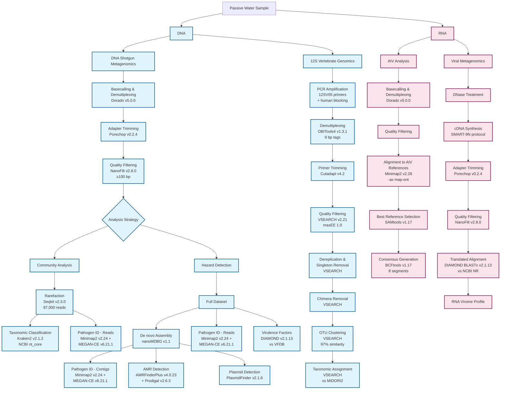

# Wetland Metagenomics, Viromics, and Vertebrate eDNA from European Wetlands (PRJEB96272)

## Project Overview

This project investigates the microbial and viral communities, vertebrate biodiversity, and prevalence of antimicrobial resistance (AMR) genes in 12 European wetlands across Germany, France, and Spain, along the [east atlantic flyway](https://earth.google.com/web/@50.30246982,5.75732731,1000.86387688a,8521661.66667581d,30y,0h,0t,0r/data=CgRCAggBMikKJwolCiExOW5PaHAxTGtOWlFQSVVMaDVYazNhbHNuS1kwblpFTGQgAToDCgEwQgIIAEoICMvq4YQEEAE), a major bird migration corridor. Samples were collected from sites categorized by land use (anthropogenic vs. natural) using torpedo-shaped passive water samplers.
From dual DNA/RNA extractions, four parallel analyses were conducted using Oxford Nanopore Technologies sequencing (MinION Mk1D/Mk1C, R10.4.1 flow cells):

1.  **Shotgun Metagenomics (eDNA):** Characterization of microbial communities and AMR genes.
2.  **Vertebrate Metabarcoding (eDNA):** Identification of local vertebrate fauna using 12S rRNA amplicons.
3.  **Avian Influenza Virus (AIV) Analysis (eRNA):** Targeted whole-genome sequencing of AIV-positive samples.
4.  **RNA Viromics (eRNA):** Untargeted analysis of RNA virus communities.

This repository contains the bioinformatic workflows used to process the sequencing data.

## ENA Files: [https://www.ebi.ac.uk/ena/browser/view/PRJEB96272](https://www.ebi.ac.uk/ena/browser/view/PRJEB96272) for Metagenomics and RNA Virome
## AIV Files: GSAID EPI4628641 (Note: Account required for download!)

---

## Sample Information and Barcoding Scheme

**⚠️ IMPORTANT: This table is essential for reproducing our analyses. It maps sampling locations to their corresponding barcodes and FASTQ files.**

### Site Coding System
Sites are coded using a **[Country][Environment][Number]** format:
- **Country:** G (Germany), F (France), S (Spain)
- **Environment:** A (Anthropogenic), N (Natural)
- **Number:** Sequential identification within each category

### 1. DNA Shotgun Metagenomics Samples
| Location | Sample ID | ONT Barcode | FASTQ Filename |
|----------|-----------|-------------|----------------|
| **Germany - Anthropogenic** | | | |
| GA1 | GA1.1 | BC01 | SQK-RBK114-24_barcode01.GA1.1.fastq.tar.gz |
| GA1 | GA1.2 | BC01 | SQK-RBK114-24_barcode01.GA1.2.fastq.tar.gz |
| GA2 | GA2.1 | BC03 | SQK-RBK114-24_barcode03.GA2.1.fastq.tar.gz |
| GA2 | GA2.2 | BC03 | SQK-RBK114-24_barcode03.GA2.2.fastq.tar.gz |
| GA3 | GA3.1 | BC05 | SQK-RBK114-24_barcode05.GA3.1.fastq.tar.gz |
| GA3 | GA3.2 | BC05 | SQK-RBK114-24_barcode05.GA3.2.fastq.tar.gz |
| **Germany - Natural** | | | |
| GN1 | GN1.1 | BC17 | SQK-RBK114-24_barcode17.GN1.1.fastq.tar.gz |
| GN1 | GN1.2 | BC07 | SQK-RBK114-24_barcode07.GN1.2.fastq.tar.gz |
| GN2 | GN2.1 | BC07 | SQK-RBK114-24_barcode07.GN2.1.fastq.tar.gz |
| GN2 | GN2.2 | BC07 | SQK-RBK114-24_barcode07.GN2.2.fastq.tar.gz |
| GN3 | GN3.1 | BC09 | SQK-RBK114-24_barcode09.GN3.1.fastq.tar.gz |
| GN3 | GN3.2 | BC09 | SQK-RBK114-24_barcode09.GN3.2.fastq.tar.gz |
| **France - Anthropogenic** | | | |
| FA1 | FA1.1 | BC19 | SQK-RBK114-24_barcode19.FA1.1.fastq.tar.gz |
| FA1 | FA1.2 | BC19 | SQK-RBK114-24_barcode19.FA1.2.fastq.tar.gz |
| FA2 | FA2.1 | BC21 | SQK-RBK114-24_barcode21.FA2.1.fastq.tar.gz |
| FA2 | FA2.2 | BC13 | SQK-RBK114-24_barcode13.FA2.2.fastq.tar.gz |
| **France - Natural** | | | |
| FN1 | FN1.1 | BC11 | SQK-RBK114-24_barcode11.FN1.1.fastq.tar.gz |
| FN1 | FN1.2 | BC11 | SQK-RBK114-24_barcode11.FN1.2.fastq.tar.gz |
| **Spain - Anthropogenic** | | | |
| SA1 | SA1.1 | BC23 | SQK-RBK114-24_barcode23.SA1.1.fastq.tar.gz |
| SA1 | SA1.2 | BC15 | SQK-RBK114-24_barcode15.SA1.2.fastq.tar.gz |
| **Spain - Natural** | | | |
| SN1 | SN1.1 | BC13 | SQK-RBK114-24_barcode13.SN1.1.fastq.tar.gz |
| SN1 | SN1.2 | BC13 | SQK-RBK114-24_barcode13.SN1.2.fastq.tar.gz |
| SN2 | SN2.1 | BC15 | SQK-RBK114-24_barcode15.SN2.1.fastq.tar.gz |
| SN2 | SN2.2 | BC15 | SQK-RBK114-24_barcode15.SN2.2.fastq.tar.gz |

### 2. 12S Vertebrate Metabarcoding Samples

| Location | Sample ID | ONT Barcode | 9bp Tag | FASTQ Filename |
|----------|-----------|-------------|---------|----------------|
| **Germany - Anthropogenic** | | | | |
| GA1 | GA1 | [BC##] | [Tag###] | [filename.fastq.gz] |
| GA2 | GA2 | [BC##] | [Tag###] | [filename.fastq.gz] |
| GA3 | GA3 | [BC##] | [Tag###] | [filename.fastq.gz] |
| **Germany - Natural** | | | | |
| GN1 | GN1 | [BC##] | [Tag###] | [filename.fastq.gz] |
| GN2 | GN2 | [BC##] | [Tag###] | [filename.fastq.gz] |
| GN3 | GN3 | [BC##] | [Tag###] | [filename.fastq.gz] |
| **France - Anthropogenic** | | | | |
| FA1 | FA1 | [BC##] | [Tag###] | [filename.fastq.gz] |
| FA2 | FA2 | [BC##] | [Tag###] | [filename.fastq.gz] |
| **France - Natural** | | | | |
| FN1 | FN1 | [BC##] | [Tag###] | [filename.fastq.gz] |
| **Spain - Anthropogenic** | | | | |
| SA1 | SA1 | [BC##] | [Tag###] | [filename.fastq.gz] |
| **Spain - Natural** | | | | |
| SN1 | SN1 | [BC##] | [Tag###] | [filename.fastq.gz] |
| SN2 | SN2 | [BC##] | [Tag###] | [filename.fastq.gz] |

### 3. AIV (RNA) Analysis Samples

| Location | Sample ID | ONT Barcode | AIV Status | FASTQ Filename |
|----------|-----------|-------------|------------|----------------|
| **Germany - Anthropogenic** | | | | |
| GA1 | GA1 | [BC##] | [Pos/Neg] | [filename.fastq.gz] |
| GA2 | GA2 | [BC##] | [Pos/Neg] | [filename.fastq.gz] |
| GA3 | GA3 | [BC##] | [Pos/Neg] | [filename.fastq.gz] |
| **Germany - Natural** | | | | |
| GN1 | GN1 | [BC##] | [Pos/Neg] | [filename.fastq.gz] |
| GN2 | GN2 | [BC##] | [Pos/Neg] | [filename.fastq.gz] |
| GN3 | GN3 | [BC##] | [Pos/Neg] | [filename.fastq.gz] |
| **France - Anthropogenic** | | | | |
| FA1 | FA1 | [BC##] | [Pos/Neg] | [filename.fastq.gz] |
| FA2 | FA2 | [BC##] | [Pos/Neg] | [filename.fastq.gz] |
| **France - Natural** | | | | |
| FN1 | FN1 | [BC##] | [Pos/Neg] | [filename.fastq.gz] |
| **Spain - Anthropogenic** | | | | |
| SA1 | SA1 | [BC##] | [Pos/Neg] | [filename.fastq.gz] |
| **Spain - Natural** | | | | |
| SN1 | SN1 | [BC##] | [Pos/Neg] | [filename.fastq.gz] |
| SN2 | SN2 | [BC##] | [Pos/Neg] | [filename.fastq.gz] |

### 4. RNA Viromics Samples
### 4. RNA Viromics Samples

### 4. RNA Viromics Samples
| Location | Sample ID | ONT Barcode | FASTQ Filename |
|----------|-----------|-------------|----------------|
| **Germany - Anthropogenic** | | | |
| GA1 | GA1 | BC01 | SQK-RPB114-24_barcode01.GA1.fastq.tar.gz |
| GA2 | GA2 | BC02 | SQK-RPB114-24_barcode02.GA2.fastq.tar.gz |
| GA3 | GA3 | BC03 | SQK-RPB114-24_barcode03.GA3.fastq.tar.gz |
| **Germany - Natural** | | | |
| GN1 | GN1 | BC04 | SQK-RPB114-24_barcode04.GN1.fastq.tar.gz |
| GN2 | GN2 | BC05 | SQK-RPB114-24_barcode05.GN2.fastq.tar.gz |
| GN3 | GN3 | BC06 | SQK-RPB114-24_barcode06.GN3.fastq.tar.gz |
| **France - Anthropogenic** | | | |
| FA1 | FA1 | BC08 | SQK-RPB114-24_barcode08.FA1.fastq.tar.gz |
| FA2 | FA2 | BC02 | SQK-RPB114-24_barcode02.FA2.fastq.tar.gz |
| **France - Natural** | | | |
| FN1 | FN1 | BC01 | SQK-RPB114-24_barcode01.FN1.fastq.tar.gz |
| **Spain - Anthropogenic** | | | |
| SA1 | SA1 | BC11 | SQK-RPB114-24_barcode11.SA1.fastq.tar.gz |
| **Spain - Natural** | | | |
| SN1 | SN1 | BC10 | SQK-RPB114-24_barcode10.SN1.fastq.tar.gz |
| SN2 | SN2 | BC12 | SQK-RPB114-24_barcode12.SN2.fastq.tar.gz |

### Site Descriptions
- **Anthropogenic sites (n=6):**
  - GA1: Urban landfill pond
  - GA2: Village wetland  
  - GA3: Urban pond
  - FA1: Intensive duck farm
  - FA2: Intensive duck farm
  - SA1: Sewage treatment plant
  
- **Natural sites (n=6):**
  - GN1-3: Coastal marshes/peat bogs
  - FN1: Wetland reserve
  - SN1-2: Wetland reserves

### Notes:
- **DNA shotgun samples:** Duplicate extractions per site (_1 and _2 suffixes)
- **12S, AIV, Virome samples:** Single extraction per site (location = sample ID)
- **12S samples:** Include both ONT barcodes and 9bp tags for demultiplexing
- **AIV samples:** Only AIV-positive samples proceed to consensus genome generation
- All sites are lentic (non-flowing) wetlands
- Raw FASTQ files are available at ENA under accession PRJEBXXXXX
---

## Analysis Pipeline Overview

This repository outlines four main analysis pipelines:

1.  **DNA Shotgun Metagenomics:** Processes FASTQ files from environmental DNA for community analysis, assembly, and AMR/pathogen detection.
2.  **AIV (RNA) Analysis:** Aligns reads from AIV-positive samples to generate consensus genomes.
3.  **Viral Metagenomics (Viromics):** Processes cDNA reads from total environmental RNA to characterize the RNA virome.
4.  **12S Vertebrate Genomics:** Processes 12S rRNA gene amplicons to identify vertebrate species.

## Tools Used

This project integrates the following key bioinformatics tools:

* **Basecalling & QC:**
    * **Dorado:** Basecaller for ONT data (v5.0.0).
    * **Porechop:** Adapter and barcode trimming (v0.2.4).
    * **NanoFilt:** Quality and length filtering for ONT reads (v2.8.0).
    * **Seqkit:** Toolkit for FASTA/Q sequence manipulation (v2.3.0).
* **Metagenomics & Assembly:**
    * **Kraken2:** K-mer based taxonomic classification (v2.1.2).
    * **metaFlye:** Long-read assembler for metagenomes (v2.9.6).
    * **nanoMDBG:** Long-read assembler for metagenomes (v1.1).
    * **Minimap2:** Long-read alignment (v2.24 for polishing, v2.28 for AIV).
    * **Racon:** Consensus correction/polishing for assemblies (v1.5.0).
    * **Medaka:** Consensus correction/polishing for assemblies (v1.7.2).
    * **Prokka:** Prokaryotic genome annotation (v1.14.5).
* **Pathogen & AMR Analysis:**
    * **AMRFinderPlus:** Detection of AMR genes (v4.0.23).
    * **Prodigal:** ORF prediction (v2.6.3).
    * **DIAMOND:** Protein sequence alignment (v2.1.13).
    * **MEGAN-CE:** Interactive metagenomic analysis (v6.21.1).
    * **PlasmidFinder:** Plasmid detection from assemblies (v2.1.6).
* **Vertebrate & Virome Analysis:**
    * **OBITools4:** Barcode demultiplexing for amplicons (v1.3.1).
    * **Cutadapt:** Primer trimming (v4.2).
    * **VSEARCH:** Sequence analysis toolkit (clustering, chimera removal) (v2.21).
* **AIV & General Utilities:**
    * **SAMtools:** Utilities for SAM/BAM alignment files (v1.17).
    * **BCFtools:** Utilities for variant calling and consensus generation (v1.17).

## Repository Structure

* `dna_shotgun_analysis_pipeline.md`: Detailed commands for the DNA shotgun metagenomics workflow.
* `aiv_rna_analysis_pipeline.md`: Detailed commands for the AIV (RNA) analysis workflow.
* `virome_analysis_pipeline.md`: Detailed commands for the viral metagenomics workflow.
* `12s_vertebrate_analysis_pipeline.md`: Detailed commands for the 12S vertebrate analysis workflow.
* `Installation_tutorial.md`: Guide for installing all required tools and databases.

## Usage Workflow

### DNA Shotgun Metagenomics Workflow

1.  **Read Processing:** Reads were demultiplexed and trimmed with Porechop, then filtered to remove reads < 100 bp with NanoFilt.
2.  **Taxonomic Classification:** Reads were classified using Kraken2 against the NCBI nt_core database. A dual strategy was used:
    * **For community analysis (beta-diversity):** Samples were rarefied to 87,000 reads using Seqkit.
    * **For hazard detection (pathogens/AMR):** The complete, non-rarefied dataset was used to maximize sensitivity.
3.  **Metagenome Assembly & Annotation:** *De novo* assembly was performed with nanoMDBG, chosen over metaFlye because its lack of a minimum read length requirement prevented the >50% data loss that metaFlye would have caused. Assemblies were functionally annotated with Prokka.
4.  **Pathogen & AMR Gene Detection:**
    * **Pathogen ID:** Reads and contigs were aligned to nt_core with Minimap2 and assigned taxonomy with MEGAN-CE using a conservative Lowest Common Ancestor (LCA) approach.
    * **Virulence Factors:** For specific samples (e.g., high *Vibrio cholerae*), reads were screened against the Virulence Factor Database (VFDB) using DIAMOND BLASTx.
    * **AMR Genes:** AMRFinderPlus (in `--plus` mode with Prodigal for ORF prediction) was run on both reads and contigs.
    * **AMR Mobility:** Contigs were screened for plasmids using PlasmidFinder.

    *For detailed commands, see [`dna_shotgun_analysis_pipeline.md`](./dna_shotgun_analysis_pipeline.md).*

### AIV (RNA) Analysis Workflow

1.  **Read Processing:** After basecalling and demultiplexing with Dorado (which removes primers), reads were quality filtered.
2.  **Alignment to Reference Genomes:** Filtered reads were aligned to a custom European AIV reference database using Minimap2 (v2.28) with the `-ax map-ont` setting.
3.  **Consensus Sequence Generation:** SAMtools was used to process alignments and identify the best-matching reference for each of the eight AIV segments. A consensus sequence for each segment was then generated using BCFtools.

    *For detailed commands, see [`aiv_rna_analysis_pipeline.md`](./aiv_rna_analysis_pipeline.md).*

### Viral Metagenomics (Viromics) Workflow

1.  **Library Prep & Read Processing:** RNA was DNase-treated and then converted to cDNA using the **Rapid SMART-9N protocol**, which employs random priming and template switching. Barcoded amplicons were generated and sequenced. Reads were trimmed (Porechop) and filtered (NanoFilt).
2.  **Taxonomic Classification:** Reads were taxonomically classified by translated alignment using **DIAMOND BLASTx** against the NCBI non-redundant (NR) protein database. Viral hits were tallied to profile the RNA virome of each sample.

    *For detailed commands, see [`virome_analysis_pipeline.md`](./virome_analysis_pipeline.md).*

### 12S Vertebrate Genomics Workflow

1.  **Library Prep:** A ~97 bp fragment of the 12S rRNA gene was amplified using 12SV05 primers with 9 bp tags. A human-blocking oligonucleotide was included. The final library was prepared with the Ligation Sequencing Kit (SQK-LSK114).
2.  **Read Processing:** Reads were demultiplexed by their 9 bp tags using **OBITools4**. Primers were trimmed with **Cutadapt**.
3.  **OTU Clustering & Classification:** The VSEARCH pipeline was used to:
    * Filter reads by expected error (maxEE 1.0).
    * Dereplicate sequences and remove singletons.
    * Remove chimeras.
    * Cluster sequences into Operational Taxonomic Units (OTUs) at 97% similarity.
4.  **Taxonomic Assignment:** OTU representative sequences were identified via global alignment against the **MIDORI2** reference database.

    *For detailed commands, see [`12s_vertebrate_analysis_pipeline.md`](./12s_vertebrate_analysis_pipeline.md).*
