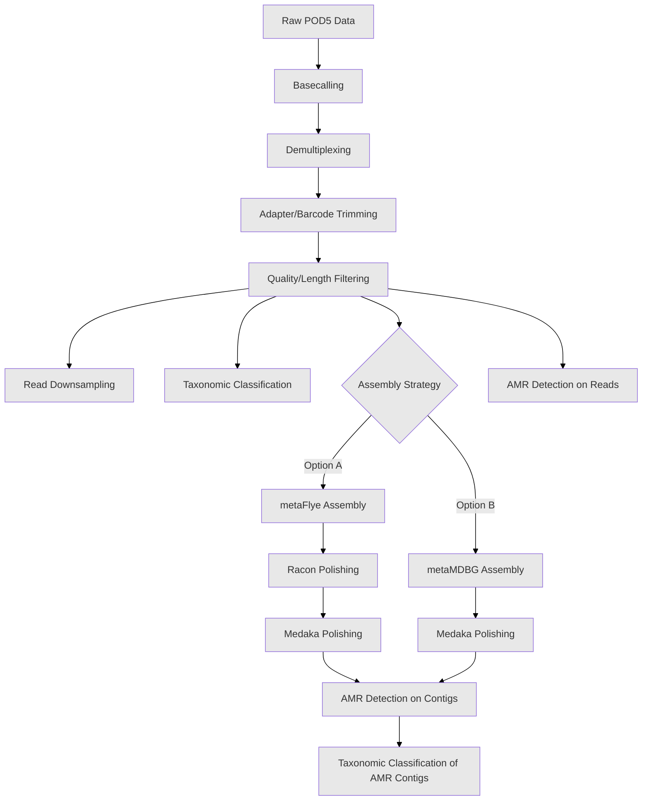

# DNA Shotgun Metagenomics Analysis Pipeline

This document provides a comprehensive workflow for DNA shotgun metagenomics analysis, from raw Nanopore data to AMR gene identification and taxonomic assignment.

## Table of Contents
1. [Prerequisites](#prerequisites)
2. [Workflow Overview](#workflow-overview)
3. [Pipeline Steps](#pipeline-steps)
   - [1. Basecalling](#1-basecalling-dorado)
   - [2. Demultiplexing](#2-demultiplexing-dorado)
   - [3. Adapter and Barcode Trimming](#3-adapter-and-barcode-trimming-porechop)
   - [4. Quality and Length Filtering](#4-quality-and-length-filtering-nanofilt)
   - [5. Read Downsampling for PCoA](#5-read-downsampling-for-pcoa-seqkit)
   - [6. Taxonomic Classification of Reads](#6-taxonomic-classification-of-reads-kraken2)
   - [7. Metagenome Assembly - Option A: metaFlye](#7-metagenome-assembly-option-a-metaflye)
   - [8. Assembly Polishing - Racon](#8-assembly-polishing-option-a-racon---3-rounds)
   - [9. Assembly Polishing - Medaka](#9-assembly-polishing-option-a-medaka-on-metaflyeracon-assembly)
   - [10. Metagenome Assembly - Option B: metaMDBG](#10-metagenome-assembly-option-b-metamdbg)
   - [11. Assembly Polishing - Medaka on metaMDBG](#11-assembly-polishing-option-b-medaka-on-metamdbg-assembly)
   - [12. Read Preparation for AMR Detection](#12-read-preparation-for-amr-detection)
   - [13. AMR Gene Detection on Reads](#13-amr-gene-detection-on-processed-reads)
   - [14. AMR Gene Detection on Contigs](#14-amr-gene-detection-on-assembled-contigs)
   - [15. Taxonomic Classification of AMR Contigs - DIAMOND](#15-taxonomic-classification-of-amr-carrying-contigs-diamond)
   - [16. Taxonomic Classification of AMR Contigs - Kraken2](#16-taxonomic-classification-of-amr-carrying-contigs-kraken2)
   - [17. Comparative Taxonomic Assignment](#17-comparative-taxonomic-assignment-of-amr-contigs)

## Prerequisites

- All necessary tools installed as per [`Installation_tutorial.md`](./Installation_tutorial.md)
- Raw POD5 data available
- Consult [`dna_shotgun_data_guide.md`](./dna_shotgun_data_guide.md) for sample-specific information

## Workflow Overview



## Pipeline Steps

### 1. Basecalling (Dorado)

Converts raw Nanopore signal data (POD5 files) into FASTQ sequences using Dorado v5.0.0 with super-accuracy mode.

```bash
#!/bin/bash
# Basecalling with Dorado v5.0.0

# Define variables
DORADO_BIN="/path/to/dorado"
CONFIG_FILE="/path/to/models/dna_r10.4.1_e8.2_400bps_sup@v5.0.0"
INPUT_POD5_DIR="/path/to/pod5_data"
OUTPUT_DIR="01_basecalled"
BASECALLED_FASTQ="${OUTPUT_DIR}/basecalled_all_samples.fastq"
KIT_NAME="SQK-RBK114-24"  # Rapid Barcoding Kit 114-24

# Create output directory
mkdir -p ${OUTPUT_DIR}

# Run basecalling
echo "[$(date)] Starting basecalling..."
${DORADO_BIN} basecaller \
    ${CONFIG_FILE} \
    ${INPUT_POD5_DIR} \
    --kit-name ${KIT_NAME} \
    --no-trim \
    --emit-fastq > ${BASECALLED_FASTQ}

# Check completion
if [ $? -eq 0 ]; then
    echo "[$(date)] Basecalling completed successfully"
    echo "Output: ${BASECALLED_FASTQ}"
else
    echo "[$(date)] ERROR: Basecalling failed"
    exit 1
fi
```

### 2. Demultiplexing (Dorado)

Separates basecalled reads by barcode.

```bash
#!/bin/bash
# Demultiplexing with Dorado

# Define variables
DORADO_BIN="/path/to/dorado"
BASECALLED_FASTQ="01_basecalled/basecalled_all_samples.fastq"
DEMUX_OUTPUT_DIR="02_demultiplexed"
KIT_NAME="SQK-RBK114-24"

# Create output directory
mkdir -p ${DEMUX_OUTPUT_DIR}

# Run demultiplexing
echo "[$(date)] Starting demultiplexing..."
${DORADO_BIN} demux \
    --output-dir ${DEMUX_OUTPUT_DIR} \
    --kit-name ${KIT_NAME} \
    ${BASECALLED_FASTQ} \
    --emit-fastq

# Check completion and list output files
if [ $? -eq 0 ]; then
    echo "[$(date)] Demultiplexing completed successfully"
    echo "Demultiplexed files:"
    ls -lh ${DEMUX_OUTPUT_DIR}/*.fastq
else
    echo "[$(date)] ERROR: Demultiplexing failed"
    exit 1
fi
```

### 3. Adapter and Barcode Trimming (Porechop)

Removes sequencing adapters and barcodes using Porechop v0.2.4.

```bash
#!/bin/bash
# Adapter trimming with Porechop v0.2.4

# Process all demultiplexed files
DEMUX_DIR="02_demultiplexed"
TRIMMED_DIR="03_trimmed"
THREADS=8

# Create output directory
mkdir -p ${TRIMMED_DIR}

# Process each barcode
for DEMUX_FILE in ${DEMUX_DIR}/barcode*.fastq; do
    BARCODE=$(basename ${DEMUX_FILE} .fastq)
    OUTPUT_FILE="${TRIMMED_DIR}/${BARCODE}.trimmed.fastq"
    
    echo "[$(date)] Processing ${BARCODE}..."
    
    porechop \
        -i ${DEMUX_FILE} \
        -o ${OUTPUT_FILE} \
        --threads ${THREADS} \
        --verbosity 1
    
    if [ $? -eq 0 ]; then
        echo "[$(date)] ${BARCODE} trimming completed"
    else
        echo "[$(date)] WARNING: ${BARCODE} trimming failed"
    fi
done
```

### 4. Quality and Length Filtering (NanoFilt)

Filters reads by length (minimum 100 bp) using NanoFilt v2.8.0.

```bash
#!/bin/bash
# Quality filtering with NanoFilt v2.8.0

# Process all trimmed files
TRIMMED_DIR="03_trimmed"
FILTERED_DIR="04_filtered"
MIN_LENGTH=100

# Create output directory
mkdir -p ${FILTERED_DIR}

# Process each trimmed file
for TRIMMED_FILE in ${TRIMMED_DIR}/*.trimmed.fastq; do
    BARCODE=$(basename ${TRIMMED_FILE} .trimmed.fastq)
    OUTPUT_FILE="${FILTERED_DIR}/${BARCODE}.filtered.fastq"
    
    echo "[$(date)] Filtering ${BARCODE}..."
    
    NanoFilt \
        --length ${MIN_LENGTH} \
        < ${TRIMMED_FILE} \
        > ${OUTPUT_FILE}
    
    # Report statistics
    if [ $? -eq 0 ]; then
        READS_BEFORE=$(grep -c "^@" ${TRIMMED_FILE})
        READS_AFTER=$(grep -c "^@" ${OUTPUT_FILE})
        echo "[$(date)] ${BARCODE}: ${READS_BEFORE} -> ${READS_AFTER} reads"
    fi
done
```

### 5. Read Downsampling for PCoA (Seqkit)

Randomly downsamples to 14,000 reads per sample for PCoA analysis using Seqkit v2.10.0.

```bash
#!/bin/bash
# Downsampling with Seqkit v2.10.0

# Process filtered files
FILTERED_DIR="04_filtered"
DOWNSAMPLED_DIR="05_downsampled_pcoa"
TARGET_READS=14000
RANDOM_SEED=11

# Create output directory
mkdir -p ${DOWNSAMPLED_DIR}

# Process each filtered file
for FILTERED_FILE in ${FILTERED_DIR}/*.filtered.fastq; do
    BARCODE=$(basename ${FILTERED_FILE} .filtered.fastq)
    OUTPUT_FILE="${DOWNSAMPLED_DIR}/${BARCODE}.14k.fastq"
    
    # Check read count
    READ_COUNT=$(seqkit stats -T ${FILTERED_FILE} | awk 'NR==2 {print $4}' | sed 's/,//g')
    
    if [ ${READ_COUNT} -ge ${TARGET_READS} ]; then
        echo "[$(date)] Downsampling ${BARCODE} (${READ_COUNT} reads)..."
        
        seqkit sample \
            -n ${TARGET_READS} \
            -s ${RANDOM_SEED} \
            ${FILTERED_FILE} \
            -o ${OUTPUT_FILE}
    else
        echo "[$(date)] WARNING: ${BARCODE} has only ${READ_COUNT} reads (< ${TARGET_READS}), excluding from PCoA"
    fi
done
```

### 6. Taxonomic Classification of Reads (Kraken2)

Performs taxonomic classification using Kraken2 v2.1.2 with nt_core database.

```bash
#!/bin/bash
# Taxonomic classification with Kraken2 v2.1.2

# Define variables
INPUT_DIR="05_downsampled_pcoa"  # Or "04_filtered" for full analysis
KRAKEN_DB="/path/to/kraken2_db/nt_core_May2025"
OUTPUT_DIR="06_kraken2_classification"
THREADS=16

# Create output directory
mkdir -p ${OUTPUT_DIR}

# Process each sample
for INPUT_FILE in ${INPUT_DIR}/*.fastq; do
    BARCODE=$(basename ${INPUT_FILE} .fastq | cut -d'.' -f1)
    OUTPUT_FILE="${OUTPUT_DIR}/${BARCODE}.kraken_output.txt"
    REPORT_FILE="${OUTPUT_DIR}/${BARCODE}.kraken_report.txt"
    
    echo "[$(date)] Running Kraken2 on ${BARCODE}..."
    
    kraken2 \
        --db ${KRAKEN_DB} \
        --threads ${THREADS} \
        --output ${OUTPUT_FILE} \
        --report ${REPORT_FILE} \
        --use-names \
        ${INPUT_FILE}
    
    if [ $? -eq 0 ]; then
        echo "[$(date)] ${BARCODE} classification completed"
    fi
done
```

### 7. Metagenome Assembly Option A: metaFlye

De novo assembly using metaFlye v2.9.6.

```bash
#!/bin/bash
# Assembly with metaFlye v2.9.6

# Process filtered reads
FILTERED_DIR="04_filtered"
ASSEMBLY_DIR="07_assembly_metaflye"
THREADS=16

# Create output directory
mkdir -p ${ASSEMBLY_DIR}

# Process each sample
for FILTERED_FILE in ${FILTERED_DIR}/*.filtered.fastq; do
    BARCODE=$(basename ${FILTERED_FILE} .filtered.fastq)
    OUTPUT_DIR="${ASSEMBLY_DIR}/${BARCODE}"
    
    echo "[$(date)] Assembling ${BARCODE} with metaFlye..."
    
    flye \
        --nano-hq ${FILTERED_FILE} \
        --out-dir ${OUTPUT_DIR} \
        --meta \
        --threads ${THREADS} \
        --min-overlap 3000
    
    if [ $? -eq 0 ]; then
        echo "[$(date)] ${BARCODE} assembly completed"
        # Report assembly statistics
        if [ -f "${OUTPUT_DIR}/assembly_info.txt" ]; then
            grep "Total length" "${OUTPUT_DIR}/assembly_info.txt"
        fi
    fi
done
```

### 8. Assembly Polishing Option A: Racon - 3 rounds

Polish metaFlye assemblies with Minimap2 v2.28 and Racon v1.5.

```bash
#!/bin/bash
# Polishing with Racon v1.5 (3 rounds)

# Define variables
FILTERED_DIR="04_filtered"
ASSEMBLY_DIR="07_assembly_metaflye"
POLISH_DIR="08_racon_polished"
THREADS=16
ROUNDS=3

# Create output directory
mkdir -p ${POLISH_DIR}

# Process each assembly
for SAMPLE_DIR in ${ASSEMBLY_DIR}/barcode*; do
    if [ -d "${SAMPLE_DIR}" ]; then
        BARCODE=$(basename ${SAMPLE_DIR})
        FILTERED_READS="${FILTERED_DIR}/${BARCODE}.filtered.fastq"
        INITIAL_ASSEMBLY="${SAMPLE_DIR}/assembly.fasta"
        SAMPLE_POLISH_DIR="${POLISH_DIR}/${BARCODE}"
        
        # Check if files exist
        if [ ! -f "${INITIAL_ASSEMBLY}" ] || [ ! -f "${FILTERED_READS}" ]; then
            echo "[$(date)] WARNING: Missing files for ${BARCODE}, skipping..."
            continue
        fi
        
        mkdir -p ${SAMPLE_POLISH_DIR}
        
        echo "[$(date)] Starting Racon polishing for ${BARCODE}..."
        
        # Copy initial assembly
        cp ${INITIAL_ASSEMBLY} "${SAMPLE_POLISH_DIR}/round0.fasta"
        
        # Perform polishing rounds
        for ROUND in $(seq 1 ${ROUNDS}); do
            echo "[$(date)] ${BARCODE} - Racon round ${ROUND}/${ROUNDS}..."
            
            PREV_ASSEMBLY="${SAMPLE_POLISH_DIR}/round$((ROUND-1)).fasta"
            CURR_ASSEMBLY="${SAMPLE_POLISH_DIR}/round${ROUND}.fasta"
            ALIGNMENT="${SAMPLE_POLISH_DIR}/round${ROUND}.sam"
            
            # Align reads to assembly
            minimap2 -ax map-ont \
                -t ${THREADS} \
                ${PREV_ASSEMBLY} \
                ${FILTERED_READS} > ${ALIGNMENT}
            
            # Polish with Racon
            racon -t ${THREADS} \
                ${FILTERED_READS} \
                ${ALIGNMENT} \
                ${PREV_ASSEMBLY} > ${CURR_ASSEMBLY}
            
            # Clean up
            rm ${ALIGNMENT}
        done
        
        ```bash
        # Create final polished assembly link
        ln -sf "round${ROUNDS}.fasta" "${SAMPLE_POLISH_DIR}/racon_polished.fasta"
        
        echo "[$(date)] ${BARCODE} Racon polishing completed"
    fi
done
```

### 9. Assembly Polishing Option A: Medaka on metaFlye+Racon assembly

Further polish with Medaka v2.0.1.

```bash
#!/bin/bash
# Final polishing with Medaka v2.0.1

# Define variables
FILTERED_DIR="04_filtered"
RACON_DIR="08_racon_polished"
MEDAKA_DIR="09_medaka_polished"
THREADS=16
MEDAKA_MODEL="r1041_e82_400bps_sup_g615"

# Create output directory
mkdir -p ${MEDAKA_DIR}

# Process each Racon-polished assembly
for SAMPLE_DIR in ${RACON_DIR}/barcode*; do
    if [ -d "${SAMPLE_DIR}" ]; then
        BARCODE=$(basename ${SAMPLE_DIR})
        FILTERED_READS="${FILTERED_DIR}/${BARCODE}.filtered.fastq"
        RACON_ASSEMBLY="${SAMPLE_DIR}/racon_polished.fasta"
        OUTPUT_DIR="${MEDAKA_DIR}/${BARCODE}"
        
        # Check if files exist
        if [ ! -f "${RACON_ASSEMBLY}" ] || [ ! -f "${FILTERED_READS}" ]; then
            echo "[$(date)] WARNING: Missing files for ${BARCODE}, skipping..."
            continue
        fi
        
        echo "[$(date)] Running Medaka for ${BARCODE}..."
        
        medaka_consensus \
            -i ${FILTERED_READS} \
            -d ${RACON_ASSEMBLY} \
            -o ${OUTPUT_DIR} \
            -t ${THREADS} \
            -m ${MEDAKA_MODEL}
        
        if [ $? -eq 0 ]; then
            echo "[$(date)] ${BARCODE} Medaka polishing completed"
            # Create convenient link to final assembly
            ln -sf "consensus.fasta" "${OUTPUT_DIR}/final_assembly.fasta"
        fi
    fi
done
```

### 10. Metagenome Assembly Option B: metaMDBG

Alternative assembly using metaMDBG/nanoMDBG v1.1.

```bash
#!/bin/bash
# Assembly with metaMDBG v1.1

# Process filtered reads
FILTERED_DIR="04_filtered"
ASSEMBLY_DIR="07_assembly_metamdbg"
THREADS=16

# Create output directory
mkdir -p ${ASSEMBLY_DIR}

# Process each sample
for FILTERED_FILE in ${FILTERED_DIR}/*.filtered.fastq; do
    BARCODE=$(basename ${FILTERED_FILE} .filtered.fastq)
    OUTPUT_DIR="${ASSEMBLY_DIR}/${BARCODE}"
    
    mkdir -p ${OUTPUT_DIR}
    
    echo "[$(date)] Assembling ${BARCODE} with metaMDBG..."
    
    # Run metaMDBG
    metaMDBG asm \
        --in-ont ${FILTERED_FILE} \
        --out-dir ${OUTPUT_DIR} \
        --out-prefix ${BARCODE} \
        --threads ${THREADS} \
        --filter-len 1000
    
    if [ $? -eq 0 ]; then
        echo "[$(date)] ${BARCODE} metaMDBG assembly completed"
        # The output is typically in ${OUTPUT_DIR}/${BARCODE}.contigs.fasta
    fi
done
```

### 11. Assembly Polishing Option B: Medaka on metaMDBG assembly

Polish metaMDBG assemblies with Medaka v2.0.1.

```bash
#!/bin/bash
# Polish metaMDBG assemblies with Medaka v2.0.1

# Define variables
FILTERED_DIR="04_filtered"
METAMDBG_DIR="07_assembly_metamdbg"
MEDAKA_DIR="09_medaka_polished_metamdbg"
THREADS=16
MEDAKA_MODEL="r1041_e82_400bps_sup_g615"

# Create output directory
mkdir -p ${MEDAKA_DIR}

# Process each metaMDBG assembly
for SAMPLE_DIR in ${METAMDBG_DIR}/barcode*; do
    if [ -d "${SAMPLE_DIR}" ]; then
        BARCODE=$(basename ${SAMPLE_DIR})
        FILTERED_READS="${FILTERED_DIR}/${BARCODE}.filtered.fastq"
        METAMDBG_ASSEMBLY="${SAMPLE_DIR}/${BARCODE}.contigs.fasta"
        OUTPUT_DIR="${MEDAKA_DIR}/${BARCODE}"
        
        # Check if files exist
        if [ ! -f "${METAMDBG_ASSEMBLY}" ] || [ ! -f "${FILTERED_READS}" ]; then
            echo "[$(date)] WARNING: Missing files for ${BARCODE}, skipping..."
            continue
        fi
        
        echo "[$(date)] Running Medaka for ${BARCODE} metaMDBG assembly..."
        
        medaka_consensus \
            -i ${FILTERED_READS} \
            -d ${METAMDBG_ASSEMBLY} \
            -o ${OUTPUT_DIR} \
            -t ${THREADS} \
            -m ${MEDAKA_MODEL}
        
        if [ $? -eq 0 ]; then
            echo "[$(date)] ${BARCODE} Medaka polishing completed"
            ln -sf "consensus.fasta" "${OUTPUT_DIR}/final_assembly.fasta"
        fi
    fi
done
```

### 12. Read Preparation for AMR Detection

Prepare reads for AMR detection by downsampling and format conversion.

```bash
#!/bin/bash
# Prepare reads for AMR detection

# Define variables
FILTERED_DIR="04_filtered"
AMR_PREP_DIR="10_amr_prep"
TARGET_READS=50000  # Example downsampling target
THREADS=8

# Create output directory
mkdir -p ${AMR_PREP_DIR}

# Process each sample
for FILTERED_FILE in ${FILTERED_DIR}/*.filtered.fastq; do
    BARCODE=$(basename ${FILTERED_FILE} .filtered.fastq)
    OUTPUT_FASTQ="${AMR_PREP_DIR}/${BARCODE}.amr_ready.fastq"
    OUTPUT_FASTA="${AMR_PREP_DIR}/${BARCODE}.amr_ready.fasta"
    
    echo "[$(date)] Preparing ${BARCODE} for AMR detection..."
    
    # Downsample if needed
    READ_COUNT=$(seqkit stats -T ${FILTERED_FILE} | awk 'NR==2 {print $4}' | sed 's/,//g')
    
    if [ ${READ_COUNT} -gt ${TARGET_READS} ]; then
        echo "[$(date)] Downsampling ${BARCODE} from ${READ_COUNT} to ${TARGET_READS} reads..."
        seqkit sample -n ${TARGET_READS} -s 42 ${FILTERED_FILE} -o ${OUTPUT_FASTQ}
    else
        cp ${FILTERED_FILE} ${OUTPUT_FASTQ}
    fi
    
    # Convert to FASTA
    seqkit fq2fa ${OUTPUT_FASTQ} -o ${OUTPUT_FASTA}
    
    echo "[$(date)] ${BARCODE} AMR preparation completed"
done
```

### 13. AMR Gene Detection on Processed Reads

Detect AMR genes in reads using appropriate tools.

```bash
#!/bin/bash
# AMR detection on reads

# Define variables
AMR_PREP_DIR="10_amr_prep"
AMR_READS_DIR="11_amr_detection_reads"
AMR_DB="/path/to/amr_database"  # e.g., CARD, ResFinder
THREADS=16

# Create output directory
mkdir -p ${AMR_READS_DIR}

# Process each sample
for FASTA_FILE in ${AMR_PREP_DIR}/*.amr_ready.fasta; do
    BARCODE=$(basename ${FASTA_FILE} .amr_ready.fasta)
    OUTPUT_DIR="${AMR_READS_DIR}/${BARCODE}"
    
    mkdir -p ${OUTPUT_DIR}
    
    echo "[$(date)] Running AMR detection on ${BARCODE} reads..."
    
    # Example using ABRicate or similar tool
    abricate \
        --db ${AMR_DB} \
        --threads ${THREADS} \
        --minid 90 \
        --mincov 80 \
        ${FASTA_FILE} > "${OUTPUT_DIR}/${BARCODE}_amr_results.tsv"
    
    if [ $? -eq 0 ]; then
        # Count AMR genes found
        AMR_COUNT=$(tail -n +2 "${OUTPUT_DIR}/${BARCODE}_amr_results.tsv" | wc -l)
        echo "[$(date)] ${BARCODE}: Found ${AMR_COUNT} AMR genes in reads"
    fi
done
```

### 14. AMR Gene Detection on Assembled Contigs

Detect AMR genes in assembled contigs.

```bash
#!/bin/bash
# AMR detection on assemblies

# Define variables
ASSEMBLY_DIR="09_medaka_polished"  # Or choose your preferred assembly
AMR_CONTIGS_DIR="12_amr_detection_contigs"
AMR_DB="/path/to/amr_database"
THREADS=16

# Create output directory
mkdir -p ${AMR_CONTIGS_DIR}

# Process each assembly
for SAMPLE_DIR in ${ASSEMBLY_DIR}/barcode*; do
    if [ -d "${SAMPLE_DIR}" ]; then
        BARCODE=$(basename ${SAMPLE_DIR})
        ASSEMBLY="${SAMPLE_DIR}/final_assembly.fasta"
        OUTPUT_DIR="${AMR_CONTIGS_DIR}/${BARCODE}"
        
        if [ ! -f "${ASSEMBLY}" ]; then
            echo "[$(date)] WARNING: No assembly found for ${BARCODE}, skipping..."
            continue
        fi
        
        mkdir -p ${OUTPUT_DIR}
        
        echo "[$(date)] Running AMR detection on ${BARCODE} contigs..."
        
        # Run AMR detection
        abricate \
            --db ${AMR_DB} \
            --threads ${THREADS} \
            --minid 90 \
            --mincov 80 \
            ${ASSEMBLY} > "${OUTPUT_DIR}/${BARCODE}_amr_contigs.tsv"
        
        # Extract AMR-carrying contigs
        if [ -s "${OUTPUT_DIR}/${BARCODE}_amr_contigs.tsv" ]; then
            # Get contig IDs with AMR genes
            tail -n +2 "${OUTPUT_DIR}/${BARCODE}_amr_contigs.tsv" | \
                cut -f2 | sort -u > "${OUTPUT_DIR}/amr_contig_ids.txt"
            
            # Extract AMR-carrying contigs
            seqkit grep -f "${OUTPUT_DIR}/amr_contig_ids.txt" \
                ${ASSEMBLY} > "${OUTPUT_DIR}/${BARCODE}_amr_contigs.fasta"
            
            AMR_CONTIG_COUNT=$(wc -l < "${OUTPUT_DIR}/amr_contig_ids.txt")
            echo "[$(date)] ${BARCODE}: ${AMR_CONTIG_COUNT} contigs carry AMR genes"
        fi
    fi
done
```

### 15. Taxonomic Classification of AMR-carrying Contigs (DIAMOND)

Classify AMR-carrying contigs using DIAMOND.

```bash
#!/bin/bash
# Taxonomic classification with DIAMOND

# Define variables
AMR_CONTIGS_DIR="12_amr_detection_contigs"
DIAMOND_DIR="13_diamond_classification"
DIAMOND_DB="/path/to/diamond_nr_database"
THREADS=16

# Create output directory
mkdir -p ${DIAMOND_DIR}

# Process each sample's AMR contigs
for SAMPLE_DIR in ${AMR_CONTIGS_DIR}/barcode*; do
    if [ -d "${SAMPLE_DIR}" ]; then
        BARCODE=$(basename ${SAMPLE_DIR})
        AMR_CONTIGS="${SAMPLE_DIR}/${BARCODE}_amr_contigs.fasta"
        OUTPUT_DIR="${DIAMOND_DIR}/${BARCODE}"
        
        if [ ! -f "${AMR_CONTIGS}" ]; then
            echo "[$(date)] No AMR contigs for ${BARCODE}, skipping..."
            continue
        fi
        
        mkdir -p ${OUTPUT_DIR}
        
        echo "[$(date)] Running DIAMOND on ${BARCODE} AMR contigs..."
        
        # Run DIAMOND blastx
        diamond blastx \
            --db ${DIAMOND_DB} \
            --query ${AMR_CONTIGS} \
            --out "${OUTPUT_DIR}/${BARCODE}_diamond_results.tsv" \
            --outfmt 6 qseqid sseqid pident length mismatch gapopen qstart qend sstart send evalue bitscore staxids \
            --max-target-seqs 5 \
            --threads ${THREADS} \
            --sensitive
        
        if [ $? -eq 0 ]; then
            echo "[$(date)] ${BARCODE} DIAMOND classification completed"
        fi
    fi
done
```

### 16. Taxonomic Classification of AMR-carrying Contigs (Kraken2)

Alternative classification using Kraken2.

```bash
#!/bin/bash
# Taxonomic classification with Kraken2

# Define variables
AMR_CONTIGS_DIR="12_amr_detection_contigs"
KRAKEN_CONTIGS_DIR="14_kraken2_amr_contigs"
KRAKEN_DB="/path/to/kraken2_db/nt_core_May2025"
THREADS=16

# Create output directory
mkdir -p ${KRAKEN_CONTIGS_DIR}

# Process each sample's AMR contigs
for SAMPLE_DIR in ${AMR_CONTIGS_DIR}/barcode*; do
    if [ -d "${SAMPLE_DIR}" ]; then
        BARCODE=$(basename ${SAMPLE_DIR})
        AMR_CONTIGS="${SAMPLE_DIR}/${BARCODE}_amr_contigs.fasta"
        OUTPUT_FILE="${KRAKEN_CONTIGS_DIR}/${BARCODE}_kraken_output.txt"
        REPORT_FILE="${KRAKEN_CONTIGS_DIR}/${BARCODE}_kraken_report.txt"
        
        if [ ! -f "${AMR_CONTIGS}" ]; then
            echo "[$(date)] No AMR contigs for ${BARCODE}, skipping..."
            continue
        fi
        
        echo "[$(date)] Running Kraken2 on ${BARCODE} AMR contigs..."
        
        kraken2 \
            --db ${KRAKEN_DB} \
            --threads ${THREADS} \
            --output ${OUTPUT_FILE} \
            --report ${REPORT_FILE} \
            --use-names \
            ${AMR_CONTIGS}
        
        if [ $? -eq 0 ]; then
            echo "[$(date)] ${BARCODE} Kraken2 classification completed"
        fi
    fi
done
```

### 17. Comparative Taxonomic Assignment of AMR Contigs

Compare and integrate results from multiple classification methods.

```bash
#!/bin/bash
# Integrate taxonomic assignments

# Define variables
AMR_CONTIGS_DIR="12_amr_detection_contigs"
DIAMOND_DIR="13_diamond_classification"
KRAKEN_DIR="14_kraken2_amr_contigs"
FINAL_DIR="15_integrated_amr_taxonomy"

# Create output directory
mkdir -p ${FINAL_DIR}

# Process each sample
for SAMPLE_DIR in ${AMR_CONTIGS_DIR}/barcode*; do
    if [ -d "${SAMPLE_DIR}" ]; then
        BARCODE=$(basename ${SAMPLE_DIR})
        OUTPUT_FILE="${FINAL_DIR}/${BARCODE}_integrated_amr_taxonomy.tsv"
        
```bash
        echo "[$(date)] Integrating taxonomic assignments for ${BARCODE}..."
        
        # Create header for integrated results
        echo -e "contig_id\tamr_gene\tdiamond_taxon\tdiamond_identity\tkraken_taxon\tkraken_confidence" > ${OUTPUT_FILE}
        
        # Parse and integrate results (example implementation)
        # This would require custom scripts to merge the different outputs
        # Here's a conceptual Python script that could be called:
        
        python3 integrate_taxonomy.py \
            --amr "${SAMPLE_DIR}/${BARCODE}_amr_contigs.tsv" \
            --diamond "${DIAMOND_DIR}/${BARCODE}/${BARCODE}_diamond_results.tsv" \
            --kraken "${KRAKEN_DIR}/${BARCODE}_kraken_output.txt" \
            --output ${OUTPUT_FILE}
        
        if [ $? -eq 0 ]; then
            echo "[$(date)] ${BARCODE} taxonomy integration completed"
            
            # Generate summary statistics
            AMR_COUNT=$(tail -n +2 ${OUTPUT_FILE} | wc -l)
            echo "[$(date)] ${BARCODE}: ${AMR_COUNT} AMR genes with taxonomic assignments"
        fi
    fi
done

# Generate final summary report
echo "[$(date)] Generating final summary report..."
python3 generate_summary_report.py \
    --input-dir ${FINAL_DIR} \
    --output "${FINAL_DIR}/amr_taxonomy_summary.html"
```

## Helper Scripts

### integrate_taxonomy.py

```python
#!/usr/bin/env python3
"""
Integrate taxonomic assignments from multiple sources for AMR-carrying contigs
"""

import argparse
import pandas as pd
from pathlib import Path

def parse_arguments():
    parser = argparse.ArgumentParser(description='Integrate AMR and taxonomy results')
    parser.add_argument('--amr', required=True, help='AMR detection results')
    parser.add_argument('--diamond', required=True, help='DIAMOND results')
    parser.add_argument('--kraken', required=True, help='Kraken2 results')
    parser.add_argument('--output', required=True, help='Output file')
    return parser.parse_args()

def main():
    args = parse_arguments()
    
    # Load AMR results
    amr_df = pd.read_csv(args.amr, sep='\t')
    
    # Load DIAMOND results
    diamond_cols = ['qseqid', 'sseqid', 'pident', 'length', 'mismatch', 
                    'gapopen', 'qstart', 'qend', 'sstart', 'send', 
                    'evalue', 'bitscore', 'staxids']
    diamond_df = pd.read_csv(args.diamond, sep='\t', names=diamond_cols)
    
    # Load Kraken2 results
    kraken_cols = ['classified', 'seqid', 'taxid', 'length', 'lca_mapping']
    kraken_df = pd.read_csv(args.kraken, sep='\t', names=kraken_cols)
    
    # Merge results
    # (Implementation would depend on specific format requirements)
    
    # Save integrated results
    integrated_df.to_csv(args.output, sep='\t', index=False)

if __name__ == '__main__':
    main()
```

### generate_summary_report.py

```python
#!/usr/bin/env python3
"""
Generate HTML summary report for AMR analysis
"""

import argparse
import pandas as pd
from pathlib import Path
import plotly.graph_objects as go
import plotly.express as px
from jinja2 import Template

def parse_arguments():
    parser = argparse.ArgumentParser(description='Generate AMR summary report')
    parser.add_argument('--input-dir', required=True, help='Directory with integrated results')
    parser.add_argument('--output', required=True, help='Output HTML file')
    return parser.parse_args()

def create_summary_plots(data):
    """Create interactive plots for the report"""
    plots = {}
    
    # AMR gene distribution
    amr_counts = data.groupby('amr_gene').size().sort_values(ascending=False).head(20)
    fig_amr = px.bar(x=amr_counts.values, y=amr_counts.index, 
                     orientation='h', title='Top 20 AMR Genes')
    plots['amr_distribution'] = fig_amr.to_html(full_html=False)
    
    # Taxonomic distribution
    taxa_counts = data.groupby('kraken_taxon').size().sort_values(ascending=False).head(20)
    fig_taxa = px.bar(x=taxa_counts.values, y=taxa_counts.index, 
                      orientation='h', title='Top 20 Taxa with AMR Genes')
    plots['taxa_distribution'] = fig_taxa.to_html(full_html=False)
    
    return plots

def generate_html_report(data, plots, output_path):
    """Generate HTML report"""
    template = Template("""
    <!DOCTYPE html>
    <html>
    <head>
        <title>AMR Analysis Summary Report</title>
        <script src="https://cdn.plot.ly/plotly-latest.min.js"></script>
        <style>
            body { font-family: Arial, sans-serif; margin: 40px; }
            h1 { color: #333; }
            .summary-box { 
                background-color: #f0f0f0; 
                padding: 20px; 
                border-radius: 5px; 
                margin: 20px 0;
            }
            .plot-container { margin: 30px 0; }
        </style>
    </head>
    <body>
        <h1>AMR Analysis Summary Report</h1>
        
        <div class="summary-box">
            <h2>Summary Statistics</h2>
            <ul>
                <li>Total samples analyzed: {{ n_samples }}</li>
                <li>Total AMR genes detected: {{ n_amr_genes }}</li>
                <li>Unique AMR gene types: {{ n_unique_amr }}</li>
                <li>Taxa with AMR genes: {{ n_taxa }}</li>
            </ul>
        </div>
        
        <div class="plot-container">
            {{ amr_plot }}
        </div>
        
        <div class="plot-container">
            {{ taxa_plot }}
        </div>
        
        <div class="summary-box">
            <h2>Analysis Parameters</h2>
            <ul>
                <li>Basecalling: Dorado v5.0.0 (SUP mode)</li>
                <li>Assembly: metaFlye v2.9.6 / metaMDBG v1.1</li>
                <li>Polishing: Racon v1.5 + Medaka v2.0.1</li>
                <li>AMR Database: {{ amr_db }}</li>
                <li>Taxonomy Database: Kraken2 nt_core (May 2025)</li>
            </ul>
        </div>
        
        <p><em>Report generated: {{ timestamp }}</em></p>
    </body>
    </html>
    """)
    
    html_content = template.render(
        n_samples=data['sample'].nunique(),
        n_amr_genes=len(data),
        n_unique_amr=data['amr_gene'].nunique(),
        n_taxa=data['kraken_taxon'].nunique(),
        amr_plot=plots['amr_distribution'],
        taxa_plot=plots['taxa_distribution'],
        amr_db='CARD/ResFinder',
        timestamp=pd.Timestamp.now().strftime('%Y-%m-%d %H:%M:%S')
    )
    
    with open(output_path, 'w') as f:
        f.write(html_content)

def main():
    args = parse_arguments()
    
    # Load all integrated results
    all_data = []
    for file in Path(args.input_dir).glob('*_integrated_amr_taxonomy.tsv'):
        df = pd.read_csv(file, sep='\t')
        df['sample'] = file.stem.split('_')[0]
        all_data.append(df)
    
    combined_data = pd.concat(all_data, ignore_index=True)
    
    # Create plots
    plots = create_summary_plots(combined_data)
    
    # Generate report
    generate_html_report(combined_data, plots, args.output)
    print(f"Report generated: {args.output}")

if __name__ == '__main__':
    main()
```

## Pipeline Execution Script

### run_full_pipeline.sh

```bash
#!/bin/bash
# Master script to run the complete pipeline

# Set up logging
LOG_DIR="logs"
mkdir -p ${LOG_DIR}
LOG_FILE="${LOG_DIR}/pipeline_$(date +%Y%m%d_%H%M%S).log"

# Function to log messages
log_message() {
    echo "[$(date '+%Y-%m-%d %H:%M:%S')] $1" | tee -a ${LOG_FILE}
}

# Function to check if previous step completed successfully
check_step() {
    if [ $? -ne 0 ]; then
        log_message "ERROR: $1 failed. Exiting pipeline."
        exit 1
    else
        log_message "SUCCESS: $1 completed."
    fi
}

# Pipeline configuration
export THREADS=16
export SAMPLE_SHEET="sample_info.csv"

log_message "Starting DNA Shotgun Metagenomics Pipeline"
log_message "Configuration: ${THREADS} threads"

# Step 1: Basecalling
log_message "Step 1: Basecalling"
bash 01_basecalling.sh
check_step "Basecalling"

# Step 2: Demultiplexing
log_message "Step 2: Demultiplexing"
bash 02_demultiplexing.sh
check_step "Demultiplexing"

# Step 3: Adapter trimming
log_message "Step 3: Adapter trimming"
bash 03_adapter_trimming.sh
check_step "Adapter trimming"

# Step 4: Quality filtering
log_message "Step 4: Quality filtering"
bash 04_quality_filtering.sh
check_step "Quality filtering"

# Step 5: Downsampling for PCoA
log_message "Step 5: Downsampling for PCoA"
bash 05_downsampling_pcoa.sh
check_step "Downsampling"

# Step 6: Taxonomic classification
log_message "Step 6: Taxonomic classification"
bash 06_kraken2_classification.sh
check_step "Taxonomic classification"

# Step 7: Assembly (both methods in parallel)
log_message "Step 7: Assembly"
(
    bash 07_assembly_metaflye.sh &
    PID1=$!
    bash 07_assembly_metamdbg.sh &
    PID2=$!
    wait $PID1 $PID2
)
check_step "Assembly"

# Step 8-9: Polishing
log_message "Step 8-9: Assembly polishing"
bash 08_racon_polishing.sh
check_step "Racon polishing"
bash 09_medaka_polishing.sh
check_step "Medaka polishing"

# Step 10-14: AMR detection
log_message "Step 10-14: AMR detection and classification"
bash 10_amr_prep.sh
check_step "AMR preparation"
bash 11_amr_detection_reads.sh
check_step "AMR detection on reads"
bash 12_amr_detection_contigs.sh
check_step "AMR detection on contigs"
bash 13_diamond_classification.sh
check_step "DIAMOND classification"
bash 14_kraken2_amr_contigs.sh
check_step "Kraken2 AMR contig classification"

# Step 15: Integration
log_message "Step 15: Integrating results"
bash 15_integrate_taxonomy.sh
check_step "Integration"

# Generate final report
log_message "Generating final report"
python3 generate_summary_report.py \
    --input-dir 15_integrated_amr_taxonomy \
    --output "final_report_$(date +%Y%m%d).html"
check_step "Report generation"

log_message "Pipeline completed successfully!"
log_message "Results available in: final_report_$(date +%Y%m%d).html"

# Generate pipeline statistics
echo "Pipeline Statistics" > pipeline_stats.txt
echo "==================" >> pipeline_stats.txt
echo "Total runtime: $SECONDS seconds" >> pipeline_stats.txt
echo "Samples processed: $(ls -1 02_demultiplexed/*.fastq | wc -l)" >> pipeline_stats.txt
echo "Disk usage: $(du -sh . | cut -f1)" >> pipeline_stats.txt
```

## Environment Setup

### environment.yml

```yaml
name: metagenomics_pipeline
channels:
  - conda-forge
  - bioconda
  - defaults
dependencies:
  # Core tools
  - python=3.9
  - pandas
  - numpy
  - plotly
  - jinja2
  
  # Bioinformatics tools
  - dorado=5.0.0
  - porechop=0.2.4
  - nanofilt=2.8.0
  - seqkit=2.10.0
  - kraken2=2.1.2
  - flye=2.9.6
  - minimap2=2.28
  - racon=1.5
  - medaka=2.0.1
  - samtools=1.17
  - diamond=2.1.0
  - abricate
  
  # Utilities
  - pigz
  - parallel
  - htop
  - tmux
```

## Usage Instructions

1. **Setup Environment**
   ```bash
   mamba env create -f environment.yml
   mamba activate metagenomics_pipeline
   ```

2. **Prepare Sample Sheet**
   Create `sample_info.csv` with sample metadata:
   ```csv
   barcode,sample_name,sample_type,collection_date
   barcode01,Sample_A,environmental,2025-01-15
   barcode02,Sample_B,clinical,2025-01-16
   ```

3. **Configure Paths**
   Edit the pipeline scripts to set correct paths for:
   - Input POD5 files
   - Database locations
   - Output directories

4. **Run Pipeline**
   ```bash
   # Run complete pipeline
   bash run_full_pipeline.sh
   
   # Or run individual steps
   bash 01_basecalling.sh
   bash 02_demultiplexing.sh
   # etc.
   ```

5. **Monitor Progress**
   ```bash
   # Watch log file
   tail -f logs/pipeline_*.log
   
   # Check resource usage
   htop
   ```

## Troubleshooting

### Common Issues

1. **Memory errors during assembly**
   - Reduce number of threads
   - Increase available RAM
   - Use `--meta` flag for metaFlye

2. **Slow Kraken2 classification**
   - Ensure database is on fast storage (SSD)
   - Increase thread count
   - Pre-load database into memory

3. **Missing barcodes after demultiplexing**
   - Check kit name matches your library prep
   - Verify barcode sequences in data
   - Adjust demultiplexing stringency

### Performance Optimization

1. **Parallel Processing**
   - Run independent samples in parallel
   - Use GNU parallel for batch processing
   - Distribute across multiple nodes if available

2. **Storage Management**
   - Clean up intermediate files after each step
   - Use compression for long-term storage
   - Monitor disk usage regularly

```markdown
3. **Resource Allocation**
   - Adjust thread counts based on available cores
   - Monitor RAM usage during assembly
   - Use appropriate queue systems for HPC environments

## Quality Control Checkpoints

### QC Script: qc_checkpoints.sh

```bash
#!/bin/bash
# Quality control checkpoints throughout the pipeline

QC_DIR="qc_reports"
mkdir -p ${QC_DIR}

# Function to generate QC report
generate_qc_report() {
    local step=$1
    local input_dir=$2
    local output_file="${QC_DIR}/${step}_qc_report.txt"
    
    echo "QC Report for ${step}" > ${output_file}
    echo "Generated: $(date)" >> ${output_file}
    echo "========================" >> ${output_file}
    
    case ${step} in
        "basecalling")
            echo "Basecalling Statistics:" >> ${output_file}
            seqkit stats 01_basecalled/*.fastq >> ${output_file}
            ;;
        "demultiplexing")
            echo "Demultiplexing Statistics:" >> ${output_file}
            for file in 02_demultiplexed/*.fastq; do
                barcode=$(basename ${file} .fastq)
                reads=$(grep -c "^@" ${file})
                echo "${barcode}: ${reads} reads" >> ${output_file}
            done
            ;;
        "filtering")
            echo "Filtering Statistics:" >> ${output_file}
            echo "Before filtering:" >> ${output_file}
            seqkit stats 03_trimmed/*.fastq >> ${output_file}
            echo -e "\nAfter filtering:" >> ${output_file}
            seqkit stats 04_filtered/*.fastq >> ${output_file}
            ;;
        "assembly")
            echo "Assembly Statistics:" >> ${output_file}
            for dir in 09_medaka_polished/barcode*; do
                if [ -d "${dir}" ]; then
                    barcode=$(basename ${dir})
                    assembly="${dir}/final_assembly.fasta"
                    if [ -f "${assembly}" ]; then
                        echo -e "\n${barcode}:" >> ${output_file}
                        seqkit stats ${assembly} >> ${output_file}
                        # N50 calculation
                        n50=$(seqkit seq -j 1 ${assembly} | seqkit fx2tab -l -n | \
                              sort -k2,2nr | awk '{sum+=$2; print $2, sum}' | \
                              awk -v total=$(seqkit stats -T ${assembly} | tail -1 | cut -f5) \
                              'sum >= total/2 {print $1; exit}')
                        echo "N50: ${n50}" >> ${output_file}
                    fi
                fi
            done
            ;;
    esac
    
    echo "QC report saved: ${output_file}"
}

# Run QC at each major checkpoint
generate_qc_report "basecalling" "01_basecalled"
generate_qc_report "demultiplexing" "02_demultiplexed"
generate_qc_report "filtering" "04_filtered"
generate_qc_report "assembly" "09_medaka_polished"

# Generate combined QC summary
python3 generate_qc_summary.py --qc-dir ${QC_DIR} --output "${QC_DIR}/qc_summary.html"
```

### generate_qc_summary.py

```python
#!/usr/bin/env python3
"""
Generate comprehensive QC summary report
"""

import argparse
import pandas as pd
import plotly.graph_objects as go
import plotly.express as px
from pathlib import Path
import re

def parse_arguments():
    parser = argparse.ArgumentParser(description='Generate QC summary')
    parser.add_argument('--qc-dir', required=True, help='QC reports directory')
    parser.add_argument('--output', required=True, help='Output HTML file')
    return parser.parse_args()

def parse_qc_reports(qc_dir):
    """Parse QC reports and extract metrics"""
    metrics = {
        'basecalling': {},
        'demultiplexing': {},
        'filtering': {},
        'assembly': {}
    }
    
    # Parse each QC report
    for report_file in Path(qc_dir).glob('*_qc_report.txt'):
        step = report_file.stem.replace('_qc_report', '')
        
        with open(report_file, 'r') as f:
            content = f.read()
            
        if step == 'demultiplexing':
            # Extract barcode read counts
            pattern = r'(barcode\d+): (\d+) reads'
            matches = re.findall(pattern, content)
            metrics[step] = {bc: int(count) for bc, count in matches}
            
        # Add more parsing logic for other steps
    
    return metrics

def create_qc_plots(metrics):
    """Create QC visualization plots"""
    plots = {}
    
    # Demultiplexing distribution
    if metrics['demultiplexing']:
        barcodes = list(metrics['demultiplexing'].keys())
        read_counts = list(metrics['demultiplexing'].values())
        
        fig = px.bar(x=barcodes, y=read_counts, 
                     title='Read Distribution Across Barcodes',
                     labels={'x': 'Barcode', 'y': 'Number of Reads'})
        plots['demux_distribution'] = fig.to_html(full_html=False)
    
    return plots

def generate_qc_html(metrics, plots, output_path):
    """Generate HTML QC report"""
    html_template = """
    <!DOCTYPE html>
    <html>
    <head>
        <title>Pipeline QC Summary</title>
        <script src="https://cdn.plot.ly/plotly-latest.min.js"></script>
        <style>
            body {{ font-family: Arial, sans-serif; margin: 40px; }}
            .metric-card {{
                background: #f5f5f5;
                padding: 15px;
                margin: 10px 0;
                border-radius: 5px;
                border-left: 4px solid #007bff;
            }}
            .warning {{ border-left-color: #ffc107; }}
            .error {{ border-left-color: #dc3545; }}
            .success {{ border-left-color: #28a745; }}
        </style>
    </head>
    <body>
        <h1>Pipeline Quality Control Summary</h1>
        
        <div class="metric-card">
            <h2>Overall Statistics</h2>
            <ul>
                <li>Total samples: {n_samples}</li>
                <li>Pipeline completion: {completion_status}</li>
                <li>Generated: {timestamp}</li>
            </ul>
        </div>
        
        <h2>Read Distribution</h2>
        {demux_plot}
        
        <div class="metric-card">
            <h2>Quality Checkpoints</h2>
            <table border="1" style="border-collapse: collapse; width: 100%;">
                <tr>
                    <th>Step</th>
                    <th>Status</th>
                    <th>Notes</th>
                </tr>
                <tr>
                    <td>Basecalling</td>
                    <td>✓ Complete</td>
                    <td>SUP accuracy mode</td>
                </tr>
                <tr>
                    <td>Demultiplexing</td>
                    <td>✓ Complete</td>
                    <td>{n_samples} samples identified</td>
                </tr>
                <tr>
                    <td>Quality Filtering</td>
                    <td>✓ Complete</td>
                    <td>Min length: 100bp</td>
                </tr>
                <tr>
                    <td>Assembly</td>
                    <td>✓ Complete</td>
                    <td>metaFlye + Racon + Medaka</td>
                </tr>
            </table>
        </div>
        
        <div class="metric-card warning">
            <h2>Warnings</h2>
            <ul>
                <li>Check samples with < 14,000 reads for PCoA inclusion</li>
                <li>Verify assembly completeness for low-coverage samples</li>
            </ul>
        </div>
    </body>
    </html>
    """
    
    # Format the HTML with actual data
    html_content = html_template.format(
        n_samples=len(metrics.get('demultiplexing', {})),
        completion_status='Complete',
        timestamp=pd.Timestamp.now().strftime('%Y-%m-%d %H:%M:%S'),
        demux_plot=plots.get('demux_distribution', ''),
    )
    
    with open(output_path, 'w') as f:
        f.write(html_content)

def main():
    args = parse_arguments()
    
    # Parse QC reports
    metrics = parse_qc_reports(args.qc_dir)
    
    # Create plots
    plots = create_qc_plots(metrics)
    
    # Generate HTML report
    generate_qc_html(metrics, plots, args.output)
    print(f"QC summary generated: {args.output}")

if __name__ == '__main__':
    main()
```

## Advanced Configuration

### config.yaml

```yaml
# Pipeline configuration file
pipeline:
  name: "DNA Shotgun Metagenomics"
  version: "1.0.0"
  
# Tool versions
tools:
  dorado: "5.0.0"
  porechop: "0.2.4"
  nanofilt: "2.8.0"
  seqkit: "2.10.0"
  kraken2: "2.1.2"
  flye: "2.9.6"
  minimap2: "2.28"
  racon: "1.5"
  medaka: "2.0.1"
  samtools: "1.17"
  
# Parameters
parameters:
  basecalling:
    model: "dna_r10.4.1_e8.2_400bps_sup@v5.0.0"
    kit: "SQK-RBK114-24"
    
  filtering:
    min_length: 100
    min_quality: null  # Not specified in original
    
  downsampling:
    pcoa_reads: 14000
    amr_reads: 50000
    
  assembly:
    metaflye:
      mode: "--meta"
      min_overlap: 3000
    metamdbg:
      filter_len: 1000
      
  amr_detection:
    min_identity: 90
    min_coverage: 80
    
  classification:
    kraken_db: "nt_core_May2025"
    diamond_db: "nr"
    
# Computational resources
resources:
  threads:
    basecalling: 16
    assembly: 16
    classification: 8
  memory:
    assembly: "64G"
    classification: "32G"
    
# Output structure
output:
  structure:
    - "01_basecalled"
    - "02_demultiplexed"
    - "03_trimmed"
    - "04_filtered"
    - "05_downsampled_pcoa"
    - "06_kraken2_classification"
    - "07_assembly_{method}"
    - "08_racon_polished"
    - "09_medaka_polished"
    - "10_amr_prep"
    - "11_amr_detection_reads"
    - "12_amr_detection_contigs"
    - "13_diamond_classification"
    - "14_kraken2_amr_contigs"
    - "15_integrated_amr_taxonomy"
    - "qc_reports"
    - "logs"
```

### Snakemake Workflow (Alternative)

```python
# Snakefile
"""
Snakemake workflow for DNA Shotgun Metagenomics Pipeline
"""

import yaml
import pandas as pd
from pathlib import Path

# Load configuration
configfile: "config.yaml"

# Load sample information
samples_df = pd.read_csv("sample_info.csv")
SAMPLES = samples_df['barcode'].tolist()

# Define final outputs
rule all:
    input:
        "final_report.html",
        expand("15_integrated_amr_taxonomy/{sample}_integrated_amr_taxonomy.tsv", 
               sample=SAMPLES)

# Rule: Basecalling
rule basecalling:
    input:
        pod5_dir = config['input']['pod5_dir']
    output:
        fastq = "01_basecalled/basecalled_all_samples.fastq"
    params:
        model = config['parameters']['basecalling']['model'],
        kit = config['parameters']['basecalling']['kit']
    threads: config['resources']['threads']['basecalling']
    shell:
        """
        dorado basecaller \
            {params.model} \
            {input.pod5_dir} \
            --kit-name {params.kit} \
            --no-trim \
            --emit-fastq > {output.fastq}
        """

# Rule: Demultiplexing
rule demultiplexing:
    input:
        fastq = rules.basecalling.output.fastq
    output:
        directory("02_demultiplexed")
    params:
        kit = config['parameters']['basecalling']['kit']
    shell:
        """
        dorado demux \
            --output-dir {output} \
            --kit-name {params.kit} \
            {input.fastq} \
            --emit-fastq
        """

# Rule: Adapter trimming
rule adapter_trimming:
    input:
        fastq = "02_demultiplexed/{sample}.fastq"
    output:
        trimmed = "03_trimmed/{sample}.trimmed.fastq"
    threads: 4
    shell:
        """
        porechop \
            -i {input.fastq} \
            -o {output.trimmed} \
            --threads {threads}
        """

# Continue with remaining rules...

# Rule: Generate final report
rule generate_report:
    input:
        integrated_results = expand("15_integrated_amr_taxonomy/{sample}_integrated_amr_taxonomy.tsv", 
                                  sample=SAMPLES)
    output:
        report = "final_report.html"
    shell:
        """
        python3 generate_summary_report.py \
            --input-dir 15_integrated_amr_taxonomy \
            --output {output.report}
        """
```

## Best Practices and Recommendations

### 1. Data Management
- Keep raw POD5 files in read-only storage
- Implement regular backups of processed data
- Use symbolic links for large files when possible
- Clean intermediate files after validation

### 2. Quality Assurance
- Validate each step before proceeding
- Monitor resource usage throughout pipeline
- Keep detailed logs of all processing steps
- Version control your analysis scripts

### 3. Reproducibility
- Document all software versions
- Save configuration files with results
- Use containerization (Docker/Singularity) when possible
- Record computational environment details

### 4. Performance Optimization
- Use fast storage (NVMe SSD) for databases
- Parallelize independent sample processing
- Optimize thread allocation per tool
- Consider GPU acceleration for basecalling

### 5. Troubleshooting Checklist
- [ ] Verify input file integrity
- [ ] Check available disk space
- [ ] Confirm database accessibility
- [ ] Validate output at each step
- [ ] Monitor memory usage during assembly
- [ ] Review log files for warnings/errors

## Citation

If you use this pipeline, please cite the tools accordingly
