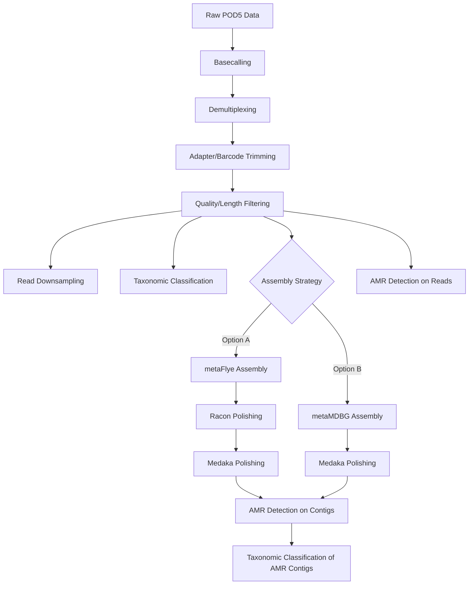

# DNA Shotgun Metagenomics Analysis Pipeline

This document provides a comprehensive workflow for DNA shotgun metagenomics analysis, from raw Nanopore data to AMR gene identification and taxonomic assignment.

## Table of Contents
1. [Prerequisites](#prerequisites)
2. [Workflow Overview](#workflow-overview)
3. [Pipeline Steps](#pipeline-steps)
   - [1. Basecalling](#1-basecalling-dorado)
   - [2. Demultiplexing](#2-demultiplexing-dorado)
   - [3. Adapter and Barcode Trimming](#3-adapter-and-barcode-trimming-porechop)
   - [4. Quality and Length Filtering](#4-quality-and-length-filtering-nanofilt)
   - [5. Read Downsampling for PCoA](#5-read-downsampling-for-pcoa-seqkit)
   - [6. Taxonomic Classification of Reads](#6-taxonomic-classification-of-reads-kraken2)
   - [7. Metagenome Assembly - Option A: metaFlye](#7-metagenome-assembly-option-a-metaflye)
   - [8. Assembly Polishing - Racon](#8-assembly-polishing-option-a-racon---3-rounds)
   - [9. Assembly Polishing - Medaka](#9-assembly-polishing-option-a-medaka-on-metaflyeracon-assembly)
   - [10. Metagenome Assembly - Option B: metaMDBG](#10-metagenome-assembly-option-b-metamdbg)
   - [11. Assembly Polishing - Medaka on metaMDBG](#11-assembly-polishing-option-b-medaka-on-metamdbg-assembly)
   - [12. Read Preparation for AMR Detection](#12-read-preparation-for-amr-detection)
   - [13. AMR Gene Detection on Reads](#13-amr-gene-detection-on-processed-reads)
   - [14. AMR Gene Detection on Contigs](#14-amr-gene-detection-on-assembled-contigs)
   - [15. Taxonomic Classification of AMR Contigs - DIAMOND](#15-taxonomic-classification-of-amr-carrying-contigs-diamond)
   - [16. Taxonomic Classification of AMR Contigs - Kraken2](#16-taxonomic-classification-of-amr-carrying-contigs-kraken2)
   - [17. Comparative Taxonomic Assignment](#17-comparative-taxonomic-assignment-of-amr-contigs)

## Prerequisites

- All necessary tools installed as per [`Installation_tutorial.md`](./Installation_tutorial.md)
- Raw POD5 data available
- Consult [`dna_shotgun_data_guide.md`](./dna_shotgun_data_guide.md) for sample-specific information

## Workflow Overview



## Pipeline Steps

### 1. Basecalling (Dorado)

Converts raw Nanopore signal data (POD5 files) into FASTQ sequences using Dorado v5.0.0 with super-accuracy mode.

```bash
#!/bin/bash
# Basecalling with Dorado v5.0.0

# Define variables
DORADO_BIN="/path/to/dorado"
CONFIG_FILE="/path/to/models/dna_r10.4.1_e8.2_400bps_sup@v5.0.0"
INPUT_POD5_DIR="/path/to/pod5_data"
OUTPUT_DIR="01_basecalled"
BASECALLED_FASTQ="${OUTPUT_DIR}/basecalled_all_samples.fastq"
KIT_NAME="SQK-RBK114-24"  # Rapid Barcoding Kit 114-24

# Create output directory
mkdir -p ${OUTPUT_DIR}

# Run basecalling
echo "[$(date)] Starting basecalling..."
${DORADO_BIN} basecaller \
    ${CONFIG_FILE} \
    ${INPUT_POD5_DIR} \
    --kit-name ${KIT_NAME} \
    --no-trim \
    --emit-fastq > ${BASECALLED_FASTQ}

# Check completion
if [ $? -eq 0 ]; then
    echo "[$(date)] Basecalling completed successfully"
    echo "Output: ${BASECALLED_FASTQ}"
else
    echo "[$(date)] ERROR: Basecalling failed"
    exit 1
fi
```

### 2. Demultiplexing (Dorado)

Separates basecalled reads by barcode.

```bash
#!/bin/bash
# Demultiplexing with Dorado

# Define variables
DORADO_BIN="/path/to/dorado"
BASECALLED_FASTQ="01_basecalled/basecalled_all_samples.fastq"
DEMUX_OUTPUT_DIR="02_demultiplexed"
KIT_NAME="SQK-RBK114-24"

# Create output directory
mkdir -p ${DEMUX_OUTPUT_DIR}

# Run demultiplexing
echo "[$(date)] Starting demultiplexing..."
${DORADO_BIN} demux \
    --output-dir ${DEMUX_OUTPUT_DIR} \
    --kit-name ${KIT_NAME} \
    ${BASECALLED_FASTQ} \
    --emit-fastq

# Check completion and list output files
if [ $? -eq 0 ]; then
    echo "[$(date)] Demultiplexing completed successfully"
    echo "Demultiplexed files:"
    ls -lh ${DEMUX_OUTPUT_DIR}/*.fastq
else
    echo "[$(date)] ERROR: Demultiplexing failed"
    exit 1
fi
```

### 3. Adapter and Barcode Trimming (Porechop)

Removes sequencing adapters and barcodes using Porechop v0.2.4.

```bash
#!/bin/bash
# Adapter trimming with Porechop v0.2.4

# Process all demultiplexed files
DEMUX_DIR="02_demultiplexed"
TRIMMED_DIR="03_trimmed"
THREADS=8

# Create output directory
mkdir -p ${TRIMMED_DIR}

# Process each barcode
for DEMUX_FILE in ${DEMUX_DIR}/barcode*.fastq; do
    BARCODE=$(basename ${DEMUX_FILE} .fastq)
    OUTPUT_FILE="${TRIMMED_DIR}/${BARCODE}.trimmed.fastq"
    
    echo "[$(date)] Processing ${BARCODE}..."
    
    porechop \
        -i ${DEMUX_FILE} \
        -o ${OUTPUT_FILE} \
        --threads ${THREADS} \
        --verbosity 1
    
    if [ $? -eq 0 ]; then
        echo "[$(date)] ${BARCODE} trimming completed"
    else
        echo "[$(date)] WARNING: ${BARCODE} trimming failed"
    fi
done
```

### 4. Quality and Length Filtering (NanoFilt)

Filters reads by length (minimum 100 bp) using NanoFilt v2.8.0.

```bash
#!/bin/bash
# Quality filtering with NanoFilt v2.8.0

# Process all trimmed files
TRIMMED_DIR="03_trimmed"
FILTERED_DIR="04_filtered"
MIN_LENGTH=100

# Create output directory
mkdir -p ${FILTERED_DIR}

# Process each trimmed file
for TRIMMED_FILE in ${TRIMMED_DIR}/*.trimmed.fastq; do
    BARCODE=$(basename ${TRIMMED_FILE} .trimmed.fastq)
    OUTPUT_FILE="${FILTERED_DIR}/${BARCODE}.filtered.fastq"
    
    echo "[$(date)] Filtering ${BARCODE}..."
    
    NanoFilt \
        --length ${MIN_LENGTH} \
        < ${TRIMMED_FILE} \
        > ${OUTPUT_FILE}
    
    # Report statistics
    if [ $? -eq 0 ]; then
        READS_BEFORE=$(grep -c "^@" ${TRIMMED_FILE})
        READS_AFTER=$(grep -c "^@" ${OUTPUT_FILE})
        echo "[$(date)] ${BARCODE}: ${READS_BEFORE} -> ${READS_AFTER} reads"
    fi
done
```

### 5. Read Downsampling for PCoA (Seqkit)

Randomly downsamples to 14,000 reads per sample for PCoA analysis using Seqkit v2.10.0.

```bash
#!/bin/bash
# Downsampling with Seqkit v2.10.0

# Process filtered files
FILTERED_DIR="04_filtered"
DOWNSAMPLED_DIR="05_downsampled_pcoa"
TARGET_READS=14000
RANDOM_SEED=11

# Create output directory
mkdir -p ${DOWNSAMPLED_DIR}

# Process each filtered file
for FILTERED_FILE in ${FILTERED_DIR}/*.filtered.fastq; do
    BARCODE=$(basename ${FILTERED_FILE} .filtered.fastq)
    OUTPUT_FILE="${DOWNSAMPLED_DIR}/${BARCODE}.14k.fastq"
    
    # Check read count
    READ_COUNT=$(seqkit stats -T ${FILTERED_FILE} | awk 'NR==2 {print $4}' | sed 's/,//g')
    
    if [ ${READ_COUNT} -ge ${TARGET_READS} ]; then
        echo "[$(date)] Downsampling ${BARCODE} (${READ_COUNT} reads)..."
        
        seqkit sample \
            -n ${TARGET_READS} \
            -s ${RANDOM_SEED} \
            ${FILTERED_FILE} \
            -o ${OUTPUT_FILE}
    else
        echo "[$(date)] WARNING: ${BARCODE} has only ${READ_COUNT} reads (< ${TARGET_READS}), excluding from PCoA"
    fi
done
```

### 6. Taxonomic Classification of Reads (Kraken2)

Performs taxonomic classification using Kraken2 v2.1.2 with nt_core database.

```bash
#!/bin/bash
# Taxonomic classification with Kraken2 v2.1.2

# Define variables
INPUT_DIR="05_downsampled_pcoa"  # Or "04_filtered" for full analysis
KRAKEN_DB="/path/to/kraken2_db/nt_core_May2025"
OUTPUT_DIR="06_kraken2_classification"
THREADS=16

# Create output directory
mkdir -p ${OUTPUT_DIR}

# Process each sample
for INPUT_FILE in ${INPUT_DIR}/*.fastq; do
    BARCODE=$(basename ${INPUT_FILE} .fastq | cut -d'.' -f1)
    OUTPUT_FILE="${OUTPUT_DIR}/${BARCODE}.kraken_output.txt"
    REPORT_FILE="${OUTPUT_DIR}/${BARCODE}.kraken_report.txt"
    
    echo "[$(date)] Running Kraken2 on ${BARCODE}..."
    
    kraken2 \
        --db ${KRAKEN_DB} \
        --threads ${THREADS} \
        --output ${OUTPUT_FILE} \
        --report ${REPORT_FILE} \
        --use-names \
        ${INPUT_FILE}
    
    if [ $? -eq 0 ]; then
        echo "[$(date)] ${BARCODE} classification completed"
    fi
done
```

### 7. Metagenome Assembly Option A: metaFlye

De novo assembly using metaFlye v2.9.6.

```bash
#!/bin/bash
# Assembly with metaFlye v2.9.6

# Process filtered reads
FILTERED_DIR="04_filtered"
ASSEMBLY_DIR="07_assembly_metaflye"
THREADS=16

# Create output directory
mkdir -p ${ASSEMBLY_DIR}

# Process each sample
for FILTERED_FILE in ${FILTERED_DIR}/*.filtered.fastq; do
    BARCODE=$(basename ${FILTERED_FILE} .filtered.fastq)
    OUTPUT_DIR="${ASSEMBLY_DIR}/${BARCODE}"
    
    echo "[$(date)] Assembling ${BARCODE} with metaFlye..."
    
    flye \
        --nano-hq ${FILTERED_FILE} \
        --out-dir ${OUTPUT_DIR} \
        --meta \
        --threads ${THREADS} \
        --min-overlap 3000
    
    if [ $? -eq 0 ]; then
        echo "[$(date)] ${BARCODE} assembly completed"
        # Report assembly statistics
        if [ -f "${OUTPUT_DIR}/assembly_info.txt" ]; then
            grep "Total length" "${OUTPUT_DIR}/assembly_info.txt"
        fi
    fi
done
```

### 8. Assembly Polishing Option A: Racon - 3 rounds

Polish metaFlye assemblies with Minimap2 v2.28 and Racon v1.5.

```bash
#!/bin/bash
# Polishing with Racon v1.5 (3 rounds)

# Define variables
FILTERED_DIR="04_filtered"
ASSEMBLY_DIR="07_assembly_metaflye"
POLISH_DIR="08_racon_polished"
THREADS=16
ROUNDS=3

# Create output directory
mkdir -p ${POLISH_DIR}

# Process each assembly
for SAMPLE_DIR in ${ASSEMBLY_DIR}/barcode*; do
    if [ -d "${SAMPLE_DIR}" ]; then
        BARCODE=$(basename ${SAMPLE_DIR})
        FILTERED_READS="${FILTERED_DIR}/${BARCODE}.filtered.fastq"
        INITIAL_ASSEMBLY="${SAMPLE_DIR}/assembly.fasta"
        SAMPLE_POLISH_DIR="${POLISH_DIR}/${BARCODE}"
        
        # Check if files exist
        if [ ! -f "${INITIAL_ASSEMBLY}" ] || [ ! -f "${FILTERED_READS}" ]; then
            echo "[$(date)] WARNING: Missing files for ${BARCODE}, skipping..."
            continue
        fi
        
        mkdir -p ${SAMPLE_POLISH_DIR}
        
        echo "[$(date)] Starting Racon polishing for ${BARCODE}..."
        
        # Copy initial assembly
        cp ${INITIAL_ASSEMBLY} "${SAMPLE_POLISH_DIR}/round0.fasta"
        
        # Perform polishing rounds
        for ROUND in $(seq 1 ${ROUNDS}); do
            echo "[$(date)] ${BARCODE} - Racon round ${ROUND}/${ROUNDS}..."
            
            PREV_ASSEMBLY="${SAMPLE_POLISH_DIR}/round$((ROUND-1)).fasta"
            CURR_ASSEMBLY="${SAMPLE_POLISH_DIR}/round${ROUND}.fasta"
            ALIGNMENT="${SAMPLE_POLISH_DIR}/round${ROUND}.sam"
            
            # Align reads to assembly
            minimap2 -ax map-ont \
                -t ${THREADS} \
                ${PREV_ASSEMBLY} \
                ${FILTERED_READS} > ${ALIGNMENT}
            
            # Polish with Racon
            racon -t ${THREADS} \
                ${FILTERED_READS} \
                ${ALIGNMENT} \
                ${PREV_ASSEMBLY} > ${CURR_ASSEMBLY}
            
            # Clean up
            rm ${ALIGNMENT}
        done
        
        # Create final polished assembly link
        ln -sf "round${ROUNDS}.fasta" "${SAMPLE
