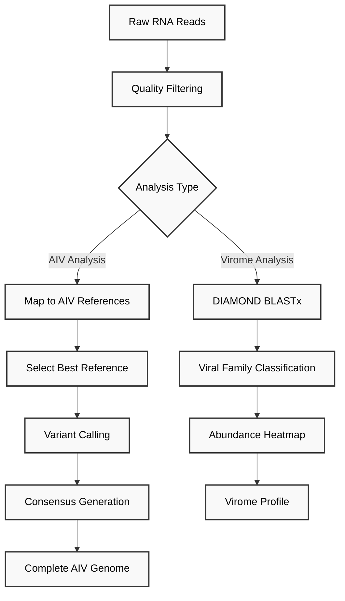

# Virus Analysis Pipeline for RNA Sequencing

This document provides the workflow for virus analysis from environmental RNA (eRNA) samples, including AIV whole-genome sequencing and virome taxonomic classification.

## Table of Contents
1. [Prerequisites](#prerequisites)
2. [Part A: AIV Whole-Genome Sequencing](#part-a-aiv-whole-genome-sequencing)
3. [Part B: Virome Taxonomic Classification](#part-b-virome-taxonomic-classification)

## Prerequisites

- Tools installed:
  - Dorado (for basecalling)
  - Minimap2 v2.28
  - SAMtools v1.17
  - BCFtools v1.17
  - DIAMOND v2.1.13
  - Clair3
  - filtlong
- Reference databases:
  - NCBI Influenza Virus Database (European sequences, as of 04/03/2023)
  - NCBI non-redundant protein database (NR, accessed May 2025)

## Data Preprocessing

### Basecalling with Dorado

Convert raw POD5 signal data to FASTQ sequences before virus analysis:

```bash
#!/bin/bash
# Basecalling RNA reads with Dorado

# Define variables
DORADO_BIN="/path/to/dorado"
MODEL="/path/to/models/rna004_130bps_sup_v5.0.0"  # RNA model
POD5_DIR="/path/to/pod5_data"
OUTPUT_DIR="basecalled_reads"

# Run basecalling
${DORADO_BIN} basecaller \
    ${MODEL} \
    ${POD5_DIR} \
    --emit-fastq > ${OUTPUT_DIR}/reads.fastq

echo "Basecalling complete. Output: ${OUTPUT_DIR}/reads.fastq"
# This FASTQ file is the input for the virus analysis pipeline
```



## Part A: AIV Whole-Genome Sequencing

AIV whole-genome sequencing analysis maps reads to reference genomes and generates consensus sequences for all eight viral segments.

### Complete AIV Analysis Script

```bash
#!/bin/bash
#SBATCH -p gpu_p
#SBATCH -q gpu_normal
#SBATCH --mem=128G
#SBATCH -t 24:00:00
#SBATCH --nice=10000
#SBATCH --gres=gpu:2
#SBATCH --job-name=influenza_all
#SBATCH -c 8
 
# Force a minimal, valid locale so filtlong (and other C++ tools) won't crash
export LANG=C
export LC_ALL=C
 
set -euo pipefail
 
if [ "$#" -ne 2 ]; then
  echo "Usage: $0 <READS.fastq> <OUTPUT_DIR>"
  exit 1
fi
 
READS=$1
OUTDIR=$2
 
# Hard-coded paths
DB_DIR="/home/haicu/albert.perlas/past/tfm/reference_segment"
CLAIR3_MODEL="/home/haicu/albert.perlas/ISIDORe/clair3_models/r1041_e82_400bps_sup_v500"
 
echo "[$(date)] Starting influenza pipeline"
echo "  Reads:     $READS"
echo "  Output:    $OUTDIR"
echo "  DB dir:    $DB_DIR"
echo "  Clair3:    $CLAIR3_MODEL"
 
# 1) Global filter
mkdir -p "$OUTDIR"
echo "[$(date)] Filtering reads (Q≥8, len≥150)..."
filtlong --min_mean_q 8 --min_length 150 \
  "$READS" > "$OUTDIR/filtered_reads.fastq"
 
# 2) Per-segment processing
segments=(PB2 PB1 PA HA NA NP M NS)
for seg in "${segments[@]}"; do
  echo "=================================================="
  echo " Segment: $seg"
  # find .fa file for this segment
  dbf=( "$DB_DIR"/*"${seg}"*.fa )
  if [ ! -f "${dbf[0]}" ]; then
    echo "  !! No .fa for $seg in $DB_DIR — skipping"
    continue
  fi
 
  seg_out="$OUTDIR/$seg"
  mkdir -p "$seg_out"
 
  # map to full DB
  echo "  Mapping filtered reads → full $seg DB..."
  minimap2 -ax map-ont "${dbf[0]}" \
    "$OUTDIR/filtered_reads.fastq" \
    | samtools view -b -o "$seg_out/mapped.bam" -
 
  echo "  Sorting & indexing mapped.bam..."
  samtools sort -o "$seg_out/mapped_sorted.bam" "$seg_out/mapped.bam"
  samtools index "$seg_out/mapped_sorted.bam"
 
  # best reference contig
  echo "  Picking best contig via idxstats..."
  samtools idxstats "$seg_out/mapped_sorted.bam" \
    > "$seg_out/idxstats.txt"
 
  # sum up all mapped‐read counts
  mapped_total=$(awk '{sum+=$3} END{print sum+0}' "$seg_out/idxstats.txt")
 
  if [ "$mapped_total" -eq 0 ]; then
    echo "  ⚠️  No reads mapped to segment $seg—skipping."
    continue
  fi
 
  #pick the best-covered contig
  best_ref=$(awk '{ if ($3>max){ max=$3; r=$1 } } END{ print r }' \
    "$seg_out/idxstats.txt")
  echo "    -> $best_ref"
 
  # extract that contig
  echo "  Extracting best reference FASTA..."
  samtools faidx "${dbf[0]}" "$best_ref" \
    > "$seg_out/best_reference.fasta"
 
  # build the .fai index
  echo "  Indexing best reference FASTA..."
  samtools faidx "$seg_out/best_reference.fasta"
 
  # subset & resort BAM
  echo "  Subsetting BAM to $best_ref..."
  samtools view -b -o "$seg_out/best_ref.bam" \
    "$seg_out/mapped_sorted.bam" "$best_ref"
  samtools sort -o "$seg_out/best_ref_sorted.bam" "$seg_out/best_ref.bam"
  samtools index "$seg_out/best_ref_sorted.bam"
 
  # require at least one primary alignment
  primary_count=$(samtools view -F0x100 -F0x800 -c "$seg_out/best_ref_sorted.bam")
  if [ "$primary_count" -eq 0 ]; then
    echo "  ⚠️  Only secondary/supplementary reads for $seg — skipping consensus."
    continue
  fi
 
  # Clair3 variant calling
  echo "  Running Clair3 on $seg..."
  run_clair3.sh \
    --bam_fn="$seg_out/best_ref_sorted.bam" \
    --ref_fn="$seg_out/best_reference.fasta" \
    --threads=8 \
    --platform="ont" \
    --snp_min_af=0.01 \
    --indel_min_af=0.01 \
    --model_path="$CLAIR3_MODEL" \
    --output="$seg_out/clair3" \
    --include_all_ctgs
 
  # normalize & index VCF
  echo "  Normalizing & indexing VCF..."
  bcftools view \
      "$seg_out/clair3/merge_output.vcf.gz" \
    > "$seg_out/variants.vcf"
  bgzip -c "$seg_out/variants.vcf" \
    > "$seg_out/variants.vcf.gz"
  bcftools index "$seg_out/variants.vcf.gz"
 
  #build a BED of zero‐coverage positions
  echo "  Building zero‐coverage mask..."
  ZERO_BED="$seg_out/zero_coverage.bed"
  samtools depth -a "$seg_out/best_ref_sorted.bam" \
    | awk '$3==0 { printf "%s\t%d\t%d\n", $1, $2-1, $2 }' \
    > "$ZERO_BED"
  touch "$ZERO_BED"
 
  #consensus—mask only those zero‐depth sites to N
  echo "  Building consensus (N only where depth=0)..."
  bcftools consensus \
    --mask "$ZERO_BED" \
    --fasta-ref "$seg_out/best_reference.fasta" \
    -o "$seg_out/consensus.fasta" \
    "$seg_out/variants.vcf.gz"
  sed -i "s/^>.*/>${seg}/" "$seg_out/consensus.fasta"
 
  echo "  [✓] Done $seg"
done
 
# concatenate all
echo "[$(date)] Concatenating all segment consensuses..."
cat "${OUTDIR}"/{PB2,PB1,PA,HA,NA,NP,M,NS}/consensus.fasta \
  > "$OUTDIR/influenza_all_segments_consensus.fasta" 2>/dev/null || true
 
echo "[$(date)] Pipeline finished. Results in $OUTDIR"
```

## Part B: Virome Taxonomic Classification

For the virome analysis, taxonomic classification was performed by translated alignment using DIAMOND BLASTx against the NCBI non-redundant protein database.

### 1. Prepare cDNA Reads

```bash
#!/bin/bash
# Prepare cDNA reads for virome analysis

CDNA_READS=$1  # Input cDNA FASTQ from RNA sequencing
OUTPUT_DIR=$2

mkdir -p ${OUTPUT_DIR}

# Quality filtering (Q≥7, length≥100)
filtlong --min_mean_q 7 --min_length 100 \
    ${CDNA_READS} > ${OUTPUT_DIR}/filtered_cdna.fastq

# Convert to FASTA for DIAMOND
seqkit fq2fa ${OUTPUT_DIR}/filtered_cdna.fastq > \
    ${OUTPUT_DIR}/filtered_cdna.fasta
```

### 2. DIAMOND BLASTx Analysis

```bash
#!/bin/bash
# Run DIAMOND BLASTx for viral classification

DIAMOND_DB="/path/to/diamond_nr_May2025"
INPUT_FASTA="${OUTPUT_DIR}/filtered_cdna.fasta"
THREADS=16

diamond blastx \
    --db ${DIAMOND_DB} \
    --query ${INPUT_FASTA} \
    --out ${OUTPUT_DIR}/diamond_results.tsv \
    --outfmt 6 qseqid sseqid pident length mismatch gapopen qstart qend sstart send evalue bitscore stitle \
    --max-target-seqs 5 \
    --id 80 \
    --threads ${THREADS} \
    --sensitive
```

### 3. Extract and Classify Viral Hits

```python
#!/usr/bin/env python3
# classify_viral_hits.py
import pandas as pd
import re

# Load DIAMOND results
df = pd.read_csv('diamond_results.tsv', sep='\t', 
                 names=['qseqid', 'sseqid', 'pident', 'length', 
                        'mismatch', 'gapopen', 'qstart', 'qend', 
                        'sstart', 'send', 'evalue', 'bitscore', 'stitle'])

# Filter for viral hits
viral_keywords = ['virus', 'viral', 'phage', 'viroid']
viral_pattern = '|'.join(viral_keywords)
viral_hits = df[df['stitle'].str.contains(viral_pattern, case=False, na=False)]

# Extract viral family from protein annotation
def extract_viral_family(title):
    # Common viral families
    families = ['Coronaviridae', 'Flaviviridae', 'Orthomyxoviridae', 
                'Paramyxoviridae', 'Picornaviridae', 'Reoviridae',
                'Retroviridae', 'Rhabdoviridae', 'Togaviridae',
                'Caliciviridae', 'Astroviridae', 'Hepeviridae']
    
    for family in families:
        if family.lower() in title.lower():
            return family
    
    # Try to extract from title
    match = re.search(r'(\w+viridae)', title, re.IGNORECASE)
    if match:
        return match.group(1)
    
    return 'Other_virus'

# Apply classification
viral_hits['viral_family'] = viral_hits['stitle'].apply(extract_viral_family)

# Count reads per viral family
family_counts = viral_hits.groupby('viral_family')['qseqid'].nunique()
family_counts.to_csv('viral_family_counts.tsv', sep='\t')

print(f"Total viral hits: {len(viral_hits)}")
print(f"Viral families detected: {len(family_counts)}")
```

### 4. Process Multiple Samples for Heatmap

```bash
#!/bin/bash
# Process multiple samples for virome analysis

SAMPLE_LIST="sample_list.txt"  # Format: sample_name<tab>fastq_path
DIAMOND_DB="/path/to/diamond_nr_May2025"

while IFS=$'\t' read -r SAMPLE_NAME FASTQ_PATH; do
    echo "Processing ${SAMPLE_NAME}..."
    
    SAMPLE_DIR="virome_analysis/${SAMPLE_NAME}"
    mkdir -p ${SAMPLE_DIR}
    
    # Filter reads
    filtlong --min_mean_q 7 --min_length 100 \
        ${FASTQ_PATH} > ${SAMPLE_DIR}/filtered.fastq
    
    # Convert to FASTA
    seqkit fq2fa ${SAMPLE_DIR}/filtered.fastq > ${SAMPLE_DIR}/filtered.fasta
    
    # DIAMOND analysis
    diamond blastx \
        --db ${DIAMOND_DB} \
        --query ${SAMPLE_DIR}/filtered.fasta \
        --out ${SAMPLE_DIR}/diamond_results.tsv \
        --outfmt 6 qseqid sseqid pident length mismatch gapopen qstart qend sstart send evalue bitscore stitle \
        --max-target-seqs 5 \
        --id 80 \
        --threads 16 \
        --sensitive
    
    # Classify viral hits
    cd ${SAMPLE_DIR}
    python3 ../../classify_viral_hits.py
    cd -
    
done < ${SAMPLE_LIST}
```

### 5. Generate Abundance Heatmap

```python
#!/usr/bin/env python3
# generate_viral_heatmap.py
import pandas as pd
import matplotlib.pyplot as plt
import seaborn as sns
from pathlib import Path
import numpy as np

# Load viral counts from all samples
abundance_data = []
for sample_dir in Path('virome_analysis').glob('*/'):
    counts_file = sample_dir / 'viral_family_counts.tsv'
    if counts_file.exists():
        df = pd.read_csv(counts_file, sep='\t', names=['viral_family', 'read_count'])
        df['sample'] = sample_dir.name
        abundance_data.append(df)

# Combine and create matrix
combined_df = pd.concat(abundance_data)
matrix = combined_df.pivot(index='sample', columns='viral_family', values='read_count').fillna(0)

# Calculate relative abundance (reads per million)
total_reads = matrix.sum(axis=1)
relative_abundance = matrix.div(total_reads, axis=0) * 1000000

# Log transform for visualization
log_abundance = np.log10(relative_abundance + 1)

# Create heatmap
plt.figure(figsize=(12, 8))
sns.clustermap(log_abundance.T, cmap='viridis', 
               cbar_kws={'label': 'log10(Reads per Million + 1)'})
plt.title('Viral Family Abundance Across Samples')
plt.tight_layout()
plt.savefig('viral_abundance_heatmap.pdf')
```
