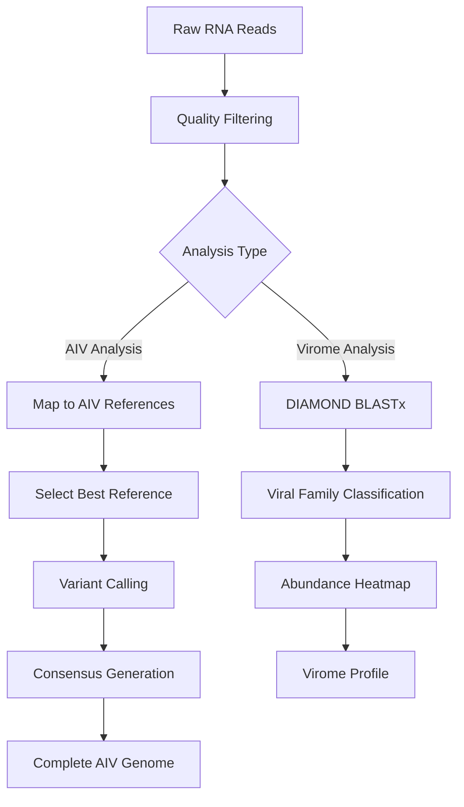

# Virus Analysis Pipeline for RNA Sequencing

This document provides a comprehensive workflow for virus analysis from environmental RNA (eRNA) samples, including AIV whole-genome sequencing and virome taxonomic classification.

## Table of Contents
1. [Prerequisites](#prerequisites)
2. [Workflow Overview](#workflow-overview)
3. [Pipeline Components](#pipeline-components)
   - [Part A: AIV Whole-Genome Sequencing](#part-a-aiv-whole-genome-sequencing)
   - [Part B: Virome Taxonomic Classification](#part-b-virome-taxonomic-classification)
4. [Detailed Pipeline Steps](#detailed-pipeline-steps)
5. [Helper Scripts](#helper-scripts)
6. [Quality Control](#quality-control)
7. [Troubleshooting](#troubleshooting)

## Prerequisites

- All necessary tools installed:
  - Minimap2 v2.28
  - SAMtools v1.17
  - BCFtools v1.17
  - DIAMOND v2.1.13
  - Clair3 (for variant calling)
  - filtlong (for read filtering)
- Reference databases:
  - NCBI Influenza Virus Database (European sequences, as of 04/03/2023)
  - NCBI non-redundant protein database (NR, accessed May 2025)
- Sufficient computational resources (GPU recommended for Clair3)

## Workflow Overview



## Pipeline Components

### Part A: AIV Whole-Genome Sequencing

Analyzes Avian Influenza Virus (AIV) sequences by mapping to reference genomes and generating consensus sequences for all eight viral segments.

### Part B: Virome Taxonomic Classification

Performs translated alignment of cDNA reads against protein databases to identify and quantify viral families present in samples.

## Detailed Pipeline Steps

### Part A: AIV Whole-Genome Sequencing

#### 1. Read Quality Filtering

```bash
#!/bin/bash
# Quality filter RNA reads for AIV analysis

# Define variables
INPUT_FASTQ=$1
OUTPUT_DIR=$2
MIN_QUALITY=8
MIN_LENGTH=150

# Create output directory
mkdir -p ${OUTPUT_DIR}

echo "[$(date)] Starting read filtering..."
echo "Input: ${INPUT_FASTQ}"
echo "Filters: Q≥${MIN_QUALITY}, length≥${MIN_LENGTH}bp"

# Filter reads using filtlong
filtlong \
    --min_mean_q ${MIN_QUALITY} \
    --min_length ${MIN_LENGTH} \
    ${INPUT_FASTQ} > ${OUTPUT_DIR}/filtered_reads.fastq

# Report statistics
if [ $? -eq 0 ]; then
    READS_BEFORE=$(grep -c "^@" ${INPUT_FASTQ})
    READS_AFTER=$(grep -c "^@" ${OUTPUT_DIR}/filtered_reads.fastq)
    echo "[$(date)] Filtering complete: ${READS_BEFORE} → ${READS_AFTER} reads"
else
    echo "[$(date)] ERROR: Filtering failed"
    exit 1
fi
```

#### 2. AIV Reference Database Preparation

```bash
#!/bin/bash
# Prepare AIV reference database for each segment

# Define variables
REFERENCE_DIR="/path/to/reference_segments"
SEGMENTS=(PB2 PB1 PA HA NA NP M NS)

echo "[$(date)] Preparing AIV reference database..."

# Download and prepare references from NCBI Influenza Database
for SEGMENT in "${SEGMENTS[@]}"; do
    echo "Processing segment: ${SEGMENT}"
    
    # Download European AIV sequences for segment (as of 04/03/2023)
    # This would typically involve NCBI EDirect tools or manual download
    # Example structure:
    # wget "https://www.ncbi.nlm.nih.gov/genomes/FLU/Database/nph-select.cgi?segment=${SEGMENT}&region=Europe"
    
    # Index reference file
    REF_FILE="${REFERENCE_DIR}/AIV_Europe_${SEGMENT}.fa"
    if [ -f "${REF_FILE}" ]; then
        samtools faidx ${REF_FILE}
        echo "  Indexed: ${REF_FILE}"
    else
        echo "  WARNING: Reference file not found for ${SEGMENT}"
    fi
done
```

#### 3. Segment-wise Mapping and Best Reference Selection

```bash
#!/bin/bash
# Map reads to each AIV segment and select best reference

# Define variables
FILTERED_READS="${OUTPUT_DIR}/filtered_reads.fastq"
REFERENCE_DIR="/path/to/reference_segments"
SEGMENTS=(PB2 PB1 PA HA NA NP M NS)
THREADS=8

# Process each segment
for SEGMENT in "${SEGMENTS[@]}"; do
    echo "=================================================="
    echo "[$(date)] Processing segment: ${SEGMENT}"
    
    # Find reference file for segment
    REF_FILE="${REFERENCE_DIR}/AIV_Europe_${SEGMENT}.fa"
    if [ ! -f "${REF_FILE}" ]; then
        echo "  WARNING: No reference for ${SEGMENT}, skipping..."
        continue
    fi
    
    SEGMENT_DIR="${OUTPUT_DIR}/${SEGMENT}"
    mkdir -p ${SEGMENT_DIR}
    
    # Initial mapping to all references for this segment
    echo "  Mapping reads to ${SEGMENT} references..."
    minimap2 -ax map-ont \
        -t ${THREADS} \
        ${REF_FILE} \
        ${FILTERED_READS} | \
    samtools view -b -o ${SEGMENT_DIR}/mapped.bam -
    
    # Sort and index
    echo "  Sorting and indexing..."
    samtools sort \
        -@ ${THREADS} \
        -o ${SEGMENT_DIR}/mapped_sorted.bam \
        ${SEGMENT_DIR}/mapped.bam
    samtools index ${SEGMENT_DIR}/mapped_sorted.bam
    
    # Get mapping statistics
    echo "  Calculating mapping statistics..."
    samtools idxstats ${SEGMENT_DIR}/mapped_sorted.bam > \
        ${SEGMENT_DIR}/idxstats.txt
    
    # Select best reference (most mapped reads)
    BEST_REF=$(awk '{if($3>max){max=$3; ref=$1}} END{print ref}' \
        ${SEGMENT_DIR}/idxstats.txt)
    MAPPED_COUNT=$(awk -v ref="${BEST_REF}" '$1==ref{print $3}' \
        ${SEGMENT_DIR}/idxstats.txt)
    
    echo "  Best reference: ${BEST_REF} (${MAPPED_COUNT} reads)"
    
    # Extract best reference sequence
    samtools faidx ${REF_FILE} ${BEST_REF} > \
        ${SEGMENT_DIR}/best_reference.fasta
    
    # Clean up
    rm ${SEGMENT_DIR}/mapped.bam
done
```

#### 4. Final Mapping and Variant Calling

```bash
#!/bin/bash
# Perform final mapping and variant calling with Clair3

# Define variables
CLAIR3_MODEL="/path/to/clair3_models/r1041_e82_400bps_sup_v500"
THREADS=8

for SEGMENT in "${SEGMENTS[@]}"; do
    SEGMENT_DIR="${OUTPUT_DIR}/${SEGMENT}"
    
    if [ ! -f "${SEGMENT_DIR}/best_reference.fasta" ]; then
        echo "Skipping ${SEGMENT}: no best reference"
        continue
    fi
    
    echo "[$(date)] Final processing for ${SEGMENT}..."
    
    # Re-map to best reference only
    echo "  Re-mapping to best reference..."
    minimap2 -ax map-ont \
        -t ${THREADS} \
        ${SEGMENT_DIR}/best_reference.fasta \
        ${FILTERED_READS} | \
    samtools view -b -F 0x100 -F 0x800 | \
    samtools sort -@ ${THREADS} -o ${SEGMENT_DIR}/best_ref_sorted.bam -
    
    samtools index ${SEGMENT_DIR}/best_ref_sorted.bam
    
    # Check if we have primary alignments
    PRIMARY_COUNT=$(samtools view -F 0x100 -F 0x800 -c \
        ${SEGMENT_DIR}/best_ref_sorted.bam)
    
    if [ ${PRIMARY_COUNT} -eq 0 ]; then
        echo "  WARNING: No primary alignments for ${SEGMENT}"
        continue
    fi
    
    # Run Clair3 variant calling
    echo "  Running Clair3 variant calling..."
    run_clair3.sh \
        --bam_fn="${SEGMENT_DIR}/best_ref_sorted.bam" \
        --ref_fn="${SEGMENT_DIR}/best_reference.fasta" \
        --threads=${THREADS} \
        --platform="ont" \
        --snp_min_af=0.01 \
        --indel_min_af=0.01 \
        --model_path="${CLAIR3_MODEL}" \
        --output="${SEGMENT_DIR}/clair3" \
        --include_all_ctgs
    
    # Process variants
    echo "  Processing variants..."
    bcftools view ${SEGMENT_DIR}/clair3/merge_output.vcf.gz > \
        ${SEGMENT_DIR}/variants.vcf
    bgzip -c ${SEGMENT_DIR}/variants.vcf > \
        ${SEGMENT_DIR}/variants.vcf.gz
    bcftools index ${SEGMENT_DIR}/variants.vcf.gz
done
```

#### 5. Consensus Sequence Generation

```bash
#!/bin/bash
# Generate consensus sequences with proper masking

for SEGMENT in "${SEGMENTS[@]}"; do
    SEGMENT_DIR="${OUTPUT_DIR}/${SEGMENT}"
    
    if [ ! -f "${SEGMENT_DIR}/variants.vcf.gz" ]; then
        echo "Skipping ${SEGMENT}: no variants"
        continue
    fi
    
    echo "[$(date)] Generating consensus for ${SEGMENT}..."
    
    # Create zero-coverage mask
    echo "  Creating coverage mask..."
    samtools depth -a ${SEGMENT_DIR}/best_ref_sorted.bam | \
    awk '$3==0 {printf "%s\t%d\t%d\n", $1, $2-1, $2}' > \
        ${SEGMENT_DIR}/zero_coverage.bed
    
    # Generate consensus with masking
    echo "  Building consensus sequence..."
    bcftools consensus \
        --mask ${SEGMENT_DIR}/zero_coverage.bed \
        --fasta-ref ${SEGMENT_DIR}/best_reference.fasta \
        -o ${SEGMENT_DIR}/consensus.fasta \
        ${SEGMENT_DIR}/variants.vcf.gz
    
    # Rename sequence header
    sed -i "s/^>.*/>AIV_${SEGMENT}/" ${SEGMENT_DIR}/consensus.fasta
    
    # Report coverage statistics
    AVG_DEPTH=$(samtools depth ${SEGMENT_DIR}/best_ref_sorted.bam | \
        awk '{sum+=$3; count++} END {print sum/count}')
    echo "  Average depth: ${AVG_DEPTH}"
done

# Concatenate all segments
echo "[$(date)] Concatenating all segment consensuses..."
cat ${OUTPUT_DIR}/{PB2,PB1,PA,HA,NA,NP,M,NS}/consensus.fasta > \
    ${OUTPUT_DIR}/AIV_complete_genome.fasta

echo "[$(date)] AIV genome assembly complete!"
```

### Part B: Virome Taxonomic Classification

#### 1. cDNA Read Preparation

```bash
#!/bin/bash
# Prepare cDNA reads for virome analysis

# Define variables
CDNA_READS=$1  # Input cDNA FASTQ from RNA sequencing
OUTPUT_DIR=$2
MIN_LENGTH=100
MIN_QUALITY=7

mkdir -p ${OUTPUT_DIR}

echo "[$(date)] Preparing cDNA reads for virome analysis..."

# Quality filtering
filtlong \
    --min_mean_q ${MIN_QUALITY} \
    --min_length ${MIN_LENGTH} \
    ${CDNA_READS} > ${OUTPUT_DIR}/filtered_cdna.fastq

# Convert to FASTA for DIAMOND
seqkit fq2fa ${OUTPUT_DIR}/filtered_cdna.fastq > \
    ${OUTPUT_DIR}/filtered_cdna.fasta

READ_COUNT=$(grep -c "^>" ${OUTPUT_DIR}/filtered_cdna.fasta)
echo "[$(date)] Prepared ${READ_COUNT} reads for analysis"
```

#### 2. DIAMOND BLASTx Analysis

```bash
#!/bin/bash
# Perform translated alignment against NR database

# Define variables
DIAMOND_DB="/path/to/diamond_nr_May2025"
THREADS=16
MIN_IDENTITY=80
MAX_TARGET_SEQS=5
EVALUE=1e-5

echo "[$(date)] Running DIAMOND BLASTx for viral classification..."

diamond blastx \
    --db ${DIAMOND_DB} \
    --query ${OUTPUT_DIR}/filtered_cdna.fasta \
    --out ${OUTPUT_DIR}/diamond_results.tsv \
    --outfmt 6 qseqid sseqid pident length mismatch gapopen qstart qend sstart send evalue bitscore stitle staxids \
    --max-target-seqs ${MAX_TARGET_SEQS} \
    --id ${MIN_IDENTITY} \
    --evalue ${EVALUE} \
    --threads ${THREADS} \
    --sensitive

echo "[$(date)] DIAMOND analysis complete"
```

#### 3. Viral Hit Extraction and Classification

```bash
#!/bin/bash
# Extract and classify viral hits

# Python script for viral classification
cat > ${OUTPUT_DIR}/classify_viral_hits.py << 'EOF'
#!/usr/bin/env python3
import pandas as pd
import re
from collections import defaultdict

# Load DIAMOND results
df = pd.read_csv('diamond_results.tsv', sep='\t', 
                 names=['qseqid', 'sseqid', 'pident', 'length', 
                        'mismatch', 'gapopen', 'qstart', 'qend', 
                        'sstart', 'send', 'evalue', 'bitscore', 
                        'stitle', 'staxids'])

# Filter for viral hits
viral_keywords = ['virus', 'viral', 'phage', 'viroid', 'satellite']
viral_pattern = '|'.join(viral_keywords)
viral_hits = df[df['stitle'].str.contains(viral_pattern, case=False, na=False)]

# Extract viral family information
def extract_viral_family(title):
    # Common viral family patterns
    families = ['Coronaviridae', 'Flaviviridae', 'Orthomyxoviridae', 
                'Paramyxoviridae', 'Picornaviridae', 'Reoviridae',
                'Retroviridae', 'Rhabdoviridae', 'Togaviridae',
                'Caliciviridae', 'Astroviridae', 'Hepeviridae',
                'Adenoviridae', 'Herpesviridae', 'Papillomaviridae',
                'Parvoviridae', 'Polyomaviridae', 'Poxviridae']
    
    for family in families:
        if family.lower() in title.lower():
            return family
    
    # Try to extract from taxonomic classification in title
    if 'family' in title.lower():
        match = re.search(r'(\w+viridae)', title, re.IGNORECASE)
                if match:
            return match.group(1)
    ```python
        if match:
            return match.group(1)
    
    # Generic classification based on keywords
    if 'coronavirus' in title.lower() or 'covid' in title.lower():
        return 'Coronaviridae'
    elif 'influenza' in title.lower() or 'flu' in title.lower():
        return 'Orthomyxoviridae'
    elif 'norovirus' in title.lower():
        return 'Caliciviridae'
    elif 'rotavirus' in title.lower():
        return 'Reoviridae'
    elif 'hepatitis' in title.lower():
        if 'hepatitis a' in title.lower():
            return 'Picornaviridae'
        elif 'hepatitis b' in title.lower():
            return 'Hepadnaviridae'
        elif 'hepatitis c' in title.lower():
            return 'Flaviviridae'
        elif 'hepatitis e' in title.lower():
            return 'Hepeviridae'
    elif 'phage' in title.lower():
        return 'Bacteriophage'
    else:
        return 'Other_virus'

# Apply family classification
viral_hits['viral_family'] = viral_hits['stitle'].apply(extract_viral_family)

# Count reads per viral family
family_counts = viral_hits.groupby('viral_family')['qseqid'].nunique().reset_index()
family_counts.columns = ['viral_family', 'read_count']

# Save results
viral_hits.to_csv('viral_hits_classified.tsv', sep='\t', index=False)
family_counts.to_csv('viral_family_counts.tsv', sep='\t', index=False)

print(f"Total viral hits: {len(viral_hits)}")
print(f"Viral families detected: {len(family_counts)}")
print("\nTop viral families:")
print(family_counts.sort_values('read_count', ascending=False).head(10))
EOF

# Run classification
python3 ${OUTPUT_DIR}/classify_viral_hits.py

echo "[$(date)] Viral classification complete"
```

#### 4. Multi-Sample Virome Analysis

```bash
#!/bin/bash
# Process multiple samples and create abundance matrix

# Define variables
SAMPLE_LIST="sample_list.txt"  # File containing sample names and paths
VIROME_OUTPUT_DIR="virome_analysis"
DIAMOND_DB="/path/to/diamond_nr_May2025"

mkdir -p ${VIROME_OUTPUT_DIR}

# Process each sample
while IFS=$'\t' read -r SAMPLE_NAME FASTQ_PATH; do
    echo "[$(date)] Processing sample: ${SAMPLE_NAME}"
    
    SAMPLE_DIR="${VIROME_OUTPUT_DIR}/${SAMPLE_NAME}"
    mkdir -p ${SAMPLE_DIR}
    
    # Filter reads
    filtlong --min_mean_q 7 --min_length 100 \
        ${FASTQ_PATH} > ${SAMPLE_DIR}/filtered.fastq
    
    # Convert to FASTA
    seqkit fq2fa ${SAMPLE_DIR}/filtered.fastq > ${SAMPLE_DIR}/filtered.fasta
    
    # DIAMOND analysis
    diamond blastx \
        --db ${DIAMOND_DB} \
        --query ${SAMPLE_DIR}/filtered.fasta \
        --out ${SAMPLE_DIR}/diamond_results.tsv \
        --outfmt 6 qseqid sseqid pident length mismatch gapopen qstart qend sstart send evalue bitscore stitle staxids \
        --max-target-seqs 5 \
        --id 80 \
        --evalue 1e-5 \
        --threads 16 \
        --sensitive
    
    # Classify viral hits
    cd ${SAMPLE_DIR}
    python3 ../classify_viral_hits.py
    cd - > /dev/null
    
    echo "[$(date)] Completed: ${SAMPLE_NAME}"
    
done < ${SAMPLE_LIST}

echo "[$(date)] All samples processed"
```

#### 5. Abundance Matrix Generation and Visualization

```python
#!/usr/bin/env python3
"""
Generate viral family abundance matrix and heatmap
"""

import pandas as pd
import numpy as np
import matplotlib.pyplot as plt
import seaborn as sns
from pathlib import Path
import argparse

def parse_arguments():
    parser = argparse.ArgumentParser(description='Generate viral abundance heatmap')
    parser.add_argument('--input-dir', required=True, help='Virome analysis directory')
    parser.add_argument('--sample-metadata', required=True, help='Sample metadata file')
    parser.add_argument('--output', required=True, help='Output directory')
    return parser.parse_args()

def load_viral_counts(input_dir):
    """Load viral family counts from all samples"""
    abundance_data = []
    
    for sample_dir in Path(input_dir).glob('*/'):
        sample_name = sample_dir.name
        counts_file = sample_dir / 'viral_family_counts.tsv'
        
        if counts_file.exists():
            df = pd.read_csv(counts_file, sep='\t')
            df['sample'] = sample_name
            abundance_data.append(df)
    
    if abundance_data:
        combined_df = pd.concat(abundance_data, ignore_index=True)
        return combined_df
    else:
        return pd.DataFrame()

def create_abundance_matrix(abundance_df):
    """Create abundance matrix for heatmap"""
    # Pivot to create sample x viral_family matrix
    matrix = abundance_df.pivot(index='sample', columns='viral_family', values='read_count')
    matrix = matrix.fillna(0)
    
    # Calculate relative abundances (reads per million)
    total_reads_per_sample = matrix.sum(axis=1)
    relative_abundance = matrix.div(total_reads_per_sample, axis=0) * 1000000
    
    return matrix, relative_abundance

def create_heatmap(abundance_matrix, metadata_df, output_dir):
    """Create abundance heatmap"""
    # Merge with metadata
    if metadata_df is not None:
        abundance_matrix = abundance_matrix.merge(
            metadata_df.set_index('sample'), 
            left_index=True, right_index=True, how='left'
        )
        
        # Sort by sample type if available
        if 'sample_type' in abundance_matrix.columns:
            abundance_matrix = abundance_matrix.sort_values('sample_type')
            sample_types = abundance_matrix['sample_type']
            abundance_matrix = abundance_matrix.drop('sample_type', axis=1)
        else:
            sample_types = None
    else:
        sample_types = None
    
    # Filter out low-abundance families (< 0.1% in any sample)
    abundance_matrix = abundance_matrix.loc[:, (abundance_matrix > 0.1).any()]
    
    # Log transform for better visualization
    log_abundance = np.log10(abundance_matrix + 1)
    
    # Create heatmap
    plt.figure(figsize=(12, 8))
    
    # Create color annotation for sample types
    if sample_types is not None:
        type_colors = {'anthropogenic': 'red', 'natural': 'blue', 'control': 'gray'}
        row_colors = [type_colors.get(t, 'black') for t in sample_types]
    else:
        row_colors = None
    
    # Generate heatmap
    sns.clustermap(
        log_abundance.T,  # Transpose so families are rows
        cmap='viridis',
        figsize=(12, 10),
        row_cluster=True,
        col_cluster=True,
        col_colors=row_colors,
        cbar_kws={'label': 'log10(Reads per Million + 1)'},
        linewidths=0.5
    )
    
    plt.suptitle('Viral Family Abundance Across Samples', y=0.98)
    plt.tight_layout()
    plt.savefig(f'{output_dir}/viral_abundance_heatmap.png', dpi=300, bbox_inches='tight')
    plt.savefig(f'{output_dir}/viral_abundance_heatmap.pdf', bbox_inches='tight')
    
    # Save abundance matrix
    abundance_matrix.to_csv(f'{output_dir}/viral_abundance_matrix.tsv', sep='\t')
    log_abundance.to_csv(f'{output_dir}/viral_abundance_log_transformed.tsv', sep='\t')

def generate_summary_stats(abundance_df, output_dir):
    """Generate summary statistics"""
    stats = {
        'total_samples': abundance_df['sample'].nunique(),
        'total_viral_families': abundance_df['viral_family'].nunique(),
        'total_viral_reads': abundance_df['read_count'].sum(),
        'avg_reads_per_sample': abundance_df.groupby('sample')['read_count'].sum().mean(),
        'top_families': abundance_df.groupby('viral_family')['read_count'].sum().sort_values(ascending=False).head(10)
    }
    
    # Save summary
    with open(f'{output_dir}/virome_summary.txt', 'w') as f:
        f.write("Virome Analysis Summary\n")
        f.write("======================\n\n")
        f.write(f"Total samples analyzed: {stats['total_samples']}\n")
        f.write(f"Viral families detected: {stats['total_viral_families']}\n")
        f.write(f"Total viral reads: {stats['total_viral_reads']:,}\n")
        f.write(f"Average viral reads per sample: {stats['avg_reads_per_sample']:.1f}\n\n")
        f.write("Top 10 viral families by read count:\n")
        for family, count in stats['top_families'].items():
            f.write(f"  {family}: {count:,} reads\n")

def main():
    args = parse_arguments()
    
    # Create output directory
    Path(args.output).mkdir(parents=True, exist_ok=True)
    
    # Load data
    print("Loading viral abundance data...")
    abundance_df = load_viral_counts(args.input_dir)
    
    if abundance_df.empty:
        print("No viral abundance data found!")
        return
    
    # Load metadata if available
    metadata_df = None
    if Path(args.sample_metadata).exists():
        metadata_df = pd.read_csv(args.sample_metadata)
    
    # Create abundance matrix
    print("Creating abundance matrix...")
    raw_matrix, relative_matrix = create_abundance_matrix(abundance_df)
    
    # Generate heatmap
    print("Generating heatmap...")
    create_heatmap(relative_matrix, metadata_df, args.output)
    
    # Generate summary statistics
    print("Generating summary statistics...")
    generate_summary_stats(abundance_df, args.output)
    
    print(f"Analysis complete! Results saved to: {args.output}")

if __name__ == '__main__':
    main()
```

### Complete AIV Analysis Script (Enhanced)

```bash
#!/bin/bash
#SBATCH -p gpu_p
#SBATCH -q gpu_normal
#SBATCH --mem=128G
#SBATCH -t 24:00:00
#SBATCH --nice=10000
#SBATCH --gres=gpu:2
#SBATCH --job-name=aiv_analysis
#SBATCH -c 8

# Enhanced AIV analysis script with better error handling and logging

# Force minimal locale
export LANG=C
export LC_ALL=C

set -euo pipefail

# Function for logging
log_message() {
    echo "[$(date '+%Y-%m-%d %H:%M:%S')] $1" | tee -a "${OUTDIR}/aiv_analysis.log"
}

# Function to check step completion
check_step() {
    if [ $? -ne 0 ]; then
        log_message "ERROR: $1 failed"
        exit 1
    else
        log_message "SUCCESS: $1 completed"
    fi
}

# Validate input arguments
if [ "$#" -ne 2 ]; then
    echo "Usage: $0 <READS.fastq> <OUTPUT_DIR>"
    echo "Example: $0 sample_001.fastq results/sample_001"
    exit 1
fi

READS=$1
OUTDIR=$2

# Validate input file
if [ ! -f "${READS}" ]; then
    echo "ERROR: Input file ${READS} not found"
    exit 1
fi

# Hard-coded paths (adjust as needed)
DB_DIR="/home/haicu/albert.perlas/past/tfm/reference_segment"
CLAIR3_MODEL="/home/haicu/albert.perlas/ISIDORe/clair3_models/r1041_e82_400bps_sup_v500"

# Create output directory and log file
mkdir -p "${OUTDIR}"
touch "${OUTDIR}/aiv_analysis.log"

log_message "Starting AIV analysis pipeline"
log_message "Input reads: ${READS}"
log_message "Output directory: ${OUTDIR}"
log_message "Reference database: ${DB_DIR}"
log_message "Clair3 model: ${CLAIR3_MODEL}"

# Step 1: Quality filtering
log_message "Step 1: Quality filtering (Q≥8, length≥150bp)"
filtlong --min_mean_q 8 --min_length 150 \
    "${READS}" > "${OUTDIR}/filtered_reads.fastq"
check_step "Quality filtering"

# Report filtering statistics
READS_BEFORE=$(grep -c "^@" "${READS}")
READS_AFTER=$(grep -c "^@" "${OUTDIR}/filtered_reads.fastq")
log_message "Filtering results: ${READS_BEFORE} → ${READS_AFTER} reads (${READS_AFTER}/${READS_BEFORE} = $(echo "scale=2; ${READS_AFTER}*100/${READS_BEFORE}" | bc)%)"

# Step 2: Process each AIV segment
segments=(PB2 PB1 PA HA NA NP M NS)
successful_segments=()

for seg in "${segments[@]}"; do
    log_message "=================================================="
    log_message "Processing segment: ${seg}"
    
    # Find reference database for this segment
    dbf=("${DB_DIR}"/*"${seg}"*.fa)
    if [ ! -f "${dbf[0]}" ]; then
        log_message "WARNING: No reference database found for ${seg}, skipping"
        continue
    fi
    
    seg_out="${OUTDIR}/${seg}"
    mkdir -p "${seg_out}"
    
    # Initial mapping to all references
    log_message "Mapping filtered reads to ${seg} reference database"
    minimap2 -ax map-ont "${dbf[0]}" \
        "${OUTDIR}/filtered_reads.fastq" | \
    samtools view -b -o "${seg_out}/mapped.bam" -
    check_step "Initial mapping for ${seg}"
    
    # Sort and index
    log_message "Sorting and indexing BAM file"
    samtools sort -o "${seg_out}/mapped_sorted.bam" "${seg_out}/mapped.bam"
    samtools index "${seg_out}/mapped_sorted.bam"
    check_step "BAM sorting and indexing for ${seg}"
    
    # Get mapping statistics
    log_message "Calculating mapping statistics"
    samtools idxstats "${seg_out}/mapped_sorted.bam" > "${seg_out}/idxstats.txt"
    
    # Check if any reads mapped
    mapped_total=$(awk '{sum+=$3} END{print sum+0}' "${seg_out}/idxstats.txt")
    if [ "${mapped_total}" -eq 0 ]; then
        log_message "WARNING: No reads mapped to segment ${seg}, skipping"
        continue
    fi
    
```bash
    # Select best reference
    best_ref=$(awk '{if($3>max){max=$3; ref=$1}} END{print ref}' "${seg_out}/idxstats.txt")
    best_count=$(awk -v ref="${best_ref}" '$1==ref{print $3}' "${seg_out}/idxstats.txt")
    log_message "Best reference: ${best_ref} (${best_count} reads mapped)"
    
    # Extract best reference sequence
    log_message "Extracting best reference sequence"
    samtools faidx "${dbf[0]}" "${best_ref}" > "${seg_out}/best_reference.fasta"
    samtools faidx "${seg_out}/best_reference.fasta"
    check_step "Reference extraction for ${seg}"
    
    # Re-map to best reference only
    log_message "Re-mapping to best reference"
    samtools view -b -o "${seg_out}/best_ref.bam" \
        "${seg_out}/mapped_sorted.bam" "${best_ref}"
    samtools sort -o "${seg_out}/best_ref_sorted.bam" "${seg_out}/best_ref.bam"
    samtools index "${seg_out}/best_ref_sorted.bam"
    check_step "Final mapping for ${seg}"
    
    # Check for primary alignments
    primary_count=$(samtools view -F0x100 -F0x800 -c "${seg_out}/best_ref_sorted.bam")
    if [ "${primary_count}" -eq 0 ]; then
        log_message "WARNING: No primary alignments for ${seg}, skipping consensus generation"
        continue
    fi
    
    log_message "Primary alignments: ${primary_count}"
    
    # Calculate coverage statistics
    log_message "Calculating coverage statistics"
    samtools depth -a "${seg_out}/best_ref_sorted.bam" > "${seg_out}/coverage.txt"
    avg_depth=$(awk '{sum+=$3; count++} END {if(count>0) print sum/count; else print 0}' "${seg_out}/coverage.txt")
    max_depth=$(awk '{if($3>max) max=$3} END {print max+0}' "${seg_out}/coverage.txt")
    zero_positions=$(awk '$3==0' "${seg_out}/coverage.txt" | wc -l)
    total_positions=$(wc -l < "${seg_out}/coverage.txt")
    coverage_breadth=$(echo "scale=2; (${total_positions}-${zero_positions})*100/${total_positions}" | bc)
    
    log_message "Coverage stats - Average: ${avg_depth}x, Max: ${max_depth}x, Breadth: ${coverage_breadth}%"
    
    # Skip consensus if coverage is too low
    if (( $(echo "${avg_depth} < 5" | bc -l) )); then
        log_message "WARNING: Average coverage too low (${avg_depth}x < 5x), skipping consensus for ${seg}"
        continue
    fi
    
    # Variant calling with Clair3
    log_message "Running Clair3 variant calling"
    run_clair3.sh \
        --bam_fn="${seg_out}/best_ref_sorted.bam" \
        --ref_fn="${seg_out}/best_reference.fasta" \
        --threads=8 \
        --platform="ont" \
        --snp_min_af=0.01 \
        --indel_min_af=0.01 \
        --model_path="${CLAIR3_MODEL}" \
        --output="${seg_out}/clair3" \
        --include_all_ctgs
    check_step "Variant calling for ${seg}"
    
    # Process variants
    log_message "Processing variants"
    bcftools view "${seg_out}/clair3/merge_output.vcf.gz" > "${seg_out}/variants.vcf"
    bgzip -c "${seg_out}/variants.vcf" > "${seg_out}/variants.vcf.gz"
    bcftools index "${seg_out}/variants.vcf.gz"
    check_step "Variant processing for ${seg}"
    
    # Count variants
    variant_count=$(bcftools view -H "${seg_out}/variants.vcf.gz" | wc -l)
    log_message "Variants detected: ${variant_count}"
    
    # Create zero-coverage mask
    log_message "Creating coverage mask"
    awk '$3==0 {printf "%s\t%d\t%d\n", $1, $2-1, $2}' "${seg_out}/coverage.txt" > "${seg_out}/zero_coverage.bed"
    
    # Generate consensus sequence
    log_message "Generating consensus sequence"
    bcftools consensus \
        --mask "${seg_out}/zero_coverage.bed" \
        --fasta-ref "${seg_out}/best_reference.fasta" \
        -o "${seg_out}/consensus.fasta" \
        "${seg_out}/variants.vcf.gz"
    check_step "Consensus generation for ${seg}"
    
    # Rename sequence header with metadata
    ref_length=$(samtools faidx "${seg_out}/best_reference.fasta" | cut -f2)
    sed -i "s/^>.*/>AIV_${seg}_cov${avg_depth}x_len${ref_length}bp/" "${seg_out}/consensus.fasta"
    
    # Clean up intermediate files
    rm -f "${seg_out}/mapped.bam" "${seg_out}/best_ref.bam"
    
    successful_segments+=("${seg}")
    log_message "Successfully completed ${seg}"
done

# Step 3: Concatenate successful segments
log_message "=================================================="
log_message "Finalizing analysis"

if [ ${#successful_segments[@]} -eq 0 ]; then
    log_message "ERROR: No segments were successfully processed"
    exit 1
fi

log_message "Successfully processed segments: ${successful_segments[*]}"

# Concatenate consensus sequences
log_message "Concatenating consensus sequences"
> "${OUTDIR}/AIV_complete_genome.fasta"
for seg in "${successful_segments[@]}"; do
    if [ -f "${OUTDIR}/${seg}/consensus.fasta" ]; then
        cat "${OUTDIR}/${seg}/consensus.fasta" >> "${OUTDIR}/AIV_complete_genome.fasta"
    fi
done

# Generate summary report
log_message "Generating summary report"
cat > "${OUTDIR}/analysis_summary.txt" << EOF
AIV Analysis Summary Report
===========================
Generated: $(date)
Input file: ${READS}
Output directory: ${OUTDIR}

Processing Results:
- Total segments attempted: ${#segments[@]}
- Successfully processed: ${#successful_segments[@]}
- Success rate: $(echo "scale=1; ${#successful_segments[@]}*100/${#segments[@]}" | bc)%

Successful segments: ${successful_segments[*]}

Coverage Summary:
EOF

# Add coverage details for each successful segment
for seg in "${successful_segments[@]}"; do
    if [ -f "${OUTDIR}/${seg}/coverage.txt" ]; then
        avg_depth=$(awk '{sum+=$3; count++} END {if(count>0) print sum/count; else print 0}' "${OUTDIR}/${seg}/coverage.txt")
        echo "- ${seg}: ${avg_depth}x average coverage" >> "${OUTDIR}/analysis_summary.txt"
    fi
done

# Calculate total genome coverage
total_length=0
covered_length=0
for seg in "${successful_segments[@]}"; do
    if [ -f "${OUTDIR}/${seg}/best_reference.fasta" ]; then
        seg_length=$(samtools faidx "${OUTDIR}/${seg}/best_reference.fasta" | cut -f2)
        total_length=$((total_length + seg_length))
        
        if [ -f "${OUTDIR}/${seg}/coverage.txt" ]; then
            seg_covered=$(awk '$3>0' "${OUTDIR}/${seg}/coverage.txt" | wc -l)
            covered_length=$((covered_length + seg_covered))
        fi
    fi
done

if [ ${total_length} -gt 0 ]; then
    genome_coverage=$(echo "scale=1; ${covered_length}*100/${total_length}" | bc)
    echo "" >> "${OUTDIR}/analysis_summary.txt"
    echo "Overall genome coverage: ${genome_coverage}% (${covered_length}/${total_length} bp)" >> "${OUTDIR}/analysis_summary.txt"
fi

log_message "Analysis complete!"
log_message "Summary report: ${OUTDIR}/analysis_summary.txt"
log_message "Complete genome: ${OUTDIR}/AIV_complete_genome.fasta"

# Final validation
if [ -s "${OUTDIR}/AIV_complete_genome.fasta" ]; then
    seq_count=$(grep -c "^>" "${OUTDIR}/AIV_complete_genome.fasta")
    log_message "Final genome contains ${seq_count} segments"
else
    log_message "WARNING: No complete genome generated"
fi
```

### Batch Processing Script

```bash
#!/bin/bash
# Batch process multiple samples for virus analysis

# Configuration
SAMPLE_LIST="samples.txt"  # Format: sample_name<tab>fastq_path<tab>analysis_type
OUTPUT_BASE_DIR="virus_analysis_results"
THREADS_PER_JOB=8
MAX_CONCURRENT_JOBS=4

# Create output directory
mkdir -p ${OUTPUT_BASE_DIR}

# Function to process AIV sample
process_aiv_sample() {
    local sample_name=$1
    local fastq_path=$2
    local output_dir="${OUTPUT_BASE_DIR}/AIV/${sample_name}"
    
    echo "[$(date)] Starting AIV analysis for ${sample_name}"
    
    # Submit SLURM job or run directly
    if command -v sbatch &> /dev/null; then
        sbatch --job-name="aiv_${sample_name}" \
               --output="${output_dir}/slurm_%j.out" \
               --error="${output_dir}/slurm_%j.err" \
               aiv_analysis.sh "${fastq_path}" "${output_dir}"
    else
        # Run directly
        bash aiv_analysis.sh "${fastq_path}" "${output_dir}"
    fi
}

# Function to process virome sample
process_virome_sample() {
    local sample_name=$1
    local fastq_path=$2
    local output_dir="${OUTPUT_BASE_DIR}/virome/${sample_name}"
    
    echo "[$(date)] Starting virome analysis for ${sample_name}"
    mkdir -p ${output_dir}
    
    # Run virome analysis
    bash virome_analysis.sh "${fastq_path}" "${output_dir}"
}

# Read sample list and process
job_count=0
while IFS=$'\t' read -r sample_name fastq_path analysis_type; do
    # Skip header or empty lines
    if [[ ${sample_name} == "sample_name" ]] || [[ -z ${sample_name} ]]; then
        continue
    fi
    
    # Validate input file
    if [ ! -f "${fastq_path}" ]; then
        echo "WARNING: File not found: ${fastq_path}, skipping ${sample_name}"
        continue
    fi
    
    # Process based on analysis type
    case ${analysis_type} in
        "AIV"|"aiv")
            process_aiv_sample "${sample_name}" "${fastq_path}" &
            ;;
        "virome"|"VIROME")
            process_virome_sample "${sample_name}" "${fastq_path}" &
            ;;
        "both"|"BOTH")
            process_aiv_sample "${sample_name}" "${fastq_path}" &
            process_virome_sample "${sample_name}" "${fastq_path}" &
            ;;
        *)
            echo "WARNING: Unknown analysis type '${analysis_type}' for ${sample_name}"
            continue
            ;;
    esac
    
    job_count=$((job_count + 1))
    
    # Limit concurrent jobs
    if [ $((job_count % MAX_CONCURRENT_JOBS)) -eq 0 ]; then
        wait  # Wait for current batch to complete
    fi
    
done < ${SAMPLE_LIST}

# Wait for all remaining jobs
wait

echo "[$(date)] All samples processed"
```

### Virome Analysis Script

```bash
#!/bin/bash
# Standalone virome analysis script

# Input validation
if [ "$#" -ne 2 ]; then
    echo "Usage: $0 <CDNA_READS.fastq> <OUTPUT_DIR>"
    exit 1
fi

CDNA_READS=$1
OUTPUT_DIR=$2

# Configuration
DIAMOND_DB="/path/to/diamond_nr_May2025"
THREADS=16
MIN_IDENTITY=80
MIN_LENGTH=100
MIN_QUALITY=7

# Create output directory
mkdir -p ${OUTPUT_DIR}

# Logging function
log_message() {
    echo "[$(date '+%Y-%m-%d %H:%M:%S')] $1" | tee -a "${OUTPUT_DIR}/virome_analysis.log"
}

log_message "Starting virome analysis"
log_message "Input: ${CDNA_READS}"
log_message "Output: ${OUTPUT_DIR}"

# Step 1: Quality filtering
log_message "Step 1: Quality filtering"
filtlong \
    --min_mean_q ${MIN_QUALITY} \
    --min_length ${MIN_LENGTH} \
    ${CDNA_READS} > ${OUTPUT_DIR}/filtered_cdna.fastq

# Convert to FASTA
seqkit fq2fa ${OUTPUT_DIR}/filtered_cdna.fastq > ${OUTPUT_DIR}/filtered_cdna.fasta

READ_COUNT=$(grep -c "^>" ${OUTPUT_DIR}/filtered_cdna.fasta)
log_message "Filtered reads: ${READ_COUNT}"

# Step 2: DIAMOND BLASTx
log_message "Step 2: DIAMOND BLASTx analysis"
diamond blastx \
    --db ${DIAMOND_DB} \
    --query ${OUTPUT_DIR}/filtered_cdna.fasta \
    --out ${OUTPUT_DIR}/diamond_results.tsv \
    --outfmt 6 qseqid sseqid pident length mismatch gapopen qstart qend sstart send evalue bitscore stitle staxids \
    --max-target-seqs 5 \
    --id ${MIN_IDENTITY} \
    --evalue 1e-5 \
    --threads ${THREADS} \
    --sensitive

# Step 3: Viral classification
log_message "Step 3: Viral hit classification"
cd ${OUTPUT_DIR}
python3 classify_viral_hits.py
cd - > /dev/null

# Step 4: Generate summary
log_message "Step 4: Generating summary"
if [ -f "${OUTPUT_DIR}/viral_family_counts.tsv" ]; then
    total_viral_reads=$(awk 'NR>1 {sum+=$2} END {print sum+0}' ${OUTPUT_DIR}/viral_family_counts.tsv)
    viral_families=$(awk 'NR>1' ${OUTPUT_DIR}/viral_family_counts.tsv | wc -l)
    
    log_message "Analysis complete:"
    log_message "- Total viral reads: ${total_viral_reads}"
    log_message "- Viral families detected: ${viral_families}"
else
    log_message "WARNING: No viral families detected"
fi

log_message "Virome analysis finished"
```

### Quality Control and Validation

```bash
#!/bin/bash
# Quality control script for virus analysis

QC_OUTPUT_DIR="qc_reports"
mkdir -p ${QC_OUTPUT_DIR}

# Function to validate AIV analysis
validate_aiv_analysis() {
    local sample_dir=$1
    local sample_name=$(basename ${sample_dir})
    local qc_file="${QC_OUTPUT_DIR}/${sample_name}_aiv_qc.txt"
    
    echo "AIV Analysis QC Report for ${sample_name}" > ${qc_file}
    ```bash
    echo "Generated: $(date)" >> ${qc_file}
    echo "========================================" >> ${qc_file}
    
    # Check if analysis completed
    if [ -f "${sample_dir}/analysis_summary.txt" ]; then
        echo "✓ Analysis completed successfully" >> ${qc_file}
        
        # Extract key metrics
        successful_segments=$(grep "Successfully processed:" "${sample_dir}/analysis_summary.txt" | cut -d: -f2)
        echo "Successful segments:${successful_segments}" >> ${qc_file}
        
        # Check genome completeness
        if [ -f "${sample_dir}/AIV_complete_genome.fasta" ]; then
            segment_count=$(grep -c "^>" "${sample_dir}/AIV_complete_genome.fasta")
            echo "Genome segments recovered: ${segment_count}/8" >> ${qc_file}
            
            if [ ${segment_count} -eq 8 ]; then
                echo "✓ Complete genome recovered" >> ${qc_file}
            elif [ ${segment_count} -ge 6 ]; then
                echo "⚠ Partial genome recovered (≥6 segments)" >> ${qc_file}
            else
                echo "✗ Incomplete genome (<6 segments)" >> ${qc_file}
            fi
        else
            echo "✗ No genome file generated" >> ${qc_file}
        fi
        
        # Coverage analysis
        echo "" >> ${qc_file}
        echo "Coverage Analysis:" >> ${qc_file}
        for seg in PB2 PB1 PA HA NA NP M NS; do
            if [ -f "${sample_dir}/${seg}/coverage.txt" ]; then
                avg_cov=$(awk '{sum+=$3; count++} END {if(count>0) printf "%.1f", sum/count; else print "0"}' "${sample_dir}/${seg}/coverage.txt")
                breadth=$(awk '$3>0' "${sample_dir}/${seg}/coverage.txt" | wc -l)
                total=$(wc -l < "${sample_dir}/${seg}/coverage.txt")
                breadth_pct=$(echo "scale=1; ${breadth}*100/${total}" | bc)
                echo "  ${seg}: ${avg_cov}x average, ${breadth_pct}% breadth" >> ${qc_file}
            else
                echo "  ${seg}: No coverage data" >> ${qc_file}
            fi
        done
        
    else
        echo "✗ Analysis failed or incomplete" >> ${qc_file}
    fi
    
    # Check for common issues
    echo "" >> ${qc_file}
    echo "Potential Issues:" >> ${qc_file}
    
    # Low read count
    if [ -f "${sample_dir}/filtered_reads.fastq" ]; then
        read_count=$(grep -c "^@" "${sample_dir}/filtered_reads.fastq")
        if [ ${read_count} -lt 1000 ]; then
            echo "⚠ Low read count: ${read_count} reads" >> ${qc_file}
        fi
    fi
    
    # Failed segments
    failed_segments=()
    for seg in PB2 PB1 PA HA NA NP M NS; do
        if [ ! -f "${sample_dir}/${seg}/consensus.fasta" ]; then
            failed_segments+=(${seg})
        fi
    done
    
    if [ ${#failed_segments[@]} -gt 0 ]; then
        echo "⚠ Failed segments: ${failed_segments[*]}" >> ${qc_file}
    fi
}

# Function to validate virome analysis
validate_virome_analysis() {
    local sample_dir=$1
    local sample_name=$(basename ${sample_dir})
    local qc_file="${QC_OUTPUT_DIR}/${sample_name}_virome_qc.txt"
    
    echo "Virome Analysis QC Report for ${sample_name}" > ${qc_file}
    echo "Generated: $(date)" >> ${qc_file}
    echo "===========================================" >> ${qc_file}
    
    # Check analysis completion
    if [ -f "${sample_dir}/viral_family_counts.tsv" ]; then
        echo "✓ Analysis completed successfully" >> ${qc_file}
        
        # Extract metrics
        total_viral_reads=$(awk 'NR>1 {sum+=$2} END {print sum+0}' "${sample_dir}/viral_family_counts.tsv")
        viral_families=$(awk 'NR>1' "${sample_dir}/viral_family_counts.tsv" | wc -l)
        
        echo "Total viral reads: ${total_viral_reads}" >> ${qc_file}
        echo "Viral families detected: ${viral_families}" >> ${qc_file}
        
        # Top viral families
        echo "" >> ${qc_file}
        echo "Top 5 viral families:" >> ${qc_file}
        awk 'NR>1' "${sample_dir}/viral_family_counts.tsv" | \
        sort -k2,2nr | head -5 | \
        while read family count; do
            echo "  ${family}: ${count} reads" >> ${qc_file}
        done
        
        # Quality assessment
        if [ ${total_viral_reads} -eq 0 ]; then
            echo "✗ No viral reads detected" >> ${qc_file}
        elif [ ${total_viral_reads} -lt 100 ]; then
            echo "⚠ Low viral read count" >> ${qc_file}
        else
            echo "✓ Good viral detection" >> ${qc_file}
        fi
        
    else
        echo "✗ Analysis failed or incomplete" >> ${qc_file}
    fi
    
    # Check input quality
    if [ -f "${sample_dir}/filtered_cdna.fasta" ]; then
        input_reads=$(grep -c "^>" "${sample_dir}/filtered_cdna.fasta")
        echo "Input reads processed: ${input_reads}" >> ${qc_file}
        
        if [ ${input_reads} -lt 10000 ]; then
            echo "⚠ Low input read count may affect sensitivity" >> ${qc_file}
        fi
    fi
}

# Run QC on all samples
echo "[$(date)] Running quality control checks..."

# AIV samples
if [ -d "virus_analysis_results/AIV" ]; then
    for sample_dir in virus_analysis_results/AIV/*; do
        if [ -d "${sample_dir}" ]; then
            echo "Validating AIV analysis: $(basename ${sample_dir})"
            validate_aiv_analysis "${sample_dir}"
        fi
    done
fi

# Virome samples
if [ -d "virus_analysis_results/virome" ]; then
    for sample_dir in virus_analysis_results/virome/*; do
        if [ -d "${sample_dir}" ]; then
            echo "Validating virome analysis: $(basename ${sample_dir})"
            validate_virome_analysis "${sample_dir}"
        fi
    done
fi

echo "[$(date)] QC reports generated in ${QC_OUTPUT_DIR}/"
```

### Comprehensive Results Summary Script

```python
#!/usr/bin/env python3
"""
Generate comprehensive summary report for virus analysis
"""

import pandas as pd
import numpy as np
import matplotlib.pyplot as plt
import seaborn as sns
from pathlib import Path
import argparse
import json
from datetime import datetime

def parse_arguments():
    parser = argparse.ArgumentParser(description='Generate virus analysis summary')
    parser.add_argument('--results-dir', required=True, help='Results directory')
    parser.add_argument('--output', required=True, help='Output directory')
    parser.add_argument('--metadata', help='Sample metadata file')
    return parser.parse_args()

def parse_aiv_results(results_dir):
    """Parse AIV analysis results"""
    aiv_results = []
    aiv_dir = Path(results_dir) / 'AIV'
    
    if not aiv_dir.exists():
        return pd.DataFrame()
    
    for sample_dir in aiv_dir.iterdir():
        if sample_dir.is_dir():
            sample_name = sample_dir.name
            result = {'sample': sample_name}
            
            # Parse summary file
            summary_file = sample_dir / 'analysis_summary.txt'
            if summary_file.exists():
                with open(summary_file, 'r') as f:
                    content = f.read()
                
                # Extract successful segments
                if 'Successful segments:' in content:
                    segments_line = [line for line in content.split('\n') 
                                   if 'Successful segments:' in line][0]
                    segments = segments_line.split(':')[1].strip().split()
                    result['successful_segments'] = len(segments)
                    result['segments_list'] = ','.join(segments)
                else:
                    result['successful_segments'] = 0
                    result['segments_list'] = ''
                
                # Extract coverage info
                coverage_data = {}
                for line in content.split('\n'):
                    if ':' in line and 'average coverage' in line:
                        parts = line.split(':')
                        if len(parts) >= 2:
                            segment = parts[0].strip('- ')
                            coverage = parts[1].replace('x average coverage', '').strip()
                            try:
                                coverage_data[segment] = float(coverage)
                            except ValueError:
                                pass
                
                result['avg_coverage'] = np.mean(list(coverage_data.values())) if coverage_data else 0
                result['coverage_data'] = json.dumps(coverage_data)
            
            # Check for complete genome
            genome_file = sample_dir / 'AIV_complete_genome.fasta'
            if genome_file.exists():
                with open(genome_file, 'r') as f:
                    result['genome_segments'] = f.read().count('>')
            else:
                result['genome_segments'] = 0
            
            aiv_results.append(result)
    
    return pd.DataFrame(aiv_results)

def parse_virome_results(results_dir):
    """Parse virome analysis results"""
    virome_results = []
    virome_dir = Path(results_dir) / 'virome'
    
    if not virome_dir.exists():
        return pd.DataFrame()
    
    for sample_dir in virome_dir.iterdir():
        if sample_dir.is_dir():
            sample_name = sample_dir.name
            result = {'sample': sample_name}
            
            # Parse viral family counts
            counts_file = sample_dir / 'viral_family_counts.tsv'
            if counts_file.exists():
                df = pd.read_csv(counts_file, sep='\t')
                result['total_viral_reads'] = df['read_count'].sum()
                result['viral_families'] = len(df)
                result['top_family'] = df.loc[df['read_count'].idxmax(), 'viral_family'] if len(df) > 0 else 'None'
                result['top_family_reads'] = df['read_count'].max() if len(df) > 0 else 0
            else:
                result['total_viral_reads'] = 0
                result['viral_families'] = 0
                result['top_family'] = 'None'
                result['top_family_reads'] = 0
            
            virome_results.append(result)
    
    return pd.DataFrame(virome_results)

def create_aiv_summary_plots(aiv_df, output_dir):
    """Create AIV summary plots"""
    if aiv_df.empty:
        return
    
    fig, axes = plt.subplots(2, 2, figsize=(15, 12))
    
    # Segment recovery success
    ax1 = axes[0, 0]
    segment_counts = aiv_df['successful_segments'].value_counts().sort_index()
    ax1.bar(segment_counts.index, segment_counts.values)
    ax1.set_xlabel('Number of Segments Recovered')
    ax1.set_ylabel('Number of Samples')
    ax1.set_title('AIV Segment Recovery Distribution')
    ax1.set_xticks(range(0, 9))
    
    # Coverage distribution
    ax2 = axes[0, 1]
    ax2.hist(aiv_df['avg_coverage'], bins=20, edgecolor='black')
    ax2.set_xlabel('Average Coverage (x)')
    ax2.set_ylabel('Number of Samples')
    ax2.set_title('Coverage Distribution')
    ax2.axvline(x=10, color='red', linestyle='--', label='10x threshold')
    ax2.legend()
    
    # Success rate by sample
    ax3 = axes[1, 0]
    success_rate = aiv_df['successful_segments'] / 8 * 100
    ax3.bar(range(len(success_rate)), success_rate.sort_values(ascending=False))
    ax3.set_xlabel('Sample Index')
    ax3.set_ylabel('Success Rate (%)')
    ax3.set_title('Segment Recovery Success Rate by Sample')
    ax3.axhline(y=75, color='red', linestyle='--', label='75% threshold')
    ax3.legend()
    
    # Genome completeness
    ax4 = axes[1, 1]
    completeness_categories = ['Complete (8/8)', 'Near-complete (6-7/8)', 
                              'Partial (3-5/8)', 'Poor (<3/8)']
    counts = [
        sum(aiv_df['successful_segments'] == 8),
        sum((aiv_df['successful_segments'] >= 6) & (aiv_df['successful_segments'] < 8)),
        sum((aiv_df['successful_segments'] >= 3) & (aiv_df['successful_segments'] < 6)),
        sum(aiv_df['successful_segments'] < 3)
    ]
    colors = ['green', 'orange', 'yellow', 'red']
    ax4.pie(counts, labels=completeness_categories, colors=colors, autopct='%1.1f%%')
    ax4.set_title('Genome Completeness Distribution')
    
    plt.tight_layout()
    plt.savefig(f'{output_dir}/aiv_summary_plots.png', dpi=300, bbox_inches='tight')
    plt.savefig(f'{output_dir}/aiv_summary_plots.pdf', bbox_inches='tight')
    plt.close()

def create_virome_summary_plots(virome_df, output_dir):
    """Create virome summary plots"""
    if virome_df.empty:
        return
    
    fig, axes = plt.subplots(2, 2, figsize=(15, 12))
    
    # Viral read distribution
    ax1 = axes[0, 0]
    ax1.hist(virome_df['total_viral_reads'], bins=20, edgecolor='black')
    ax1.set_xlabel('Total Viral Reads')
    ax1.set_ylabel('Number of Samples')
    ax1.set_title('Viral Read Count Distribution')
    ax1.set_yscale('log')
    
    # Viral family diversity
    ax2 = axes[0, 1]
    ax2.hist(virome_df['viral_families'], bins=range(0, virome_df['viral_families'].max()+2), 
             edgecolor='black')
    ax2.set_xlabel('Number of Viral Families')
    ax2.set_ylabel('Number of Samples')
    ax2.set_title('Viral Family Diversity')
    
    # Top viral families
    ax3 = axes[1, 0]
    top_families = virome_df['top_family'].value_counts().head(10)
    ax3.barh(range(len(top_families)), top_families.values)
```python
    ax3.set_yticks(range(len(top_families)))
    ax3.set_yticklabels(top_families.index)
    ax3.set_xlabel('Number of Samples')
    ax3.set_title('Most Abundant Viral Families Across Samples')
    
    # Viral detection success
    ax4 = axes[1, 1]
    detection_categories = ['High (>1000 reads)', 'Medium (100-1000 reads)', 
                           'Low (1-99 reads)', 'None (0 reads)']
    counts = [
        sum(virome_df['total_viral_reads'] > 1000),
        sum((virome_df['total_viral_reads'] >= 100) & (virome_df['total_viral_reads'] <= 1000)),
        sum((virome_df['total_viral_reads'] >= 1) & (virome_df['total_viral_reads'] < 100)),
        sum(virome_df['total_viral_reads'] == 0)
    ]
    colors = ['darkgreen', 'green', 'orange', 'red']
    ax4.pie(counts, labels=detection_categories, colors=colors, autopct='%1.1f%%')
    ax4.set_title('Viral Detection Success')
    
    plt.tight_layout()
    plt.savefig(f'{output_dir}/virome_summary_plots.png', dpi=300, bbox_inches='tight')
    plt.savefig(f'{output_dir}/virome_summary_plots.pdf', bbox_inches='tight')
    plt.close()

def generate_html_report(aiv_df, virome_df, output_dir, metadata_df=None):
    """Generate comprehensive HTML report"""
    
    # Calculate summary statistics
    aiv_stats = {}
    if not aiv_df.empty:
        aiv_stats = {
            'total_samples': len(aiv_df),
            'complete_genomes': sum(aiv_df['successful_segments'] == 8),
            'partial_genomes': sum(aiv_df['successful_segments'] >= 6),
            'avg_coverage': aiv_df['avg_coverage'].mean(),
            'success_rate': (aiv_df['successful_segments'] / 8).mean() * 100
        }
    
    virome_stats = {}
    if not virome_df.empty:
        virome_stats = {
            'total_samples': len(virome_df),
            'samples_with_virus': sum(virome_df['total_viral_reads'] > 0),
            'total_viral_reads': virome_df['total_viral_reads'].sum(),
            'avg_families_per_sample': virome_df['viral_families'].mean(),
            'detection_rate': (virome_df['total_viral_reads'] > 0).mean() * 100
        }
    
    html_template = f"""
    <!DOCTYPE html>
    <html>
    <head>
        <title>Virus Analysis Summary Report</title>
        <style>
            body {{ font-family: Arial, sans-serif; margin: 40px; }}
            .header {{ background-color: #f0f8ff; padding: 20px; border-radius: 10px; }}
            .section {{ margin: 30px 0; }}
            .stats-grid {{ display: grid; grid-template-columns: repeat(auto-fit, minmax(250px, 1fr)); gap: 20px; }}
            .stat-card {{ 
                background: #f9f9f9; 
                padding: 15px; 
                border-radius: 8px; 
                border-left: 4px solid #007bff;
            }}
            .success {{ border-left-color: #28a745; }}
            .warning {{ border-left-color: #ffc107; }}
            .danger {{ border-left-color: #dc3545; }}
            table {{ border-collapse: collapse; width: 100%; margin: 20px 0; }}
            th, td {{ border: 1px solid #ddd; padding: 8px; text-align: left; }}
            th {{ background-color: #f2f2f2; }}
            .plot-container {{ text-align: center; margin: 20px 0; }}
            .plot-container img {{ max-width: 100%; height: auto; }}
        </style>
    </head>
    <body>
        <div class="header">
            <h1>Virus Analysis Summary Report</h1>
            <p>Generated: {datetime.now().strftime('%Y-%m-%d %H:%M:%S')}</p>
            <p>Analysis includes AIV whole-genome sequencing and virome taxonomic classification</p>
        </div>
        
        <div class="section">
            <h2>Executive Summary</h2>
            <div class="stats-grid">
    """
    
    # Add AIV statistics
    if aiv_stats:
        html_template += f"""
                <div class="stat-card success">
                    <h3>AIV Analysis</h3>
                    <ul>
                        <li>Samples processed: {aiv_stats['total_samples']}</li>
                        <li>Complete genomes: {aiv_stats['complete_genomes']}</li>
                        <li>Partial genomes (≥6 segments): {aiv_stats['partial_genomes']}</li>
                        <li>Average coverage: {aiv_stats['avg_coverage']:.1f}x</li>
                        <li>Overall success rate: {aiv_stats['success_rate']:.1f}%</li>
                    </ul>
                </div>
        """
    
    # Add virome statistics
    if virome_stats:
        html_template += f"""
                <div class="stat-card success">
                    <h3>Virome Analysis</h3>
                    <ul>
                        <li>Samples processed: {virome_stats['total_samples']}</li>
                        <li>Samples with viral hits: {virome_stats['samples_with_virus']}</li>
                        <li>Total viral reads: {virome_stats['total_viral_reads']:,}</li>
                        <li>Avg families per sample: {virome_stats['avg_families_per_sample']:.1f}</li>
                        <li>Detection rate: {virome_stats['detection_rate']:.1f}%</li>
                    </ul>
                </div>
        """
    
    html_template += """
            </div>
        </div>
    """
    
    # Add AIV results section
    if not aiv_df.empty:
        html_template += """
        <div class="section">
            <h2>AIV Analysis Results</h2>
            <div class="plot-container">
                
            </div>
            
            <h3>Sample Details</h3>
            <table>
                <tr>
                    <th>Sample</th>
                    <th>Segments Recovered</th>
                    <th>Success Rate</th>
                    <th>Average Coverage</th>
                    <th>Status</th>
                </tr>
        """
        
        for _, row in aiv_df.iterrows():
            success_rate = (row['successful_segments'] / 8) * 100
            status = "Complete" if row['successful_segments'] == 8 else \
                    "Partial" if row['successful_segments'] >= 6 else \
                    "Poor" if row['successful_segments'] >= 3 else "Failed"
            
            html_template += f"""
                <tr>
                    <td>{row['sample']}</td>
                    <td>{row['successful_segments']}/8</td>
                    <td>{success_rate:.1f}%</td>
                    <td>{row['avg_coverage']:.1f}x</td>
                    <td>{status}</td>
                </tr>
            """
        
        html_template += """
            </table>
        </div>
        """
    
    # Add virome results section
    if not virome_df.empty:
        html_template += """
        <div class="section">
            <h2>Virome Analysis Results</h2>
            <div class="plot-container">
                
            </div>
            
            <h3>Sample Details</h3>
            <table>
                <tr>
                    <th>Sample</th>
                    <th>Viral Reads</th>
                    <th>Viral Families</th>
                    <th>Top Family</th>
                    <th>Top Family Reads</th>
                </tr>
        """
        
        for _, row in virome_df.iterrows():
            html_template += f"""
                <tr>
                    <td>{row['sample']}</td>
                    <td>{row['total_viral_reads']:,}</td>
                    <td>{row['viral_families']}</td>
                    <td>{row['top_family']}</td>
                    <td>{row['top_family_reads']:,}</td>
                </tr>
            """
        
        html_template += """
            </table>
        </div>
        """
    
    # Add methods section
    html_template += """
        <div class="section">
            <h2>Methods Summary</h2>
            <h3>AIV Whole-Genome Sequencing</h3>
            <ul>
                <li>Quality filtering: Q≥8, length≥150bp using filtlong</li>
                <li>Reference mapping: Minimap2 v2.28 with -ax map-ont</li>
                <li>Reference database: NCBI Influenza Virus Database (European sequences, 04/03/2023)</li>
                <li>Variant calling: Clair3 with ONT model</li>
                <li>Consensus generation: BCFtools with zero-coverage masking</li>
            </ul>
            
            <h3>Virome Taxonomic Classification</h3>
            <ul>
                <li>Quality filtering: Q≥7, length≥100bp using filtlong</li>
                <li>Translated alignment: DIAMOND BLASTx v2.1.13</li>
                <li>Database: NCBI non-redundant protein database (May 2025)</li>
                <li>Identity threshold: ≥80%</li>
                <li>Classification: Viral family assignment based on protein annotations</li>
            </ul>
        </div>
        
        <div class="section">
            <h2>Quality Control Notes</h2>
            <ul>
                <li>AIV samples with <5x average coverage may have unreliable consensus sequences</li>
                <li>Virome samples with <100 viral reads may have limited sensitivity</li>
                <li>Complete AIV genomes require all 8 segments (PB2, PB1, PA, HA, NA, NP, M, NS)</li>
                <li>Viral family classification depends on protein database annotations</li>
            </ul>
        </div>
        
        <footer style="margin-top: 50px; padding-top: 20px; border-top: 1px solid #ccc;">
            <p><em>Report generated by virus analysis pipeline</em></p>
        </footer>
    </body>
    </html>
    """
    
    # Save HTML report
    with open(f'{output_dir}/virus_analysis_report.html', 'w') as f:
        f.write(html_template)

def main():
    args = parse_arguments()
    
    # Create output directory
    Path(args.output).mkdir(parents=True, exist_ok=True)
    
    # Load metadata if available
    metadata_df = None
    if args.metadata and Path(args.metadata).exists():
        metadata_df = pd.read_csv(args.metadata)
    
    # Parse results
    print("Parsing AIV results...")
    aiv_df = parse_aiv_results(args.results_dir)
    
    print("Parsing virome results...")
    virome_df = parse_virome_results(args.results_dir)
    
    # Create plots
    if not aiv_df.empty:
        print("Creating AIV summary plots...")
        create_aiv_summary_plots(aiv_df, args.output)
    
    if not virome_df.empty:
        print("Creating virome summary plots...")
        create_virome_summary_plots(virome_df, args.output)
    
    # Generate HTML report
    print("Generating HTML report...")
    generate_html_report(aiv_df, virome_df, args.output, metadata_df)
    
    # Save data tables
    if not aiv_df.empty:
        aiv_df.to_csv(f'{args.output}/aiv_results_summary.tsv', sep='\t', index=False)
    
    if not virome_df.empty:
        virome_df.to_csv(f'{args.output}/virome_results_summary.tsv', sep='\t', index=False)
    
    print(f"Summary report generated: {args.output}/virus_analysis_report.html")

if __name__ == '__main__':
    main()
```

### Master Pipeline Script

```bash
#!/bin/bash
# Master script for complete virus analysis pipeline

# Configuration
PIPELINE_DIR="$(cd "$(dirname "${BASH_SOURCE[0]}")" && pwd)"
CONFIG_FILE="${PIPELINE_DIR}/virus_config.yaml"
SAMPLE_LIST="${PIPELINE_DIR}/samples.txt"

# Default parameters
THREADS=16
MEMORY="128G"
TIME_LIMIT="24:00:00"

# Function to display usage
usage() {
    cat << EOF
Usage: $0 [OPTIONS]

Options:
    -s, --samples FILE      Sample list file (required)
    -o, --output DIR        Output directory (default: virus_results)
    -t, --threads INT       Number of threads (default: 16)
    -m, --memory STR        Memory limit (default: 128G)
    -h, --help              Show this help message

Sample list format (tab-separated):
sample_name    fastq_path    analysis_type    sample_type
sample_001     /path/to/reads.fastq    AIV    environmental
sample_002     /path/to/reads.fastq    virome    clinical
sample_003     /path/to/reads.fastq    both    control

Analysis types: AIV, virome, both
EOF
}

# Parse command line arguments
while [[ $# -gt 0 ]]; do
    case $1 in
        -s|--samples)
            SAMPLE_LIST="$2"
            shift 2
            ;;
        -o|--output)
            OUTPUT_DIR="$2"
            shift 2
            ;;
        -t|--threads)
            THREADS="$2"
            shift 2
            ;;
        -m|--memory)
            MEMORY="$2"
            shift 2
            ;;
        -h|--help)
            usage
            exit 0
            ;;
        *)
            echo "Unknown option: $1"
            usage
            exit 1
            ;;
    esac
done

# Set default output directory
OUTPUT_DIR="${OUTPUT_DIR:-virus_results}"

# Validate inputs
if [ ! -f "${SAMPLE_LIST}" ]; then
    echo "ERROR: Sample list file not found: ${SAMPLE_LIST}"
    exit 1
fi

# Create output directory structure
mkdir -p "${OUTPUT_DIR}"/{AIV,virome,logs,qc_reports}

# Set up logging
LOG_FILE="${OUTPUT_DIR}/logs/pipeline_$(date +%Y%m%d_%H%M%S).log"
exec 1> >(tee -a "${LOG_FILE}")
exec 2> >(tee -a "${LOG_FILE}" >&2)

echo "[$(date)] Starting virus analysis pipeline"
echo "Sample list: ${SAMPLE_LIST}"
echo "Output directory: ${OUTPUT_DIR}"
```bash
echo "Threads: ${THREADS}"
echo "Memory: ${MEMORY}"

# Export environment variables
export THREADS
export MEMORY
export OUTPUT_DIR
export PIPELINE_DIR

# Step 1: Validate sample list and prepare jobs
echo "[$(date)] Step 1: Validating sample list and preparing jobs"
python3 "${PIPELINE_DIR}/validate_samples.py" \
    --sample-list "${SAMPLE_LIST}" \
    --output "${OUTPUT_DIR}/validated_samples.txt"

if [ $? -ne 0 ]; then
    echo "ERROR: Sample validation failed"
    exit 1
fi

# Step 2: Submit analysis jobs
echo "[$(date)] Step 2: Submitting analysis jobs"
job_ids=()

while IFS=$'\t' read -r sample_name fastq_path analysis_type sample_type; do
    # Skip header
    if [[ ${sample_name} == "sample_name" ]]; then
        continue
    fi
    
    echo "Processing: ${sample_name} (${analysis_type})"
    
    case ${analysis_type} in
        "AIV"|"aiv")
            job_id=$(sbatch \
                --job-name="aiv_${sample_name}" \
                --output="${OUTPUT_DIR}/logs/aiv_${sample_name}_%j.out" \
                --error="${OUTPUT_DIR}/logs/aiv_${sample_name}_%j.err" \
                --mem=${MEMORY} \
                --time=${TIME_LIMIT} \
                --cpus-per-task=${THREADS} \
                "${PIPELINE_DIR}/aiv_analysis.sh" \
                "${fastq_path}" \
                "${OUTPUT_DIR}/AIV/${sample_name}" | \
                awk '{print $4}')
            job_ids+=("${job_id}")
            ;;
            
        "virome"|"VIROME")
            job_id=$(sbatch \
                --job-name="virome_${sample_name}" \
                --output="${OUTPUT_DIR}/logs/virome_${sample_name}_%j.out" \
                --error="${OUTPUT_DIR}/logs/virome_${sample_name}_%j.err" \
                --mem=${MEMORY} \
                --time=${TIME_LIMIT} \
                --cpus-per-task=${THREADS} \
                "${PIPELINE_DIR}/virome_analysis.sh" \
                "${fastq_path}" \
                "${OUTPUT_DIR}/virome/${sample_name}" | \
                awk '{print $4}')
            job_ids+=("${job_id}")
            ;;
            
        "both"|"BOTH")
            # Submit both AIV and virome jobs
            aiv_job_id=$(sbatch \
                --job-name="aiv_${sample_name}" \
                --output="${OUTPUT_DIR}/logs/aiv_${sample_name}_%j.out" \
                --error="${OUTPUT_DIR}/logs/aiv_${sample_name}_%j.err" \
                --mem=${MEMORY} \
                --time=${TIME_LIMIT} \
                --cpus-per-task=${THREADS} \
                "${PIPELINE_DIR}/aiv_analysis.sh" \
                "${fastq_path}" \
                "${OUTPUT_DIR}/AIV/${sample_name}" | \
                awk '{print $4}')
            
            virome_job_id=$(sbatch \
                --job-name="virome_${sample_name}" \
                --output="${OUTPUT_DIR}/logs/virome_${sample_name}_%j.out" \
                --error="${OUTPUT_DIR}/logs/virome_${sample_name}_%j.err" \
                --mem=${MEMORY} \
                --time=${TIME_LIMIT} \
                --cpus-per-task=${THREADS} \
                "${PIPELINE_DIR}/virome_analysis.sh" \
                "${fastq_path}" \
                "${OUTPUT_DIR}/virome/${sample_name}" | \
                awk '{print $4}')
            
            job_ids+=("${aiv_job_id}" "${virome_job_id}")
            ;;
            
        *)
            echo "WARNING: Unknown analysis type '${analysis_type}' for ${sample_name}"
            ;;
    esac
    
done < "${OUTPUT_DIR}/validated_samples.txt"

echo "[$(date)] Submitted ${#job_ids[@]} jobs"

# Step 3: Wait for jobs to complete
if [ ${#job_ids[@]} -gt 0 ]; then
    echo "[$(date)] Step 3: Waiting for jobs to complete..."
    
    # Create dependency string for final processing
    dependency_string=$(IFS=:; echo "${job_ids[*]}")
    
    # Submit QC and summary job
    summary_job_id=$(sbatch \
        --job-name="virus_summary" \
        --dependency=afterany:${dependency_string} \
        --output="${OUTPUT_DIR}/logs/summary_%j.out" \
        --error="${OUTPUT_DIR}/logs/summary_%j.err" \
        --mem=32G \
        --time=02:00:00 \
        --cpus-per-task=4 \
        "${PIPELINE_DIR}/generate_final_report.sh" \
        "${OUTPUT_DIR}" | \
        awk '{print $4}')
    
    echo "[$(date)] Summary job submitted: ${summary_job_id}"
    echo "[$(date)] Pipeline jobs submitted. Monitor with: squeue -u \$USER"
else
    echo "[$(date)] No jobs submitted. Running summary directly..."
    bash "${PIPELINE_DIR}/generate_final_report.sh" "${OUTPUT_DIR}"
fi

echo "[$(date)] Pipeline submission complete"
```

### Sample Validation Script

```python
#!/usr/bin/env python3
"""
Validate sample list and prepare for analysis
"""

import pandas as pd
import argparse
from pathlib import Path
import sys

def parse_arguments():
    parser = argparse.ArgumentParser(description='Validate sample list')
    parser.add_argument('--sample-list', required=True, help='Input sample list')
    parser.add_argument('--output', required=True, help='Output validated sample list')
    return parser.parse_args()

def validate_samples(sample_file):
    """Validate sample list format and file existence"""
    try:
        # Read sample list
        df = pd.read_csv(sample_file, sep='\t')
        
        # Check required columns
        required_cols = ['sample_name', 'fastq_path', 'analysis_type']
        missing_cols = [col for col in required_cols if col not in df.columns]
        
        if missing_cols:
            print(f"ERROR: Missing required columns: {missing_cols}")
            return None
        
        # Validate each sample
        valid_samples = []
        errors = []
        
        for idx, row in df.iterrows():
            sample_name = row['sample_name']
            fastq_path = row['fastq_path']
            analysis_type = row['analysis_type']
            
            # Check sample name
            if pd.isna(sample_name) or sample_name == '':
                errors.append(f"Row {idx+1}: Empty sample name")
                continue
            
            # Check file existence
            if not Path(fastq_path).exists():
                errors.append(f"Row {idx+1}: File not found: {fastq_path}")
                continue
            
            # Check analysis type
            valid_types = ['AIV', 'aiv', 'virome', 'VIROME', 'both', 'BOTH']
            if analysis_type not in valid_types:
                errors.append(f"Row {idx+1}: Invalid analysis type: {analysis_type}")
                continue
            
            # Check file size (should be > 0)
            file_size = Path(fastq_path).stat().st_size
            if file_size == 0:
                errors.append(f"Row {idx+1}: Empty file: {fastq_path}")
                continue
            
            valid_samples.append(row)
        
        if errors:
            print("Validation errors found:")
            for error in errors:
                print(f"  {error}")
            
            if len(valid_samples) == 0:
                print("ERROR: No valid samples found")
                return None
            else:
                print(f"WARNING: {len(errors)} samples failed validation")
                print(f"Proceeding with {len(valid_samples)} valid samples")
        
        # Create validated dataframe
        validated_df = pd.DataFrame(valid_samples)
        
        # Add sample_type column if not present
        if 'sample_type' not in validated_df.columns:
            validated_df['sample_type'] = 'unknown'
        
        return validated_df
        
    except Exception as e:
        print(f"ERROR: Failed to read sample list: {e}")
        return None

def main():
    args = parse_arguments()
    
    print(f"Validating sample list: {args.sample_list}")
    
    validated_df = validate_samples(args.sample_list)
    
    if validated_df is None:
        sys.exit(1)
    
    # Save validated sample list
    validated_df.to_csv(args.output, sep='\t', index=False)
    
    print(f"Validation complete. Valid samples: {len(validated_df)}")
    print(f"Validated sample list saved: {args.output}")
    
    # Print summary
    print("\nSample summary:")
    print(f"  Total samples: {len(validated_df)}")
    print(f"  Analysis types: {validated_df['analysis_type'].value_counts().to_dict()}")
    if 'sample_type' in validated_df.columns:
        print(f"  Sample types: {validated_df['sample_type'].value_counts().to_dict()}")

if __name__ == '__main__':
    main()
```

### Final Report Generation Script

```bash
#!/bin/bash
# Generate final comprehensive report

OUTPUT_DIR=$1

if [ -z "${OUTPUT_DIR}" ]; then
    echo "Usage: $0 <OUTPUT_DIR>"
    exit 1
fi

echo "[$(date)] Generating final report for ${OUTPUT_DIR}"

# Step 1: Run quality control
echo "[$(date)] Running quality control checks..."
bash "${PIPELINE_DIR}/qc_validation.sh" "${OUTPUT_DIR}"

# Step 2: Generate virome abundance matrix if multiple samples
echo "[$(date)] Generating virome abundance matrix..."
if [ -d "${OUTPUT_DIR}/virome" ] && [ $(ls -1 "${OUTPUT_DIR}/virome" | wc -l) -gt 1 ]; then
    python3 "${PIPELINE_DIR}/generate_virome_heatmap.py" \
        --input-dir "${OUTPUT_DIR}/virome" \
        --sample-metadata "${OUTPUT_DIR}/validated_samples.txt" \
        --output "${OUTPUT_DIR}/virome_analysis"
fi

# Step 3: Generate comprehensive summary
echo "[$(date)] Generating comprehensive summary..."
python3 "${PIPELINE_DIR}/generate_virus_summary.py" \
    --results-dir "${OUTPUT_DIR}" \
    --output "${OUTPUT_DIR}/final_report" \
    --metadata "${OUTPUT_DIR}/validated_samples.txt"

# Step 4: Create archive of key results
echo "[$(date)] Creating results archive..."
cd "${OUTPUT_DIR}"
tar -czf virus_analysis_results_$(date +%Y%m%d).tar.gz \
    final_report/ \
    qc_reports/ \
    */*/consensus.fasta \
    */*/AIV_complete_genome.fasta \
    */*/viral_family_counts.tsv \
    logs/pipeline_*.log

echo "[$(date)] Final report generation complete!"
echo "Key outputs:"
echo "  - Comprehensive report: ${OUTPUT_DIR}/final_report/virus_analysis_report.html"
echo "  - QC reports: ${OUTPUT_DIR}/qc_reports/"
echo "  - Results archive: ${OUTPUT_DIR}/virus_analysis_results_$(date +%Y%m%d).tar.gz"

# Send completion notification (if configured)
if command -v mail &> /dev/null && [ ! -z "${USER_EMAIL}" ]; then
    echo "Virus analysis pipeline completed successfully. Results available at: ${OUTPUT_DIR}" | \
    mail -s "Virus Analysis Complete" "${USER_EMAIL}"
fi
```

### Configuration File Template

```yaml
# virus_config.yaml
# Configuration file for virus analysis pipeline

# Database paths
databases:
  aiv_references: "/path/to/aiv_reference_segments"
  diamond_nr: "/path/to/diamond_nr_May2025"
  clair3_model: "/path/to/clair3_models/r1041_e82_400bps_sup_v500"

# Analysis parameters
parameters:
  quality_filtering:
    aiv:
      min_quality: 8
      min_length: 150
    virome:
      min_quality: 7
      min_length: 100
  
  mapping:
    threads: 8
    minimap2_preset: "map-ont"
  
  variant_calling:
    snp_min_af: 0.01
    indel_min_af: 0.01
    min_coverage: 5
  
  diamond:
    min_identity: 80
    max_target_seqs: 5
    evalue: 1e-5
    sensitivity: "sensitive"

# Computational resources
resources:
  default:
    threads: 16
    memory: "128G"
    time: "24:00:00"
  
  summary:
    threads: 4
    memory: "32G"
    time: "02:00:00"

# Output settings
output:
  keep_intermediates: false
  compress_results: true
  generate_plots: true

# Notification settings
notifications:
  email: ""  # Set to your email for completion notifications
  slack_webhook: ""  # Optional Slack webhook for notifications
```

This comprehensive virus analysis pipeline provides:

1. **AIV whole-genome sequencing** with segment-wise analysis and consensus generation
2. **Virome taxonomic classification** using translated alignment
3. **Quality control** and validation at each step
4. **Batch processing** capabilities for multiple samples
5. **Comprehensive reporting** with visualizations
6. **Flexible configuration** for different environments

The pipeline handles both analysis types independently or together, provides detailed logging and error handling, and generates publication-ready reports and visualizations.
